# PJC-1
Prashanth
2025-01-17

<!-- WARNING: THIS FILE WAS AUTOGENERATED! DO NOT EDIT! -->

### Lesson 1

------------------------------------------------------------------------

### slides1

``` python

def slides1(
    n
):

```

------------------------------------------------------------------------

### slides1

``` python

def slides1(
    n
):

```

<div>

> **Lesson 1 summary**
>
> **Class Structure & Logistics:** - All webinars will be recorded and
> available within 24 hours for those who can’t attend live - Students
> get 2 years access to course materials (1 year of active study + 1
> additional year) - Two live webinars per month (1 hour each) with
> mentors to summarize lessons, answer questions, and provide examples -
> Telegram group open for daily questions starting immediately - Private
> emails available for personal queries
>
> **Guru Mantra Practice:** - Each class begins with “Om Guruve Namaha”
> repeated 12 times - Thursdays are preferred - Idea is placing Guru on
> lagna - This places Guru in each of the 12 rashis/houses
> symbolically - Ensures blessings for proper learning and understanding
>
> **Parampara Mantra (Main Practice):** - The mantra is: **Hare Rama
> Krishna** (Janaka Shadakshari Mantra - 6 syllables) - Comes from
> Janaka Rishi, passed through Shri Achyutananda tradition - **Daily
> practice:** First thing upon waking, before feet touch ground -
> **Recommended:** 3 rounds of 108 repetitions (324 total) - Can be done
> mentally or with mala/finger counting - Maintains satva, continuous
> learning connection, and parampara flow
>
> **Study Recommendations:** - Keep a special notebook as a Sanskrit
> dictionary for terminology - Keep a separate notebook for all mantras
> (write mantras in red pen - blessing of Ganesha) - Study preparatory
> lessons (Arambha) before official course starts in January - Complete
> homework for self-testing (not graded, but highly encouraged)
>
> **Software & Tools:** - Recommended: Jagannatha Hora (free) or Shri
> Jyoti Star (paid) - iPhone app: “Jyotish” (though no perfect mobile
> solution exists yet)
>
> **Course Philosophy:** - Self-paced online course based on Pandit
> Sanjay Rath’s live teachings - Focus on building solid foundations
> slowly and thoroughly (Saturn/Parashara energy) - Knowledge grows in
> depth and breadth over time - Students learn from each other’s
> questions

</div>

### Lesson 2

<div>

> **Summary of Lesson 2:**
>
> ## Core Philosophy
>
> - **Without spiritual discipline, learning Jyotish is difficult** -
>   understanding all charts (past, present, future) requires spiritual
>   support
> - Parashara Jyotish is deeply connected to spirituality (Vishnu
>   Purana, Rigveda)
> - **Appreciation of Guru** is the first and most important step
>
> ## Key Practices Introduced
>
> ### 1. **Guru Vandana**
>
> - Prayer/worship of the Guru (13 stanzas)
> - Done first thing after morning bath
> - Can be recited in one sitting as daily Guru prayer
> - Traditionally sung at initiations in the parampara
>
> ### 2. **Pancha Devatas (Five Deities)**
>
> These represent the five tattvas and are worshipped in order:
>
> 1.  **Ganesha** (Prithvi/Earth) - Must be worshipped first; sits in
>     Muladhara chakra
> 2.  **Surya** (Agni/Fire) - Establishes energy levels
> 3.  **Vishnu** (Akasha/Space) - Grants purity and connection
> 4.  **Devi** (Jala/Water) - Brings sustenance and empathy
> 5.  **Shiva** (Vayu/Air) - Stops storms in life
>
> **Important**: Any one of these five can lead to moksha if worshipped
> properly.
>
> ## Main Sadhanas for PJC Year 1
>
> ### **Ganesha Sadhana** (Primary - 1 Year)
>
> **Setup:** - Draw Swastika mandala with red powder/paste - Place
> Ganesha picture at eye level (looking slightly up = sattvic) - Light
> ghee lamp (represents your home - keep it clean and personal) - Face
> East or Northeast (or strongest direction in Ashtakavarga of Sun)
>
> **Mantra Selection:** - Use **one of 12 Ganesha names based on YOUR
> LAGNA** (from Sri Narada’s list) - Example: Sagittarius Lagna = “Om
> Soham balachandraya svaha”
>
> **Practice:** - Minimum: **108 times daily for 1 year** - Rigorous:
> **15 malas daily** (22 malas on Chaturthi) - Start on **Chaturthi**
> (Ganesha’s tithi) - Keep pen and paper near Ganesha during sadhana
> (use that pen for Jyotish notes later)
>
> **Purpose:** Strengthens Lagna, Jupiter, and Mercury → supports
> learning and Guru-Shishya connection
>
> ### **Narasimha Sadhana** (40 Days)
>
> **Preparation:** 1. Recite Shanti Mantra (from Rigveda) 2. **Bija
> Pranayama** (10 times): done with Pranayama - Inhale: “Om” - Hold:
> “Hreem” - Exhale: “Shraum” - Use both nostrils
>
> **Main Mantra:** check slide
>
> - **1,008 times daily for 40 days**
> - Start on **Tuesday**
> - Can continue after 40 days
>
> **Purpose:** - Connected to Mangala (Mars) - gives strength (satva) -
> Removes the 6 Ripus (enemies): Moha, Kama, Lobha, Matsarya, Krodha,
> Mada - Purifies luminaries, nakshatras, and agni - Strengthens mind
> for learning negative karmas in Jyotish
>
> ### **Muladhara Chakra Sadhana** (Optional but Recommended)
>
> - Light lamp with “Sri Ram Jai Ram Jai Jai Ram”
> - Drink sweet water (jaggery/brown sugar, NOT white sugar) with “Om
>   Ramachandraya Namaha”
> - Narayana Kavacha procedure
> - Mantra: “Om Hreem Kshraum Hum Phat” - **108 times**
> - **40 days**
>
> **Purpose:** Cleanses first three chakras (Muladhara, Swadhisthana,
> Manipura) related to basic instincts and manifested universe
>
> ## Practical Guidelines
>
> **Mala/Rosary:** - Rudraksha recommended for Ganesha - 54 beads
> preferred (108 also fine) - Don’t touch with index finger (tarjani) -
> Once dedicated to sadhana, don’t use for other purposes
>
> **Diet:** Vegetarian recommended but not mandatory for these sadhanas
>
> **Timing:** - Parampara Mantra (Hare Rama Krishna): First thing upon
> waking - Other sadhanas: After bath, in the morning
>
> **Direction:** East or Northeast best (or use Ashtakavarga of Sun for
> personal direction)
>
> Would you like me to clarify any specific aspect of these practices?

</div>

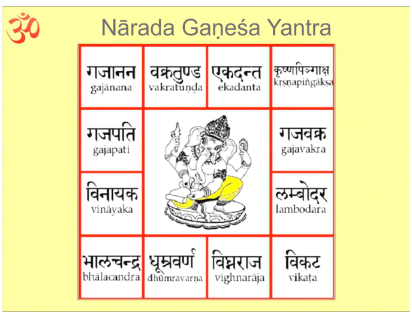


## Lesson 3

<div>

> **Summary of Lesson 3 Transcript**
>
> ## Opening & Structure
>
> - **Started with Guru Mantra** (Om Guruve Namaha) repeated 12 times
> - Course officially begins on **Makara Sankranti** (Sun entering
>   Capricorn) on a **Thursday** - both auspicious for spiritual
>   learning
> - Future webinars will be held **Sundays at 11 AM CET** during Guru
>   Hora
> - Calendar will be shared for planning ahead
>
> ## Course Logistics & Guidelines
>
> **Telegram Group Usage:** - Follow the syllabus/modules
> systematically - Keep questions focused on current module being
> studied - Ask intentional, specific questions (not open-ended “tell us
> more”) - Telegram is just a tool - take your own notes as primary
> resource - Mentors monitor discussions and will intervene if needed
>
> **Learning Approach:** - Self-paced online course with mentor
> support - Guruji’s teaching method: Start with the NAME → meaning →
> application - Not spoon-feeding - some questions left for
> self-research - Learn from each other’s questions and discussions
>
> **Materials:** - Adobe Flash issue being resolved - patience
> requested - All webinars recorded on private YouTube channel
> (permanent access) - 2-year access to PJC Year 1 materials
> (extendable)
>
> ## Main Teaching: What is Jyotish?
>
> **Jyotish = Study of 33 Devas (not just planets/signs)**
>
> ### 1. **Ashtavasu (8 Vassus/Lights)**
>
> - **Sun & Moon** - Original light givers (luminaries)
> - **5 Tatwa Planets** - Give knowledge through their physical nature:
>   - **Mars** (Agni) - Fire, energy, engineering
>   - **Mercury** (Prithvi) - Earth, solid state
>   - **Jupiter** (Akasha) - Space, magnetism, connection
>   - **Venus** (Jala) - Water, liquid state
>   - **Saturn** (Vayu) - Air, movement, breath, longevity
> - **Nakshatras** - Mental desires and emotional states
>
> ### 2. **Dvadasha Adityas (12 Adityas)**
>
> - The 12 months/signs representing **all material resources**
> - Sun’s movement creates 30-degree portions (rashis)
> - Each sign = time period + space
> - **Vishnu Aditya** youngest
>
> ### 3. **Ekadasha Rudra (11 Rudras)**
>
> - Address **destruction energies** in horoscope
> - 10 hold prana (life force) in body
> - 11th relates to individual soul (calculated from Atmakaraka)
> - Connected to **Rudra Bhavas** (houses that can end life)
>
> ### 4. **Indra & Prajapati (2)**
>
> - **Prajapati** = Lagna/1st house (our creation/birth)
> - **Indra** = 10th house (throne, control of senses, karma)
>
> ## Key Concepts Clarified
>
> **Rashis vs Bhavas:** - **Rashis** = Material resources, physical
> quantities (“heap”) - **Bhavas** = Our thoughts/perceptions about life
> aspects
>
> **Important Axes:** - **1st-7th**: Birth-Death, Me-Others (horizontal,
> eye-level) - **4th-10th**: Midnight-Noon, Lowest-Highest point
> (vertical)
>
> **Three Material Worlds:** - **Bhuloka** - Earth (where we are) -
> **Bhuvarloka** - Solar system (Sun, planets) - **Svargaloka** - Sky
> (nakshatras, constellations)

</div>


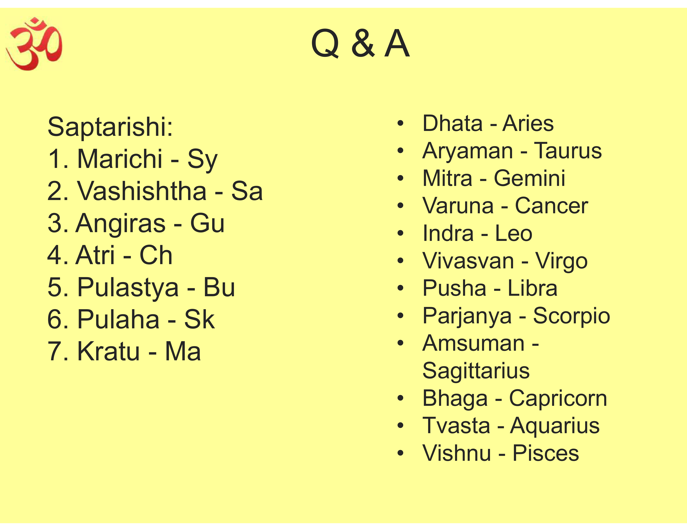

## Lesson 4

<div>

> **Summary of Lesson 4: Panchanga (Five Limbs of Time)**
>
> ## Opening Context
>
> - This is part of the **Aramba (preparatory) portion** of PJC Year 1
> - Aramba introduces many concepts that students will revisit
>   throughout the year
> - Focus is on understanding basic concepts before diving deeper
>
> ## What is Panchanga?
>
> **Pancha** = Five, **Anga** = Limbs
>
> The five fundamental divisions of time that form the **foundation of
> any horoscope**. Panchanga must be examined **before** looking at
> planetary positions, as it shows the **quality of time** for that
> birth.
>
> ### The Five Limbs:
>
> 1.  **Vara** (Day) - Agni Tatva
> 2.  **Tithi** (Lunar day) - Jala Tatva  
> 3.  **Karana** (Half-tithi) - Prithvi Tatva
> 4.  **Nakshatra** (Lunar mansion) - Vayu Tatva
> 5.  **Yoga** (Sun-Moon combination) - Akasha Tatva
>
> ## Benefits of Learning Panchanga
>
> - **Vara** - Prolongs life
> - **Tithi** - Brings prosperity
> - **Karana** - Gives success in all tasks
> - **Nakshatra** - Removes sin
> - **Yoga** - Immunity from disease
>
> ## 1. VARA (The Day)
>
> **Connection**: Agni (fire), energy levels, physical health
>
> **Calculation**: Sunrise to next sunrise
>
> **Seven Varas**: Ravivara (Sunday), Somavara (Monday), Mangalavara
> (Tuesday), Buddhavara (Wednesday), Guruvara (Thursday), Shukravara
> (Friday), Shanivara (Saturday)
>
> **Analysis**: - Check **Varesha** (lord of the day) placement from
> **Lagna** - Also check Varesha placement from **Surya**
>
> **Example Given**: Franklin D. Roosevelt - Born Monday (Varesha =
> Moon) - Moon in 10th house conjunct Mars - Moon has **zero Digbala**
> (directional strength) in 10th - Moon-Mars = Gandanta (fire-water
> conflict) - Moon in 6th from Sun (enemy position) - Result: Polio
> (health issues related to movement on 4th-10th axis)
>
> ### Vara Chakra Concepts:
>
> - **6th graha** = enemy (Shatru)
> - **8th graha** = eclipse (Grahana) - blocks manifestation
>
> ## 2. TITHI (Lunar Day)
>
> **Connection**: Jala Tatva, relationships, emotional content,
> interactions
>
> **Calculation**: Sun-Moon relationship; 1 tithi = 12 degrees of zodiac
>
> **30 Tithis total**: 15 in Krishna Paksha (waning), 15 in Shukla
> Paksha (waxing)
>
> **Eight Lords**: Surya, Chandra, Mangala, Budha, Guru, Shukra, Shani,
> Rahu (Ketu has no lordship)
>
> **Analysis**: Check Tithi lord placement from **4th house**
>
> ### Problematic Tithis:
>
> **Rikta Tithis** (4th, 9th, 14th) - Most problematic: - Too much
> emotion, self-centered - **Chaturthi** - Ganesha (deity) -
> **Navami** - Durga (deity) - **Chaturdashi** - Shiva (deity)
>
> **Other Doshas**: - **Ekadashi** (11th) - Addiction/anger issues
> (Mars/Agni) → fasting advised - **Trayodashi** (13th) - Wealth
> problems - **Krishna Chaturdashi** & **Shukla Pratipada** - Serious
> relationship issues (related to Soma’s sin with Tara)
>
> **Example Given**: Marilyn Monroe - Tithi lord = Venus - Venus in 10th
> house in Aries (enemy sign) - Zero Digbala - Had relationships but
> they were problematic
>
> ## 3. DIG CHAKRA (Directional Strength)
>
> Eight directions where grahas have **full potential**:
>
> - **East** (Indra) - **Surya** - Self-realization
> - **Southeast** (Agni) - **Shukra** - Details, art
> - **South** (Yama) - **Mangala** - Warrior energy
> - **Southwest** (Niriti) - **Rahu** - Chaos
> - **West** (Varuna) - **Shani** - Detachment
> - **Northwest** (Vayu) - **Chandra** - Movement
> - **North** (Kubera) - **Budha** - Wealth, profession
> - **Northeast** (Ishana) - **Guru** - Knowledge
>
> Plus: **Upward** (Ketu/Ananta - Moksha), **Downward** (Lagna/Brahma -
> Rebirth)
>
> ## 4. KALA CHAKRA (Time/Blockage Wheel)
>
> Shows which grahas **block** each direction:
>
> - Mangala blocks Shukra (Agni corner)
> - Guru blocks Mangala (Yama corner)
> - Budha blocks Rahu (Niriti corner)
> - Shukra blocks Shani (Varuna corner)
> - Chandra blocks Budha (Kubera corner)
> - Rahu blocks Guru (Ishana corner)
> - Ketu blocks Surya (Indra corner)
>
> **Key Point**: These are **pairs** that create either debate (Sattvic)
> or war (Tamasic)
>
> ------------------------------------------------------------------------
>
> ## Important Reminders:
>
> - Panchanga is the **first layer** - more factors will be added
> - Cannot make final judgments from Panchanga alone
> - Must learn grahas, rashis, bhavas before complete analysis
> - Return to Aramba concepts throughout the year as understanding
>   deepens
>
> Would you like me to clarify any specific aspect of Panchanga?

</div>


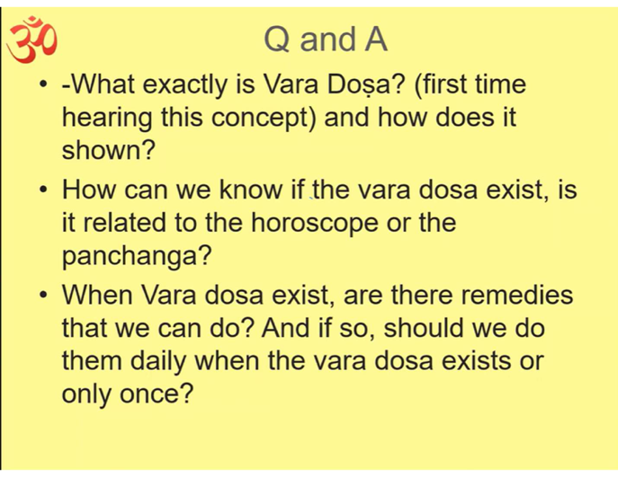


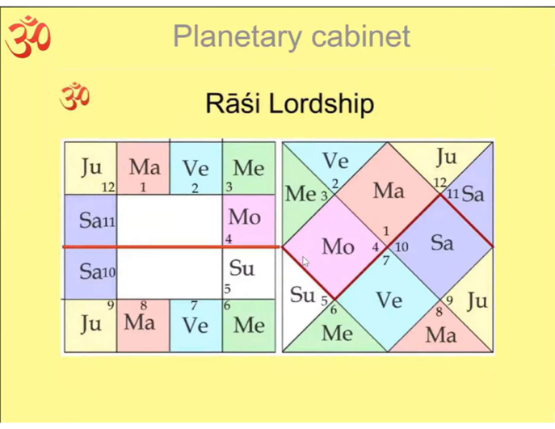

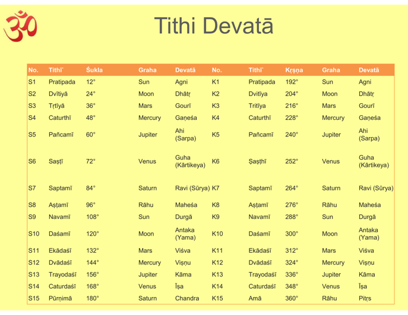


## Lesson 5

<div>

> **Summary of Lesson 5: Rashi Swarupa (Nature of Signs)**
>
> ## Opening Context & Housekeeping
>
> **Learning Process:** - Jyotish learning is **spiral** - same topics
> revisited from different angles/levels - Currently using “microscope”
> approach (detailed) vs “telescope” (broad picture from Aramba) -
> Learning Jyotish is like performing Brahma Yagya - devas work on you
> as you learn - Don’t fear Panchanga doshas you discover - you’re only
> seeing small details, not full picture
>
> **Important Clarifications:** - **Do NOT worship Sanjay Rath** or put
> his picture on altar - He is **Shiksha Guru** (5th house - teacher of
> subject) - NOT Diksha Guru (9th house - spiritual guide who takes
> responsibility for soul)
>
> ------------------------------------------------------------------------
>
> ## RASHI NAMES (Parashara-Specific)
>
> **Names that differ from popular usage:** - **Mesha** (Aries) - Ram -
> **Vrishabha/Vrisha** (Taurus) - Bull - **Mithuna** (Gemini) - Couple -
> **Karkata** (Cancer) - Crab - **Simha** (Leo) - Lion - **Kumari**
> (Virgo) - **Young virgin girl** (not just Kanya) - **Tula** (Libra) -
> Scale/Balance - **Ali** (Scorpio) - NOT Vrishchika; means **blessing,
> bridge, or exalted** (refers to semen storage) - **Dhanu**
> (Sagittarius) - Bow/Archer - **Makara/Nakra** (Capricorn) - **Reversal
> of hell** (karma determines direction) - **Kumbha** (Aquarius) -
> Pot/Water bearer - **Meena** (Pisces) - Fish
>
> ------------------------------------------------------------------------
>
> ## BRAHMA DOSHA (Creation Flaw)
>
> **Key Principle:** Rashis with **unclear/multiple symbols** carry
> Brahma Dosha
>
> ### **5 Rashis WITHOUT Dosha:**
>
> Clear, single-element symbols: 1. **Mesha** - Ram (clear) 2.
> **Vrishabha** - Bull (clear) 3. **Karkata** - Crab (clear) 4.
> **Simha** - Lion (clear) 5. **Vrishchika/Ali** - Scorpion (clear)
>
> ### **7 Rashis WITH Dosha:**
>
> <table>
> <colgroup>
> <col style="width: 11%" />
> <col style="width: 34%" />
> <col style="width: 26%" />
> <col style="width: 27%" />
> </colgroup>
> <thead>
> <tr>
> <th>Rashi</th>
> <th>Planet Showing Dosha</th>
> <th>Devata Angered</th>
> <th>Nature of Dosha</th>
> </tr>
> </thead>
> <tbody>
> <tr>
> <td><strong>Meena</strong></td>
> <td>Surya (Sun)</td>
> <td><strong>Agni</strong></td>
> <td>Fish cursed to never see sunlight; <strong>Remedy:
> Pranayama</strong></td>
> </tr>
> <tr>
> <td><strong>Kumbha</strong></td>
> <td>Chandra (Moon)</td>
> <td><strong>Jala</strong></td>
> <td>Water gets spoiled/fermented in pot; emotions problematic</td>
> </tr>
> <tr>
> <td><strong>Makara</strong></td>
> <td>Guru (Jupiter)</td>
> <td><strong>Indra</strong></td>
> <td>Loss of senses/direction; alcohol issues</td>
> </tr>
> <tr>
> <td><strong>Dhanu</strong></td>
> <td>Budha (Mercury)</td>
> <td><strong>Vishnu</strong></td>
> <td>Battlefield; right vs wrong obsession; <strong>righteous
> anger</strong></td>
> </tr>
> <tr>
> <td><strong>Tula</strong></td>
> <td>Mangala (Mars)</td>
> <td><strong>Skanda</strong></td>
> <td>War vs prosperity conflict; “all fair in love and war”</td>
> </tr>
> <tr>
> <td><strong>Kanya</strong></td>
> <td>Shani (Saturn)</td>
> <td><strong>Brahma</strong></td>
> <td>Purity vs impurity; obsession with cleanliness</td>
> </tr>
> <tr>
> <td><strong>Mithuna</strong></td>
> <td>Shukra (Venus)</td>
> <td><strong>Lakshmi</strong></td>
> <td>Boy + girl + club + instrument; <strong>dominant Bhuloka
> dosha</strong>; relationship/emotion issues</td>
> </tr>
> </tbody>
> </table>
>
> **Usage:** Check dosha planet in chart when analyzing that ascendant -
> may not be as helpful as expected
>
> ------------------------------------------------------------------------
>
> ## RASHI COLORS
>
> - **Mesha** - Blood red/royal red
> - **Vrishabha** - Milk white
> - **Mithuna** - Green (all shades)
> - **Karkata** - White with red tinge (light pink)
> - **Simha** - White with yellow tinge (off-white/sand)
> - **Kanya** - **Gray** (intestines; discernment)
> - **Tula** - **Black**
> - **Vrishchika** - Light yellow (brownish due to Ketu)
> - **Dhanu** - Dark yellow/turmeric/golden
> - **Makara** - **Dark blue** (industrial)
> - **Kumbha** - **Purple** (Rahu; fermentation/poison/medicine)
> - **Meena** - Light blue (sky blue)
>
> ------------------------------------------------------------------------
>
> ## BODY PARTS (Kalapurusha)
>
> Natural zodiac = God’s body template: 1. Mesha - **Head** 2.
> Vrishabha - **Face & neck** 3. Mithuna - **Arms & shoulders** 4.
> Karkata - **Chest, heart, breast** 5. Simha - **Stomach & liver** 6.
> Kanya - **Intestines, navel** 7. Tula - **Below navel, kidneys** 8.
> **Vrishchika - Genitalia** (HORIZONTAL - Ketu reverses) 9. Dhanu -
> **Thighs** 10. Makara - **Knees** 11. Kumbha - **Calves** 12.
> **Meena - Feet** (HORIZONTAL - Ketu reverses)
>
> **Exception:** Ketu-ruled parts are horizontal, not vertical
>
> ------------------------------------------------------------------------
>
> ## GUNA OF RASHIS (Two Systems)
>
> ### **System 1: By Creation/Mobility**
>
> <table style="width:100%;">
> <colgroup>
> <col style="width: 16%" />
> <col style="width: 22%" />
> <col style="width: 16%" />
> <col style="width: 22%" />
> <col style="width: 22%" />
> </colgroup>
> <thead>
> <tr>
> <th>Type</th>
> <th>Rashis</th>
> <th>Guna</th>
> <th>Energy</th>
> <th>Devata</th>
> </tr>
> </thead>
> <tbody>
> <tr>
> <td><strong>Chara</strong> (Movable)</td>
> <td>Mesha, Karkata, Tula, Makara</td>
> <td><strong>Rajas</strong></td>
> <td>Excess energy, pioneers, creative</td>
> <td><strong>Brahma</strong></td>
> </tr>
> <tr>
> <td><strong>Sthira</strong> (Fixed)</td>
> <td>Vrishabha, Simha, Vrishchika, Kumbha</td>
> <td><strong>Tamas</strong></td>
> <td>Inert, stable, sustaining</td>
> <td><strong>Rudra</strong></td>
> </tr>
> <tr>
> <td><strong>Dwi</strong> (Dual)</td>
> <td>Mithuna, Kanya, Dhanu, Meena</td>
> <td><strong>Sattva</strong></td>
> <td>Balanced between mobile &amp; fixed</td>
> <td><strong>Vishnu</strong></td>
> </tr>
> </tbody>
> </table>
>
> ### **System 2: By Lordship**
>
> Rashi lord’s guna adds layer to rashi: - **Sattva planets:** Surya,
> Chandra, Guru - **Rajas planets:** Budha, Shukra - **Tamas planets:**
> Mangala, Shani
>
> **Example:** Mesha = Chara (Rajas by creation) + Mars lord (Tamas) =
> High energy but can be lazy/uninformed
>
> **How to Read:** Check which guna dominates based on lord’s strength
> in chart
>
> ------------------------------------------------------------------------
>
> ## MALE/FEMALE SIGNS
>
> ### **Krura (Cruel/Male) - ODD signs:**
>
> Mesha, Mithuna, Simha, Tula, Dhanu, Kumbha - Aggressive, assertive,
> extroverted, outspoken - Make own decisions, less likely to seek
> advice
>
> ### **Saumya (Gentle/Female) - EVEN signs:**
>
> Vrishabha, Karkata, Kanya, Vrishchika, Makara, Meena - Passive,
> introverted, sustaining - More likely to seek guidance/advice
>
> **For Child Gender (Saptamsha only):** - **Mithuna & Karkata SWAP** -
> **Kumbha & Meena SWAP**
>
> ------------------------------------------------------------------------
>
> ## YUGA RASHIS (Dharma/Light Level)
>
> - **Krita/Satya:** Simha, Vrishchika, Kumbha, Vrishabha - Things come
>   easily, 100% support
> - **Treta:** Mesha, Karkata, Tula, Makara - 75% support, some effort
>   needed
> - **Dwapara:** Dhanu, Meena, Mithuna, Kanya - 50% support
> - **Kali:** (remaining context) - Least support
>
> **Usage:** Shows how much support/ease person has in getting
> knowledge, solutions
>
> ------------------------------------------------------------------------
>
> ## PLANETARY CABINET (Lordship Logic)
>
> From **Sun & Moon** (King & Queen): 1. **Sun & Moon** - Leo & Cancer
> (King & Queen’s quarters) 2. **Budha** - Gemini & Virgo
> (Prince/Princess - next to parents) 3. **Shukra** - Taurus & Libra
> (Court ladies) 4. **Mangala** - Aries & Scorpio (Guards/Knights;
> Scorpio also has spies via Ketu) 5. **Guru** - Sagittarius & Pisces
> (Advisors/Priests/Ministers) 6. **Shani** - Capricorn & Aquarius
> (Workers/Commoners/Labor)
>
> **Also shows:** Speed of planets from Earth (geocentric view)
>
> ------------------------------------------------------------------------
>
> ## MEMORY AID: Hand Method
>
> **Fingers = 12 Rashis** (4 fingers × 3 parts = 12)
>
> - **Fingertips** (top part) = **Chara rashis** (Mesha, Karkata, Tula,
>   Makara) - Most mobile, doing karma
> - **Middle sections** = **Sthira rashis** (Vrishabha, Simha,
>   Vrishchika, Kumbha) - Fixed, no free will
> - **Base/Root** = **Dwi rashis** (Mithuna, Kanya, Dhanu, Meena) -
>   **Most controlling lagnas!**
>
> **Dual lagnas control through:** - **Budha lagnas** (Mithuna/Kanya) -
> Control via **information/details** - **Guru lagnas** (Dhanu/Meena) -
> Control via **knowledge/belief systems**
>
> ------------------------------------------------------------------------
>
> **Next Steps:** This foundational knowledge will be layered with
> grahas (planets), bhavas (houses), and yogas in upcoming lessons.
>
> Would you like me to clarify any specific concept?

</div>


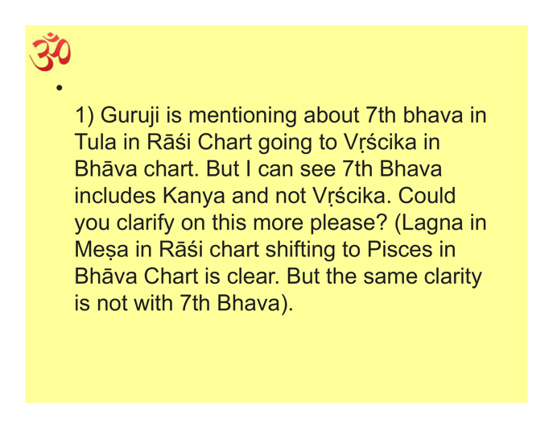

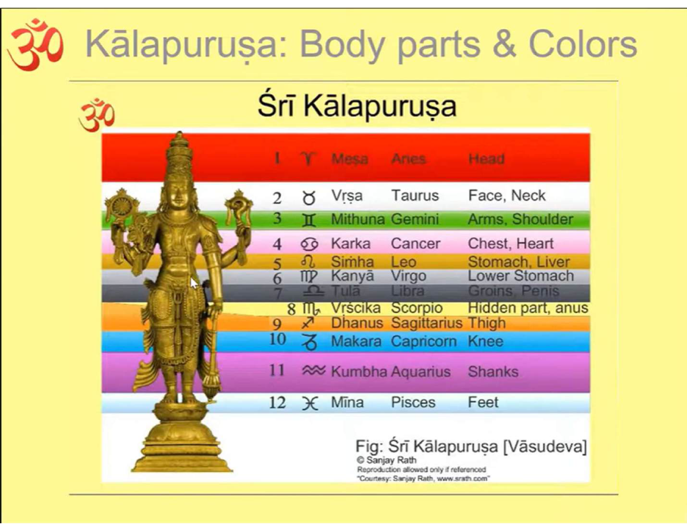

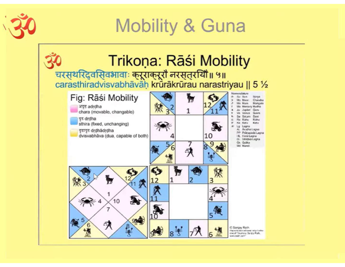

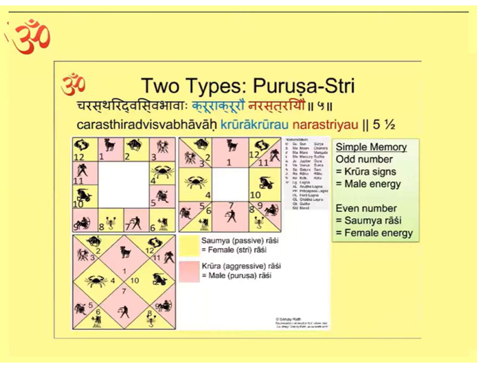


## Lesson 6

<div>

> **Summary of Lesson 6: Katapayadi & Bhava Chakras**
>
> ## 1. KATAPAYADI SYSTEM (Numerical Values from Names)
>
> **Core Principle:** Sanskrit consonants have numerical values (0-9)
>
> **Key Rules:** - **Vowels = 0** (only counted if name starts with
> vowel) - Use **pronunciation**, not spelling - Drop incomplete
> consonants (without following vowel) - **Ra/La rule:** If consonants
> joined with R or L, keep only initial consonant - **Reverse the
> number** after calculation - **Divide by 12** to get remainder = Rashi
>
> **Example: Vivekananda** - Consonants: Va-Ve-Ka-Na-Na-Da - Values:
> 4-4-1-0-8 - Number: 44108 → Reversed: 80144 - After dividing by 12 →
> Remainder = **4** (karka rahsi)
>
> **Usage:** - **Rashi** (sign) = interaction with people - **House
> number** = inner manifestation
>
> ------------------------------------------------------------------------
>
> ## 2. ASTRONOMICAL BASICS
>
> **Horizon:** Where earth and sky meet (observer-dependent)
>
> **Key Points:** - **Udaya Lagna** = Eastern horizon (rising point) -
> **Asta Lagna** = Western horizon (setting point) - 180° from Udaya -
> **MC (Mid-Heaven/Zenith)** = 90° above observer - **Ecliptic** =
> Horizontal plane between Sun & Earth
>
> **Directional Degrees:** - North = 0°/360° - East = 90° - South =
> 180° - West = 270°
>
> ------------------------------------------------------------------------
>
> ## 3. BHAVA CHAKRA (House System)
>
> **Method:** Take Lagna degree ± 15 degrees = 30° house span
>
> **Example: Swami Vivekananda (26° Dhanu Lagna)** - 1st House = 11°
> Dhanu to 11° Makara - 2nd House = 11° Makara to 11° Kumbha - And so
> on…
>
> **Result:** Planets may **shift houses** if they’re within 15° of cusp
>
> **In Vivekananda’s chart:** - Mars shifted from 5th → 4th house -
> Venus shifted from 2nd → 1st house - Jupiter shifted to 10th house
>
> **Significance:** When many planets shift = **major life
> transformations**
>
> ------------------------------------------------------------------------
>
> ## 4. BHAVA CHALIT CHAKRA
>
> **Starting Point:** Uses **Bhava Lagna** (special lagna, moves 2
> hours/sign)
>
> **Same process:** Bhava Lagna degree ± 15°
>
> **Key Difference:** - Bhava Chakra starts from **Udaya Lagna** - Bhava
> Chalit starts from **Bhava Lagna** (calculated separately)
>
> ------------------------------------------------------------------------
>
> ## 5. BIOLOGICAL CLOCK CHART (Practical Application)
>
> **Setup:** 1. Draw Bhava Chalit Chakra 2. Place **6 AM** where Sun is
> located 3. Place **6 PM** in 7th house from Sun 4. Each house =
> **2-hour period**
>
> **Planet Activities & Best Times:**
>
> <table>
> <colgroup>
> <col style="width: 27%" />
> <col style="width: 34%" />
> <col style="width: 37%" />
> </colgroup>
> <thead>
> <tr>
> <th>Planet</th>
> <th>Activity</th>
> <th>Best Time</th>
> </tr>
> </thead>
> <tbody>
> <tr>
> <td><strong>Surya</strong></td>
> <td>Spiritual practice, energy level</td>
> <td>Sun’s house + aspects</td>
> </tr>
> <tr>
> <td><strong>Chandra</strong></td>
> <td>Eating/food</td>
> <td>Moon’s house + aspects</td>
> </tr>
> <tr>
> <td><strong>Mangala</strong></td>
> <td>Exercise, physical strength</td>
> <td>Mars house + aspects (4th, 7th, 8th from itself)</td>
> </tr>
> <tr>
> <td><strong>Budha</strong></td>
> <td>Reading, learning, playing</td>
> <td>Mercury’s house + aspects</td>
> </tr>
> <tr>
> <td><strong>Guru</strong></td>
> <td>Big decisions, digestion, conclusions</td>
> <td>Jupiter’s house + aspects</td>
> </tr>
> <tr>
> <td><strong>Shukra</strong></td>
> <td>Relationships, indulgence</td>
> <td>Venus’s house + aspects</td>
> </tr>
> <tr>
> <td><strong>Shani</strong></td>
> <td>Resting (15 min minimum)</td>
> <td>Saturn’s house + aspects</td>
> </tr>
> <tr>
> <td><strong>Rahu</strong></td>
> <td><strong>NO activity</strong> - meditation time</td>
> <td>Rahu’s house + aspects</td>
> </tr>
> <tr>
> <td><strong>Ketu</strong></td>
> <td><strong>Avoid activities</strong> - meditation</td>
> <td>Ketu’s house + aspects</td>
> </tr>
> </tbody>
> </table>
>
> **Important Notes:** - Check planet’s **aspects** (5th, 7th, 9th, 2nd
> from itself for Rahu) - When planets conjunct = divide time between
> both activities - Each house = 2 hours, but find at least 15 min for
> that activity - Movement is **anti-zodiacal** (Sun moves through
> houses, not signs)
>
> ------------------------------------------------------------------------
>
> ## 6. CHART TYPES (Three Representations)
>
> 1.  **Surya Chakra** (East Indian) - for spirituality
> 2.  **Brigu Chakra** (North Indian) - for Bhava Chakra
> 3.  **Guru Chakra** (South Indian) - for Vastu
>
> **Practice tip:** Use each chart exclusively for 1-3 months to master
> all types
>
> ------------------------------------------------------------------------
>
> **Homework:** Draw your Bhava Chalit Chakra and create your biological
> clock timing table!
>
> Would you like clarification on any specific concept?

</div>


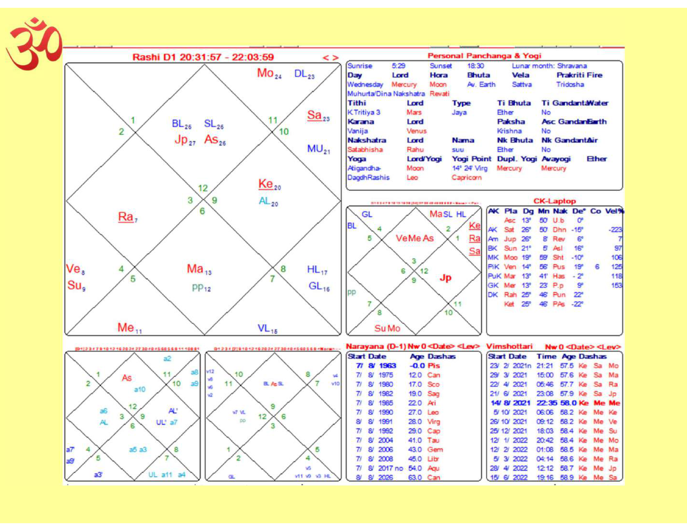

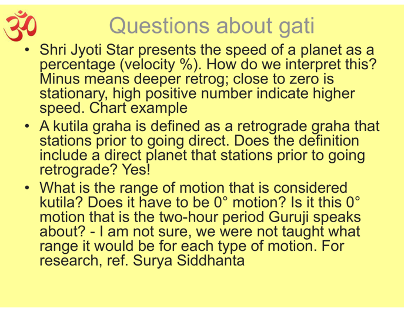

## Lesson 7

<div>

> **Summary of Lesson 7: Grahas (Planets) - Introduction**
>
> ### Opening Context
>
> - This is the **first of three webinars** on Grahas (planets)
> - Traditionally, Jyotish teaching **starts with Chapter 3** (Grahas),
>   not Chapters 1-2 (Creation/Philosophy)
> - Students should study Parashara shlokas **at least 3 times** to
>   truly digest them
> - Use audio recordings from other batches as supplementary material
>
> ------------------------------------------------------------------------
>
> ### CORE DEFINITION: What is a Graha?
>
> **Parashara’s Definition (Chapter 3, Shloka 1):** Heavenly bodies
> classified by: 1. **Visibility** (can we see them?) 2. **Movement**
> (do they move?)
>
> - **Moving bodies** = **Graha** (from root “grahana” = to
>   seize/eclipse)
> - **Fixed bodies** = **Nakshatra** (fixed stars)
>
> **KEY POINT:** Grahas have the inherent nature to **eclipse the
> mind** - this is their fundamental characteristic.
>
> ------------------------------------------------------------------------
>
> ### Why Rahu & Ketu are Grahas (Despite Having No Physical Body)
>
> **Question addressed:** If we only count visible bodies, why include
> Rahu/Ketu?
>
> **Answer:** - They are **mathematical points** (nodes of the Moon) -
> They create **inverse light/shadow** (like closing eyes after seeing
> sun = black circle) - They represent **extremes of the mind**: -
> **Rahu** = Fully material, maximum desire, wants to consume
> everything - **Ketu** = Fully detached, wants nothing, renunciation
>
> **Manifestations:** - **Rahu:** Foreigners, different cultures,
> borders, geographical boundaries, fermentation, alcohol, medicine -
> **Ketu:** Outcasts, monks/nuns, spiritual people, those who renounce
> society - **Example given:** Man who moved to attic for years, refused
> all contact = clear Ketu influence
>
> ------------------------------------------------------------------------
>
> ### PLANETARY MOTION (Critical Concept)
>
> ### Three Categories of Motion:
>
> 1.  **Always Direct (Forward):**
>     - **Surya (Sun) & Chandra (Moon)** - the Luminaries
>     - Establish dharma, predictable, “one foot after another”
> 2.  **Always Retrograde (Backward):**
>     - **Rahu & Ketu** - the Nodes
>     - Move opposite to all other planets
>     - Cause eclipses when they meet luminaries
> 3.  **Can Be Either (Tara Grahas - 5 Planets):**
>     - **Mangala, Budha, Guru, Shukra, Shani**
>     - When **direct** → behave like Luminaries (normal, predictable)
>     - When **retrograde** → behave like Nodes (unpredictable,
>       unfulfilled desires)
>
> ------------------------------------------------------------------------
>
> ### RETROGRADE PLANETS (Vakri)
>
> **Nature:** Planet behaves like Rahu/Ketu
>
> **Characteristics:** - **Not progressing** - standing still or
> pacing - **Unfulfilled desire/karma** with that planet -
> **Unpredictable, odd behavior** - **Cannot be trusted** (unexpected
> turns) - **May not give results** (especially in Prashna/horary)
>
> **Strength Implications:** - Retrograde = **Extremely strong** (like
> nodes) - Has **Cheshtabala** (directional strength) - Can cause
> **highest grahana** (eclipse power)
>
> **Prashna (Horary) Rules:** - If significator is vakri → **Won’t
> happen** (or needs 3 attempts) - **3x multiplier:** 3x more effort, 3
> attempts, or 3 blessings/children
>
> ------------------------------------------------------------------------
>
> ### EIGHT TYPES OF MOTION
>
> **5 Direct Motions:** 1-5. (Various speeds of forward movement)
>
> **3 Retrograde Motions:** 1. **Vakra** - Standard retrograde 2.
> **Anu-vakra** - Slowing down in retrograde 3. **Kutila** -
> **Stationary** (about to change direction)
>
> **IMPORTANT:** Kutila applies to **both** transitions: - Direct →
> Retrograde - Retrograde → Direct
>
> ------------------------------------------------------------------------
>
> ### WHEN DO PLANETS GO RETROGRADE?
>
> **Outer Planets (Mars, Jupiter, Saturn):**
>
> **Exercise given:** Draw blank chart, place Jupiter on Lagna
>
> - **120° from Sun** (5th or 9th house) = **Kutila (Stationary)**
>   - 5th house = Just entering retrograde
>   - 9th house = Just finishing retrograde
> - **180° from Sun** (7th house) = **Highest retrograde motion**
> - **6th house** = Vakra (Mars nature)
> - **8th house** = Anu-vakra (Rahu nature)
> - **4th/10th houses** = Direct motion range
>
> **Inner Planets (Mercury, Venus):** - Requires deep astronomical study
> (Surya Siddhanta) - Not explained in basic course
>
> ------------------------------------------------------------------------
>
> ### CHART EXAMPLE: Pandit Sanjay Rath
>
> **Jupiter:** Sun in 5th from Jupiter → Jupiter **stationary**
> (velocity = 7, very low)
>
> **Saturn:** Opposite Sun (7th house) → **Highest retrograde**
> (velocity = -223%)
>
> **Velocity Interpretation:** - **Minus (-)** = Retrograde - **Close to
> 0** = Stationary - **High positive** = Fast direct motion - **High
> negative** = Fast retrograde (double speed)
>
> **Note:** No exact ranges given for motion types - must observe
> velocity values
>
> ------------------------------------------------------------------------
>
> ### DO WE MOVE RETROGRADE PLANETS IN THE CHART?
>
> **NO!** Planet stays where it is.
>
> **Example:** Retrograde boyfriend still behaves oddly, but he’s still
> your boyfriend in the same place.
>
> **What changes:** - Planet gets **nature of nodes** - Can cancel
> exaltation/debilitation (taught in next lesson) - Creates yogas from
> its actual position
>
> ------------------------------------------------------------------------
>
> ### NAKSHATRA vs RASHI (Critical Distinction)
>
> **Question:** Why do grahas show different colors in nakshatra vs
> rashi?
>
> **Answer - The Three Lokas:**
>
> 1.  **Bhuloka (Earth)** - Where we are
>     - **Rashis** = All material resources, physical interactions
> 2.  **Bhuvarloka (Solar System)** - Above us
>     - **Grahas** = Moving planets, casting shadows
> 3.  **Svargaloka (Sky)** - Above that
>     - **Nakshatras** = Fixed stars, mental/emotional plane, devatas
>
> **How Grahas Work:** - Grahas move through nakshatras (truth) - Cast
> shadow on both nakshatras AND rashis - **Bind** nakshatra
> significations with rashi significations
>
> **Nakshatras** = Your **thoughts, emotions, ideas** (lunar, night
> concept) - Where graha is = your specific lens of thinking/feeling
>
> **Rashis** = **Material resources, physical things** (everything you
> can see/touch) - Where graha is = where you experience grahana
> materially
>
> **Example: Two planets in same rashi but different nakshatras:** -
> Working on same project (rashi) - But have different ideas/emotions
> about it (nakshatra)
>
> **Direction of influence works both ways:** 1. Mental → Material:
> Thoughts manifest as actions 2. Material → Mental: Events cause us to
> think certain thoughts
>
> ------------------------------------------------------------------------
>
> ### FOUR TYPES OF LAGNA (Briefly Mentioned)
>
> Not explained in detail (covered in separate lesson), but:
>
> **Birth Time Indicators:** - **Sun in 1st** (Udaya Lagna) = Sunrise
> birth - **Sun in 7th** (Asta Lagna) = Sunset birth - **Sun in 10th**
> (Akasha Lagna) = Midday birth (~noon) - **Sun in 4th** (Jala Lagna) =
> Midnight birth
>
> ------------------------------------------------------------------------
>
> ### SAM-YOGA (Combinations)
>
> **Sam-yoga** = ALL ways planets can combine (with planets, nakshatras,
> rashis)
>
> **Sam-bandha** = **Important** combinations that have great impact -
> This is the term we use most - 4 specific types (one being
> conjunction/yuti)
>
> **Sam-yoga Sphuta** = Mathematical meeting point of two planets -
> Calculated even if not in same rashi - Shows where yoga will manifest
>
> **Later:** Yoga Sphuta can combine ANY two points (e.g., Lagna lord +
> 7th lord)
>
> ------------------------------------------------------------------------
>
> ### BHAVISHYA vs ATITA YOGA
>
> **Bhavishya Yoga** = Yoga that **will happen in future** - Planets
> moving toward conjunction
>
> **Atita/Veeta Yoga** = Yoga that **happened in past** - Planets moving
> apart after conjunction
>
> **Why calculate Atita Yoga Sphuta?** - See where past yoga had
> impact - Useful for research/deep study of charts - Example: Two
> people with Chandra-Ketu in 11th - did it happen already or will it
> happen?
>
> **If yoga rashi not visible from yoga:** - Don’t use seasons
> (mentioned but corrected) - Use **Samukha-rashi**
> (opposite/complementary signs) - Taught in Rashi Drishti module
>
> ------------------------------------------------------------------------
>
> ### GRAHA YUDHA (Planetary War)
>
> **Not taught in detail yet** - comes in Year 3
>
> - 4 types of interpretation
> - Related to Bala (strength) calculations
> - Just introduced as concept for now
>
> ------------------------------------------------------------------------
>
> ### KEY TERMINOLOGY TO REMEMBER
>
> - **Graha** = Planet that eclipses mind
> - **Vakri** = Retrograde
> - **Kutila** = Stationary
> - **Sam-bandha** = Important combination
> - **Sam-yoga Sphuta** = Meeting point of yoga
> - **Bhavishya Yoga** = Future yoga
> - **Atita/Veeta Yoga** = Past yoga
> - **Prasanga** = Planet that bridges gap (Year 3/4 topic)
>
> ------------------------------------------------------------------------
>
> ### HOMEWORK/NEXT STEPS
>
> - Study planetary motions in your own chart
> - Observe velocity values in software
> - Check if any retrograde planets present
> - Note which nakshatras vs rashis planets occupy
> - Prepare questions for next Graha webinar
>
> ------------------------------------------------------------------------
>
> **Next Topics:** Exaltation, debilitation, planetary relationships,
> yogas in detail
>
> Would you like me to clarify any specific concept from this lesson?

</div>

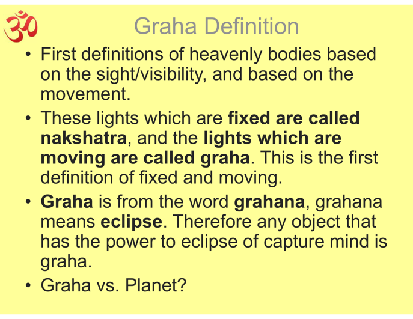


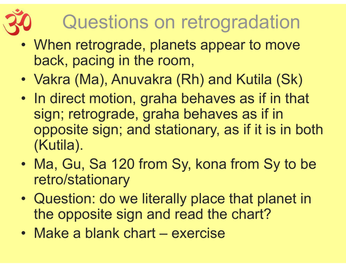

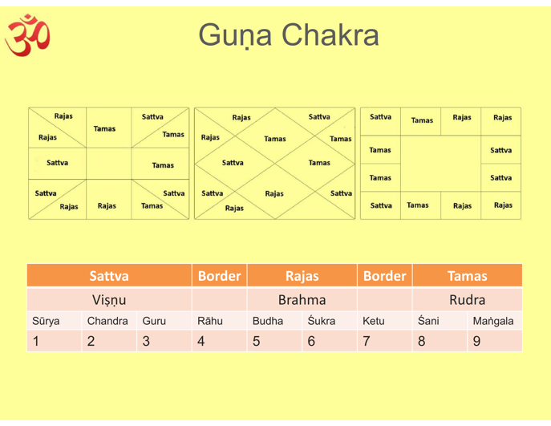


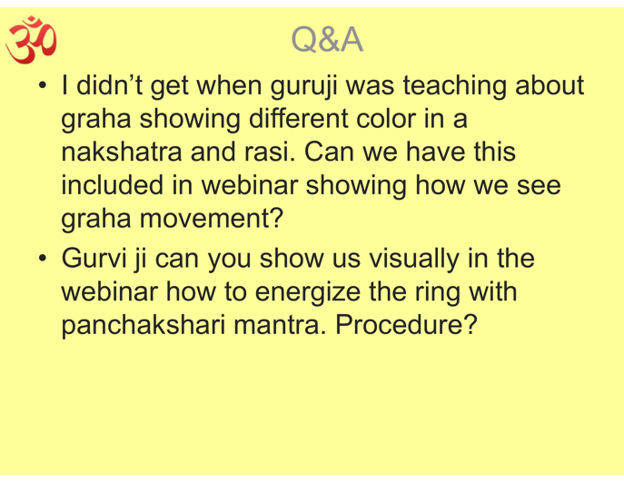

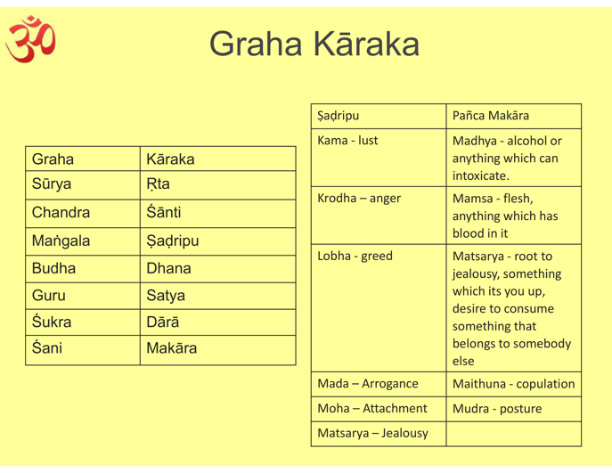


## Lesson 8

<div>

> **Summary of Lesson 8: Graha Devatas & Karakas**
>
> ### 1. ADI DEVATA MANTRAS (For Auspicious Beginnings)
>
> **Purpose:** Worship when **starting** something new (job, family,
> project, book)
>
> <table>
> <colgroup>
> <col style="width: 25%" />
> <col style="width: 40%" />
> <col style="width: 33%" />
> </colgroup>
> <thead>
> <tr>
> <th>Graha</th>
> <th>Adi Devata</th>
> <th>Purpose</th>
> </tr>
> </thead>
> <tbody>
> <tr>
> <td><strong>Surya</strong></td>
> <td>Vahni (Agni)</td>
> <td>Awakens purpose, takes prayers to devas</td>
> </tr>
> <tr>
> <td><strong>Chandra</strong></td>
> <td>Ambika</td>
> <td></td>
> </tr>
> <tr>
> <td><strong>Mangala</strong></td>
> <td>Subramanya</td>
> <td>Auspicious form (NOT Skanda/warrior form)</td>
> </tr>
> <tr>
> <td><strong>Budha</strong></td>
> <td>Rama (0-10°), Krishna (10-20°), Vishnu (20-30°)</td>
> <td>Choose based on degree</td>
> </tr>
> <tr>
> <td><strong>Guru</strong></td>
> <td></td>
> <td></td>
> </tr>
> <tr>
> <td><strong>Shukra</strong></td>
> <td></td>
> <td></td>
> </tr>
> <tr>
> <td><strong>Shani</strong></td>
> <td></td>
> <td></td>
> </tr>
> </tbody>
> </table>
>
> **Key Point:** Adi devatas are for **awakening/starting** activities.
>
> ------------------------------------------------------------------------
>
> ### 2. PRATIYADI DEVATA MANTRAS (For Control & Sustenance)
>
> **Purpose:** **Control, sustain, protect, remove obstacles, complete
> karmas**
>
> <table>
> <colgroup>
> <col style="width: 21%" />
> <col style="width: 53%" />
> <col style="width: 25%" />
> </colgroup>
> <thead>
> <tr>
> <th>Graha</th>
> <th>Pratiyadi Devata</th>
> <th>Nature</th>
> </tr>
> </thead>
> <tbody>
> <tr>
> <td><strong>Surya</strong></td>
> <td>Shiva</td>
> <td>Manifested form (with form)</td>
> </tr>
> <tr>
> <td><strong>Chandra</strong></td>
> <td>Gauri</td>
> <td></td>
> </tr>
> <tr>
> <td><strong>Mangala</strong></td>
> <td>Subramanya</td>
> <td>Same as Adi devata</td>
> </tr>
> <tr>
> <td><strong>Budha</strong></td>
> <td>Narayana</td>
> <td>Unmanifested, above avatars</td>
> </tr>
> <tr>
> <td><strong>Guru</strong></td>
> <td>Sadashiva</td>
> <td><strong>Unmanifested</strong> Shiva (no form)</td>
> </tr>
> <tr>
> <td><strong>Shukra</strong></td>
> <td>Lakshmi</td>
> <td>Sustains relationships, love</td>
> </tr>
> <tr>
> <td><strong>Shani</strong></td>
> <td>Krishna Narayana (Jagannath)</td>
> <td>Relieves sins, without form</td>
> </tr>
> <tr>
> <td><strong>Rahu</strong></td>
> <td>Chandi (Durga)</td>
> <td></td>
> </tr>
> <tr>
> <td><strong>Ketu</strong></td>
> <td>Ganesha</td>
> <td></td>
> </tr>
> </tbody>
> </table>
>
> **Key Difference:** - Adi devata = Start things - Pratiyadi devata =
> Sustain, protect, correct, complete
>
> **When to Use:** Based on **dasha** and **current need** (not all at
> once!)
>
> ------------------------------------------------------------------------
>
> ### 3. FOUR KENDRAS & FOUR LAGNAS
>
> **Kendras represent Vishnu’s sustaining power**
>
> <table>
> <colgroup>
> <col style="width: 9%" />
> <col style="width: 19%" />
> <col style="width: 8%" />
> <col style="width: 16%" />
> <col style="width: 25%" />
> <col style="width: 20%" />
> </colgroup>
> <thead>
> <tr>
> <th>Lagna</th>
> <th>Sun Position</th>
> <th>Time</th>
> <th>Represents</th>
> <th>Bija (Vaishnava)</th>
> <th>Bija (Shaiva)</th>
> </tr>
> </thead>
> <tbody>
> <tr>
> <td><strong>Udaya</strong> (1st)</td>
> <td>Sunrise</td>
> <td>~6 AM</td>
> <td>Life beginning, Buddhi (intelligence)</td>
> <td>Hare</td>
> <td>Om</td>
> </tr>
> <tr>
> <td><strong>Asta</strong> (7th)</td>
> <td>Sunset</td>
> <td>~6 PM</td>
> <td>Moon rises, social life, Shuddhi (cleansing)</td>
> <td>Rama</td>
> <td>Hreem</td>
> </tr>
> <tr>
> <td><strong>Jala</strong> (4th)</td>
> <td>Midnight</td>
> <td>~12 AM</td>
> <td>Moon’s full potential, rest, forgiveness</td>
> <td>Krishna</td>
> <td>Kleem</td>
> </tr>
> <tr>
> <td><strong>Akasha/Svarga</strong> (10th)</td>
> <td>Midday</td>
> <td>~12 PM</td>
> <td>Sun’s full potential, Siddhi (accomplishment), karma burning</td>
> <td>Hare</td>
> <td>Shreem</td>
> </tr>
> </tbody>
> </table>
>
> **SAMADHI = Balance of all 4:** Buddhi + Shuddhi + Siddhi + Riti
>
> ------------------------------------------------------------------------
>
> ### 4. JOB/CAREER ANALYSIS (Practical Application)
>
> #### **Sattva Houses (Sustaining Job):**
>
> From **Akasha Lagna (10th)**, count 4th, 5th, 9th, 12th houses. These
> become from your **Lagna**: **1st, 2nd, 6th, 9th**
>
> - **1st house** = Mental ability to do job
> - **2nd house** = Wealth accumulated from job
> - **6th house** = Hard work capacity
> - **9th house** = Knowledge/education for job
>
> #### **Rajas Houses (Job Fluctuations):**
>
> Venus & Mercury signs from Akasha = **3rd, 4th, 11th, 12th** from
> Lagna
>
> - **3rd** = Daily efforts, enterprise
> - **4th** = Love for job
> - **11th** = Income
> - **12th** = Losses from job
>
> #### **Tamas Houses (Job Changes):**
>
> Mars & Saturn signs from Akasha = **5th, 7th, 8th, 10th** from Lagna
>
> - **5th** = New job appears
> - **7th** = Social responsibilities cause change
> - **8th** = Retirement, weakness
> - **10th** = Progress/ambition
>
> ------------------------------------------------------------------------
>
> ### 5. ABHIJIT RASHI (4th from Sun)
>
> **Two Devatas:** 1. **Kubera** = Wealth 2. **Vishnu** =
> Purity/Enlightenment
>
> **Choice:** Do we choose wealth or enlightenment?
>
> **Reversal Principle:** - **12th from Sun** = What we GAIN (nature
> loses, we gain) - **2nd from Sun** = What we LOSE (we give back to
> nature)
>
> ------------------------------------------------------------------------
>
> ### 6. GUNA CHAKRA (Quality of Grahas)
>
> #### **Three Gunas with Borders:**
>
> **SATTVA:** Surya, Chandra, Guru (sustenance, protection) ↓ **RAHU**
> (border - attacks sattva) ↓ **RAJAS:** Budha (5), Shukra (6) ↓
> **KETU** (border) ↓ **TAMAS:** Mangala, Shani
>
> **Numbers:** Sy=1, Ch=2, Gu=3, Ra=4, Bu=5, Sk=6, Ke=7, Sa=8, Ma=9
>
> ------------------------------------------------------------------------
>
> ### 7. FOUR GUNA TYPES (Character Classification)
>
> <table>
> <colgroup>
> <col style="width: 18%" />
> <col style="width: 24%" />
> <col style="width: 24%" />
> <col style="width: 33%" />
> </colgroup>
> <thead>
> <tr>
> <th>Type</th>
> <th>Nature</th>
> <th>Grahas</th>
> <th>Character</th>
> </tr>
> </thead>
> <tbody>
> <tr>
> <td><strong>Uttama</strong></td>
> <td>Purest sattva</td>
> <td>Saumya &amp; Punya (Moon, Guru, Venus, Mercury)</td>
> <td>Forgiveness, control, calm, humble</td>
> </tr>
> <tr>
> <td><strong>Madhyama</strong></td>
> <td>Kshatriya, harsh but auspicious</td>
> <td><strong>Surya only</strong></td>
> <td>Protects dharma, corrects (like prison)</td>
> </tr>
> <tr>
> <td><strong>Udashina</strong></td>
> <td>Sad, depressed, greedy</td>
> <td>Venus, Mercury (rajas)</td>
> <td>Never satisfied, sorrowful</td>
> </tr>
> <tr>
> <td><strong>Adhama</strong></td>
> <td>Evil, harsh</td>
> <td>Mars, Saturn (tamas)</td>
> <td>Lies, lazy, violent</td>
> </tr>
> </tbody>
> </table>
>
> **Problems to Develop:** - **Tamas (Rakshasa)** = Empathy (Daya) -
> **Rajas (Manushya)** = Donation (Dana) - **Sattva (Deva)** = Control
> senses
>
> **Goal:** Become **Gunatita** (beyond gunas)
>
> ------------------------------------------------------------------------
>
> ### 8. SHADRIPUS (6 Enemies) & PANCHAMAKARAS (5 Elements to Avoid)
>
> #### **Shadripus (Mars karaka):**
>
> 1.  **Kama** - Desire
> 2.  **Krodha** - Anger
> 3.  **Lobha** - Greed
> 4.  **Moha** - Attachment
> 5.  **Mada** - Pride
> 6.  **Matsarya** - Jealousy
>
> #### **Panchamakaras (Saturn karaka):**
>
> 1.  **Madya** - Alcohol/intoxication
> 2.  **Mamsa** - Flesh/blood (damages Moon/Shanti)
> 3.  **Matsarya** - Desire for others’ possessions
> 4.  **Maithuna** - Copulation
> 5.  **Mudra** - Inappropriate postures/touching
>
> **Relationship:** Panchamakaras **cause** Shadripus
>
> ------------------------------------------------------------------------
>
> ### 9. BHAVA KARAKAS (House Significators)
>
> <table>
> <colgroup>
> <col style="width: 20%" />
> <col style="width: 32%" />
> <col style="width: 47%" />
> </colgroup>
> <thead>
> <tr>
> <th>House</th>
> <th>Karaka(s)</th>
> <th>What They Show</th>
> </tr>
> </thead>
> <tbody>
> <tr>
> <td>1st</td>
> <td>Surya</td>
> <td>Self</td>
> </tr>
> <tr>
> <td>2nd</td>
> <td>Guru (wealth), Budha (speech)</td>
> <td></td>
> </tr>
> <tr>
> <td>3rd</td>
> <td>Mangala</td>
> <td>Courage, siblings</td>
> </tr>
> <tr>
> <td>4th</td>
> <td>Chandra (mother), Mangala (property)</td>
> <td></td>
> </tr>
> <tr>
> <td>5th</td>
> <td>Guru</td>
> <td>Children, intelligence</td>
> </tr>
> <tr>
> <td>6th</td>
> <td>Shani, Mangala</td>
> <td>Enemies, disease</td>
> </tr>
> <tr>
> <td>7th</td>
> <td>Shukra</td>
> <td>Spouse</td>
> </tr>
> <tr>
> <td>8th</td>
> <td>Shani</td>
> <td>Longevity</td>
> </tr>
> <tr>
> <td>9th</td>
> <td>Surya, Guru</td>
> <td>Father, dharma</td>
> </tr>
> <tr>
> <td>10th</td>
> <td>Budha (job ability), Surya (need), Shani (effort), Guru
> (fruits)</td>
> <td>Career</td>
> </tr>
> <tr>
> <td>11th</td>
> <td>Guru</td>
> <td>Gains</td>
> </tr>
> <tr>
> <td>12th</td>
> <td>Shani</td>
> <td>Loss, expenses</td>
> </tr>
> </tbody>
> </table>
>
> **Technique:** Place karaka as lagna to see specific relationships -
> E.g., 4th from Guru = knowledge from mother - 5th from Budha =
> communication with children
>
> ------------------------------------------------------------------------
>
> ### 10. 12 ADITYAS (One for Each Sign)
>
> <table>
> <thead>
> <tr>
> <th>Sign</th>
> <th>Aditya</th>
> <th>Sign</th>
> <th>Aditya</th>
> </tr>
> </thead>
> <tbody>
> <tr>
> <td>Mesha</td>
> <td>Dhata</td>
> <td>Tula</td>
> <td>Indra</td>
> </tr>
> <tr>
> <td>Vrishabha</td>
> <td>Aryaman</td>
> <td>Vrishchika</td>
> <td>(Ali)</td>
> </tr>
> <tr>
> <td>Mithuna</td>
> <td>Mitra</td>
> <td>Dhanu</td>
> <td>Bhaga</td>
> </tr>
> <tr>
> <td>Karkata</td>
> <td>Varuna</td>
> <td>Makara</td>
> <td>Bhaga</td>
> </tr>
> <tr>
> <td>Simha</td>
> <td>Indra</td>
> <td>Kumbha</td>
> <td></td>
> </tr>
> <tr>
> <td>Kanya</td>
> <td>Vivasvan</td>
> <td>Meena</td>
> <td>Vishnu</td>
> </tr>
> </tbody>
> </table>
>
> \*\* above table is incorrect please check the slides \*\*
>
> **Two Adityas matter:** 1. **Lagna Aditya** = Defines YOU,
> intellectual functioning (personal) 2. **Sun sign Aditya** = What you
> do to the WORLD (external)
>
> **House where Sun placed** = Area blessed by that Aditya
>
> ------------------------------------------------------------------------
>
> ### 11. RASHI DOSHA APPLICATION
>
> **Key Point:** Look at **placement** of dosha-carrying planet
>
> **Example:** Mithuna lagna (Lakshmi dosha via Shukra) - Where is Venus
> placed? = Problematic area - Lordship also matters - Must check if
> planet is **afflicted** for bigger problems
>
> **Not all doom!** Even afflicted placements in upachaya houses can
> give benefits.
>
> ------------------------------------------------------------------------
>
> **Questions to explore:** - Which dasha are you in now? - What
> specific area needs remedy? - Want to understand your chart’s specific
> dosha?

</div>


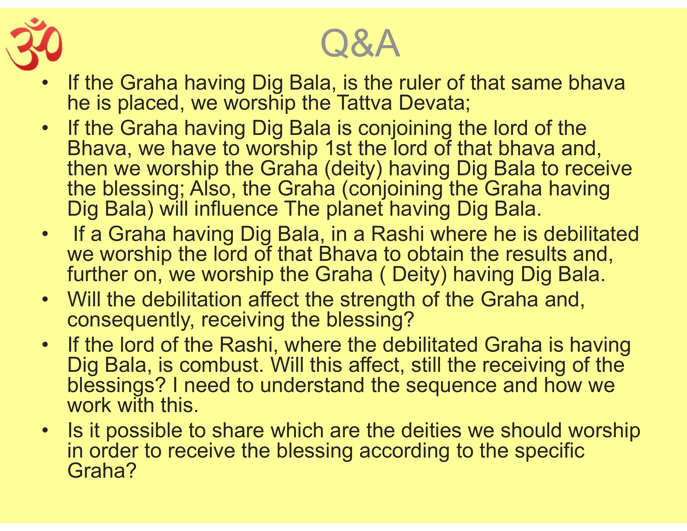


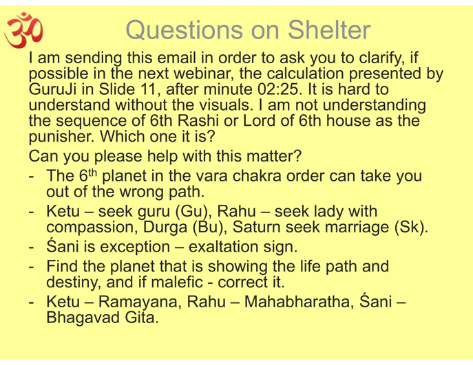


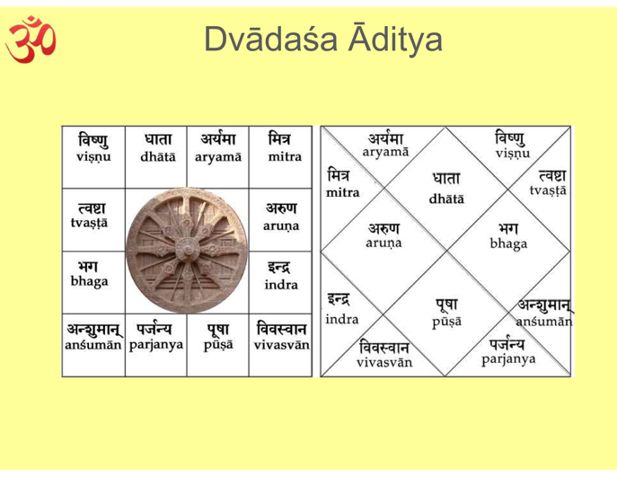


## lesson 9

<div>

> **Core Concept: Dig Bala (Directional Strength)**
>
> **What it is:** Planets gain special strength when placed in specific
> houses (kendras) from the lagna. Behind each planet in dig bala is a
> devata (deity) blessing that position.
>
> **Key Principle:** Dig bala is a **kendra-based concept** - planets
> gain this strength in the 1st, 4th, 7th, or 10th houses from lagna.
>
> ## The 10 Directions & Deities
>
> Each of the 9 grahas plus lagna has a specific dig bala position: -
> **Surya** (10th house) - Indra’s blessing: oversight, control,
> statesmanship - **Chandra** (4th house) - Vayu’s blessing: speed,
> pranayama knowledge - **Mangal** (10th house) - Yama’s blessing:
> knowledge of borders, longevity, dasha - **Budha** (1st house) -
> Kubera’s blessing: knowledge of wealth - **Guru** (1st house) -
> Ishana’s blessing: full knowledge, reasoning (viveka) - **Shukra**
> (4th house) - Agni’s blessing: vision, ability to envision - **Shani**
> (7th house) - Varuna’s blessing: carrying burdens, labor knowledge -
> **Rahu** (7th house) - Niriti’s blessing: understanding chaos and its
> removal - **Ketu** (10th house) - Ananta’s blessing: meditation,
> spiritual introspection - **Lagna** (vargottama) - Mritunjaya
> blessing: longevity
>
> ## How Dig Bala Works
>
> **From Lagna:** The devata gives **knowledge** to the person - this is
> a blessing that can be strengthened through remedies
>
> **From Arudha Lagna:** Shows the **physical direction** where
> blessings manifest (useful for relocation advice)
>
> ## Important Rules
>
> 1.  **Conjunctions:** When a dig bala planet conjoins another planet,
>     it **spills the blessing** onto that planet (like an expensive
>     house raising the value of a neighboring cheap house)
>
> 2.  **Dispositor is Key:** The dispositor can lock or unlock the
>     blessing - check its condition first. If doing remedies, worship
>     the dispositor first, then the dig bala planet.
>
> 3.  **Zero Dig Bala:** Opposite placement shows **lack of knowledge**
>     in houses ruled by that planet - the person may be capable but
>     unable to apply themselves in those areas
>
> 4.  **Independent of Sign:** Dig bala works regardless of whether the
>     planet is exalted, debilitated, or in own sign - these are
>     separate layers of analysis
>
> ## Practical Applications
>
> - Use dig bala as a **remedy tool** - it’s a blessing that can be
>   strengthened
> - One strong benefit can lift an entire chart
> - For malefics in kendras, we prefer them weak (unless they’re lagna
>   lord or have dig bala blessing)
> - Don’t do all remedies at once - address current dasha issues only
>
> ## Examples Given
>
> **Abraham Lincoln:** Budha (lagna lord) in 1st house conjunct Surya -
> Kubera’s wealth blessing manifested through Surya’s statesmanship.
> Rahu-Mangal in 9th activated through war/law-making but ultimately led
> to his death (Rahu in marana karaka sthana defeated by Mangal).
>
> Would you like me to clarify any specific aspect of dig bala?

</div>


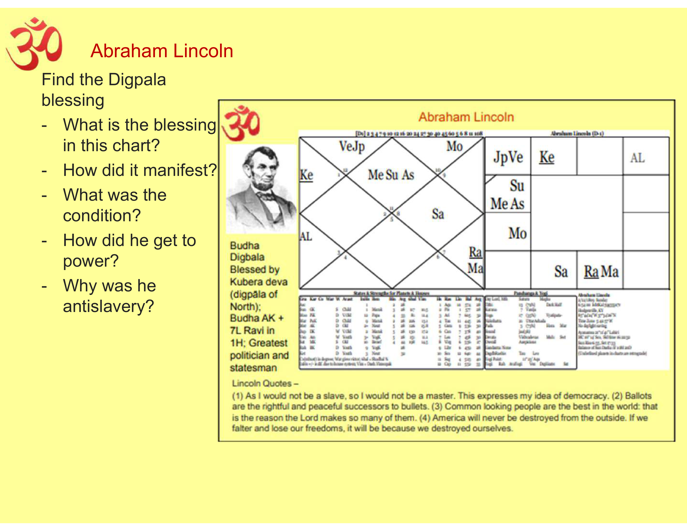


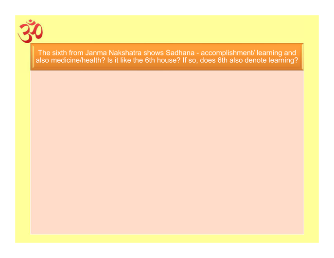

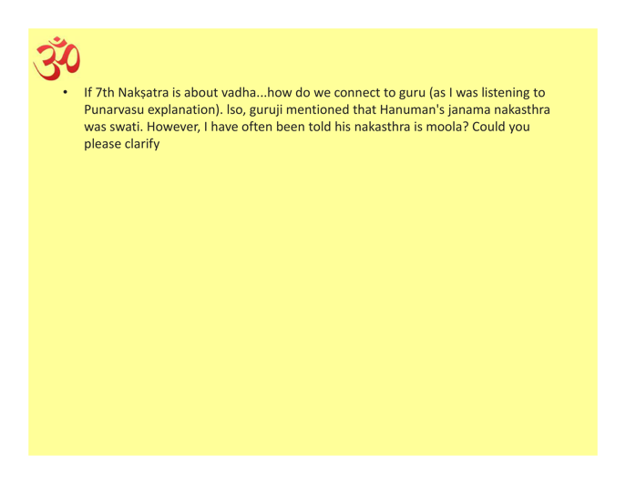

## lesson 10

<div>

> **Caution**
>
> I’ll summarize this Vedic astrology lesson on Nakshatras. This is
> quite extensive, so let me break it into key sections:
>
> ## Core Concept: Nakshatras & Thought Creation
>
> - **27/28 Nakshatras** are the Moon’s mansions, above and outside the
>   Rashi chart
> - They represent **thought creation** - thoughts start in nakshatras,
>   bubble up through divisional charts, and manifest in the Rashi chart
> - After manifestation, they return to nakshatras as **emotions**
>
> ## Janma Nakshatra (Birth Moon’s Nakshatra)
>
> The lord of your Janma Nakshatra shows your mental attitude:
>
> - **Sun**: Need to find a boss/God; work for others
> - **Moon**: Function best in family/gurukul settings
> - **Mars**: Prone to conflicts; must avoid them
> - **Mercury**: Difficulty finishing projects (Gandanta)
> - **Jupiter**: Seek knowledge, uphold tradition/dharma
> - **Venus**: Need purity/respect in relationships
> - **Saturn**: Break boundaries; good for innovation/research
> - **Rahu**: Face betrayal/disappointment; must stay honest
> - **Ketu**: Unsettled mind; need meditation (Gandanta)
>
> ## Navtara Chakra (Three Columns)
>
> - **Buloka** (1st column): Personal well-being, youth
> - **Buvaloka** (2nd column): Career, social life, adulthood
> - **Svargaloka** (3rd column): Spiritual matters, elder age
>
> Odd nakshatras (1st, 3rd, 5th, 7th) in first two columns are
> problematic; in spiritual column, challenges are beneficial.
>
> ## Important Nakshatras from Moon
>
> - **10th Nakshatra** (Karma): Shows career/action capacity; same lord
>   as Janma
> - **25th Nakshatra** (Manas): The pillar - most critical mental
>   support point
> - **7th & 22nd**: Death/endings (Vadha)
>
> ## Special Considerations
>
> - **Shunya Nakshatra**: Shows emptiness in certain rashis
> - **Gandanta**: Mercury (can’t finish) and Ketu (can’t start) create
>   problems
> - **Combustion by Sun**: Cleansing through humiliation before
>   improvement
> - **Masa Nakshatra**: Check Atmakaraka’s rashi to find problematic
>   nakshatra lords
>
> ## Key Teaching Points
>
> - Nakshatras show **mental capacity**, but Rashi chart shows
>   **manifestation**
> - Both must support each other - genius without opportunity
>   accomplishes nothing
> - Use 27-nakshatra scheme for practical work; 28 for spiritual matters
> - Check nakshatra lord’s placement in Rashi chart for full
>   understanding
>
> Would you like me to elaborate on any specific section?

</div>

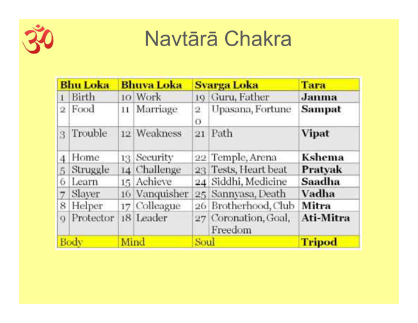


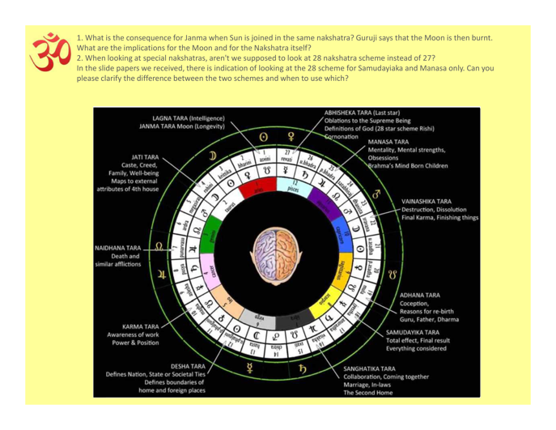

## lesson 11

<div>

> **Caution**
>
> I’ll create a comprehensive summary of this Vedic astrology lesson on
> Graha Drishti (planetary aspects). This is quite detailed, so let me
> break it into key sections:
>
> ## **Lesson 11: Graha Drishti (Planetary Aspects) - Summary**
>
> ### **Course Logistics**
>
> - Monthly webinars recorded and available within 24 hours
> - 2 years access to materials
> - Telegram group for daily questions
> - Daily practice: “Hare Rama Krishna” mantra (3 rounds of 108) upon
>   waking
> - Recommended software: Jagannatha Hora (free) or Shri Jyoti Star
>   (paid)
>
> ### **Core Concepts of Graha Drishti**
>
> **Definition:** Graha drishti is planetary aspect - the ability of
> planets (movable bodies) to influence other bodies from certain
> positions. It represents: - Expression of desire (temporary, activated
> during dashas or through mantras) - Ability to influence based on
> position - What the planet is viewing/becoming aware of - What the
> planet prioritizes
>
> ### **Four Types of Graha Drishti**
>
> **1. Outer Planets (have multiple aspects):**
>
> - **Saturn - Upachaya/Growth Drishti:** 3rd and 10th houses
>   - Focus: Work, daily effort (parakrama)
>   - Makara lagna natives are workaholics, constantly discussing work
> - **Jupiter - Trikona/Knowledge Drishti:** 5th and 9th houses
>   - Focus: Knowledge acquisition
>   - 5th = new knowledge; 9th = past knowledge/education from guru
>   - Jupiter lagna natives prioritize learning above all
> - **Mars - Raksha/Security Drishti:** 4th and 8th houses
>   - Focus: Protection and security
>   - 4th = inner security (home, mother, protection)
>   - 8th = outer security (external threats)
>   - Tests security by provoking/poking (like throwing stones at glass)
>   - Martial lagna natives can be defensive
>
> **2. Inner Planets (Kendra planets):**
>
> - **Sun, Moon, Venus, Mercury - Purna/Full Drishti:** 7th house only
>   - Represents desire for that specific planet’s significations
>   - Sun: desire for self-expression
>   - Venus: desire for partnership/comfort
>   - Moon: sustenance
>   - Mercury: communication
>
> **3. Rahu - Kama Drishti:** 2nd and 7th houses - Represents desire to
> possess, enjoy, consume
>
> **4. Ketu:** Has no graha drishti (withdrawn nature)
>
> ### **Practical Applications**
>
> **Using Raksha Drishti (4th & 8th from lords):**
>
> - **Marriage (from 7th lord):**
>   - 4th from 7th lord = inner marriage issues (disharmony, lack of
>     intimacy)
>   - 8th from 7th lord = outer threats (affairs, third parties)
> - **Work (from 10th lord):**
>   - 4th from 10th lord = inner work issues (colleagues, internal
>     problems)
>   - 8th from 10th lord = job change, loss, looking elsewhere
> - **Wealth (from 2nd lord):**
>   - 4th from 2nd lord = protecting wealth internally
>   - 8th from 2nd lord = external threats (taxes, theft)
>
> **Using Kriya Drishti (3rd & 10th - Saturn’s aspects):** - 3rd = new
> work/initiatives - 10th = old work/unresolved issues
>
> **Using Jnana Drishti (5th & 9th - Jupiter’s aspects):** - 5th = new
> knowledge/skills to learn - 9th = past knowledge/education/baggage -
> Afflicted 9th can mean stuck in perpetual education
>
> ### **Analysis Methods**
>
> Can analyze from three perspectives: 1. **Bhava (house)** -
> general/Kalapurusha chart 2. **Bhava Lord** - individual chart
> specifics 3. **Karaka** - natural significator
>
> ### **Atmakaraka Application**
>
> **Permanent Nature:** Shown by Atmakaraka’s purna drishti - Indicates
> soul’s highest priorities - Example: Jupiter as AK in 9th house
> prioritizes knowledge of 1st house (self, health, birth purpose) and
> 5th house (children, future, mantras)
>
> **Temporal Nature:** Shown by Mahadasha lord’s purna drishti - Current
> life priorities during that period
>
> ### **Important Notes**
>
> - All planets have all aspects, but purna drishti shows HIGHEST
>   priority
> - Retrograde planets have 3x stronger desire/influence (Cheshtabala)
> - Afflicted 9th house can indicate educational blocks preventing
>   career progress
> - For severe afflictions, only analyze purna drishti; for other
>   analyses, may use partial aspects too
> - Jupiter not natural leader because priorities are knowledge
>   (5th/9th), not protection (4th/8th) or governance
>
> ### **Homework Assignment**
>
> 1.  Draw your chart and mark all houses your Atmakaraka has purna
>     drishti on
> 2.  Apply this to 10 charts of people you know well
> 3.  Journal conclusions about what worked/didn’t work
>
> ------------------------------------------------------------------------
>
> Would you like me to clarify any specific aspect of this lesson, or
> shall we explore how to apply these concepts to a chart?

</div>


## Lesson 12

<div>

> **Caution**
>
> I’ll provide a comprehensive summary of this Vedic astrology lesson on
> Rashi Drishti (sign aspects). This is a detailed transcript, so I’ll
> break it into key sections:
>
> ## Core Concept: Rashi Drishti vs Graha Drishti
>
> **Rashi Drishti** is fundamentally different from Graha Drishti: -
> **Graha Drishti** = planetary desire to influence; changes with
> dashas/transits (temporary) - **Rashi Drishti** = permanent natural
> functioning; mutual sharing of information between signs; exists
> throughout time
>
> Key example: Mars in Mesha and Guru in Vrishika have mutual rashi
> drishti (knowledge sharing), but only Mars has graha drishti on Guru
> (8th aspect), not vice versa.
>
> ## Three Types of Rashi Drishti
>
> ### 1. **Abhimukha Drishti (Face-to-Face, 100%)**
>
> - Signs directly opposite each other
> - Represents **Vishnu tatva** (sustenance)
> - Mutual dependency for survival
> - Examples:
>   - Mesha-Vrishika: Body health depends on waste elimination
>   - Rishabha-Tula: Family needs partnership
>   - Mithuna-Dhanus: Contracts need knowledge (9th house)
>   - Karka-Makara: Heart rhythm-life cycle (rebirth)
>
> **Protection principle**: Planets in abhimukha signs protect each
> other, especially the sign lord and exalted planet. Malefics in
> abhimukha can jeopardize sustenance.
>
> ### 2. **Parshva Drishti (Side Aspects, 50%)**
>
> Two types: - **First Parshva** (creation side) - **Brahma tatva** -
> **Second Parshva** (destruction side) - **Rudra tatva** (also called
> Badaka)
>
> For Mesha: Simha (creation), Vrishika (sustenance/abhimukha), Kumbha
> (destruction/badaka)
>
> ### 3. **Badaka (Obstacle, 25%)**
>
> The “destruction” parshva - represents overconfidence where we think
> we know but don’t.
>
> **Badaka rules**: - **Chara (movable) signs**: 11th house is badaka -
> **Sthira (fixed) signs**: 9th house is badaka  
> - **Dvisvabhava (dual) signs**: 7th house is badaka
>
> The badaka moves in 3-step pattern opposite to Vishnu’s movement
> through signs.
>
> ## Samukha Drishti (Opposite Signs)
>
> Signs 180° apart represent the same quality with different
> manifestations - two sides of one coin. You can only choose one
> side: - Mesha-Vrishika (Mars): Warrior vs spiritual/occult -
> Rishabha-Tula: Family establishment vs wandering - Mithuna-Dhanus:
> Worldly involvement vs sannyasa
>
> ## Practical Application Method
>
> When analyzing any rashi, examine **four positions**: 1. The rashi
> itself 2. Its creation source (first parshva) 3. Its sustenance
> (abhimukha) 4. Its destruction/obstacles (badaka)
>
> Check both from: - **Lagna** (intellectual ability) - **Lagna lord
> placement** (practical application ability)
>
> ## Chart Examples Analyzed
>
> **Srila Prabhupada** (Dhanus lagna): - Abhimukha = Mithuna (7th house
> challenge: samsara vs sannyasa) – \*\* this is incorrec i think it is
> samukha rashi \*\* - From lagna lord (Guru in 9th/Simha): Abhimukha is
> Makara (2nd) with exalted Shani - successfully faced challenge,
> established family then took sannyasa - Parshva knowledge: Meena (4th
> house purity/bhakti) - Applied through exalted Shani - uplifted drug
> users/hippies to vegetarianism and Krishna consciousness
>
> **Kurt Cobain** (Simha lagna): - Abhimukha = Makara (6th) with
> Shani-Venus (desires/vices problem) - Knowledge source (Tula) lords
> over badaka - created own blockages - Fame he couldn’t handle, led to
> suicide
>
> ## Important Technical Points
>
> - Planets in badaka can be blessing (if benefic) or curse (if malefic)
> - Guru in badaka doesn’t mean no guru if benefic
> - Lords and exalted planets of signs are “blind protectors”
> - Retrograde planets in protective positions add stubbornness to
>   protection
> - Debilitated planets in protective positions cannot protect properly
> - Marana karaka sthana creates additional problems in badaka
>
> ## Sign Dependencies
>
> The transcript lists which planets protect which signs (lord + exalted
> planet for each).
>
> Would you like me to elaborate on any specific section?

</div>


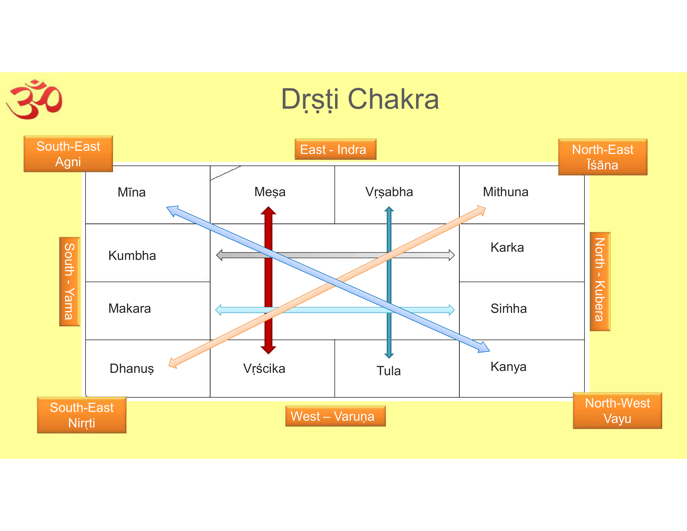

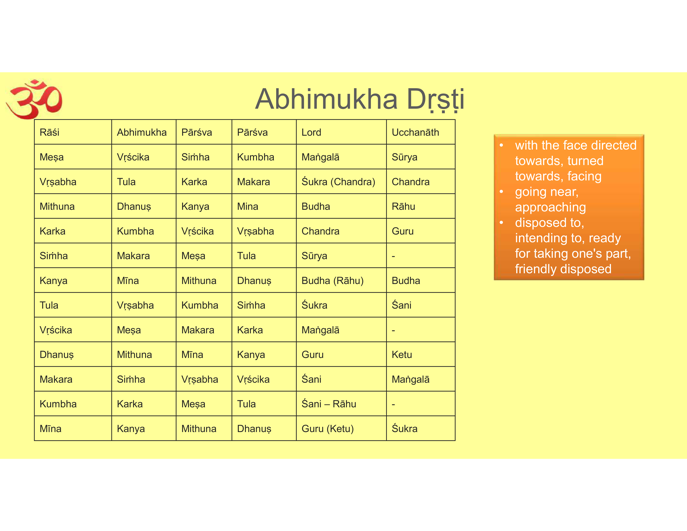

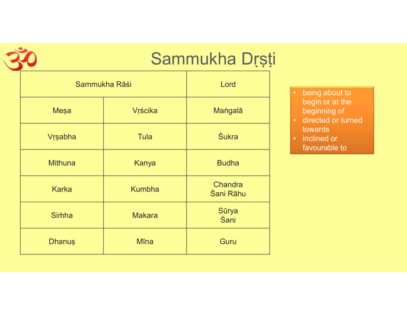

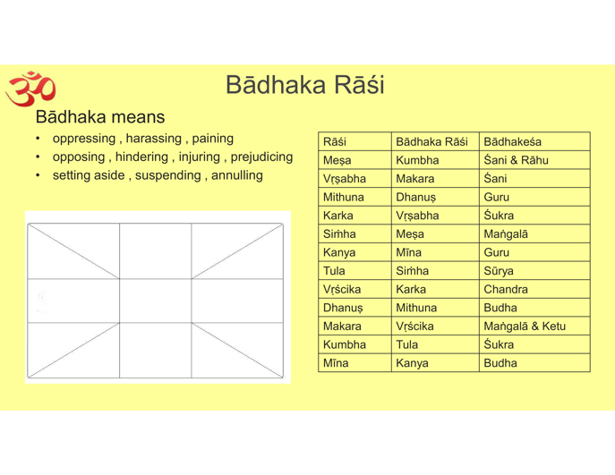


## Lesson 13

<div>

> **Caution**
>
> I’ll provide a comprehensive summary of this Jyotish (Vedic astrology)
> lesson on Bhavas (houses):
>
> ## Core Concepts
>
> **Bhava Definition** - Bhavas are not static areas of life but dynamic
> states of mind, attitudes, sentiments, and experiences - They grow and
> expand based on knowledge and awareness - Three ways to define bhavas:
> Narayana (rashi-based), Bhava Chakra (degree-based), and Bhava Chalita
> Chakra
>
> **Bhava Names** The 12 houses have specific Sanskrit names that reveal
> their significance: Lagna, Dhana, Sahaja, Sukha, Putra, Ari, Yuvati,
> Randhra, Dharma, Karma, Labha, Vyaya
>
> ## Bhava Groups and Underlying Principles
>
> **Kendras (1st, 4th, 7th, 10th)** - Vishnu/Moon concept - Most
> important houses - the four pillars of life - Visualized as a
> four-petal lotus - Only houses we have direct access to - 1st & 7th:
> High tide (high emotions) - birth/coming and going/journey - 4th &
> 10th: Low tide (rest/relaxation) - home and work - Planets in kendras
> cooperate and support each other
>
> **Konas (5th, 9th)** - Lakshmi/Shiva concept - Resources and knowledge
> that sustain life - Represent prosperity and dharma - 5th house:
> Future, mantra, prayers, visualization, children - 9th house: Past,
> guru knowledge, father, lineage, dharma - When bhava lords are placed
> in konas, they show what you pray for or admire
>
> **Dusthanas (6th, 8th, 12th)** - Shani/Saturn concept - Represent
> sorrow, sin, and karmic debts - Planets here have “taxes” to pay - 6th
> house: Weaknesses (shadripu), temptations, lifestyle choices,
> celibacy - FREE WILL - 8th house: Past sins (rina), karmic debts,
> unseen diseases - NO FREE WILL - 12th house: Losses, foreign
> residence, blame
>
> **Upachaya Houses (3rd, 6th, 10th, 11th)** - Free will houses - Have
> potential to grow and develop - Lagna lord in 3rd/6th: Manta Yoga
> (extreme intelligence) - Lagna lord in 10th/11th: Siddha Yoga (huge
> achievements) - 3rd: Choice of weapon/expression - 6th: Dealing with
> enemies/temptations - 10th: Keeping promises, work - 11th: Gains -
> what you’re willing to accept/take
>
> **Trikona (3rd, 6th, 11th)** - Brahma houses - Contribute to our
> creation - 3rd & 6th: Creation part - 11th: Delivery part - Related to
> Rahu (cause of birth) - 6th house: Body creation (with Brahma) - 12th
> house: Mind creation (with Saraswati)
>
> ## Practical Examples
>
> **Travel & Foreign Residence** - 7th house: Journey and movement (not
> residence) - 10th house: Away from home - 12th house: Foreign
> residence/settlement - 3rd house: Short-term travel - 9th house:
> Freedom to travel (visa/permits)
>
> **Children** - Male chart: 5th house for progeny - Female chart: 9th
> house for progeny, conception, pregnancy
>
> **Judgment of Bhavas** - Benefic planets in a house bring happiness
> (sukha) - If bhava lord is in kendra/kona from lagna, that bhava is
> empowered - Example: 6th lord in kendras strengthens celibacy, can
> delay marriage
>
> **Lord Placement** - From lagna: Shows our experience of that bhava -
> From the bhava itself: Shows resources available to that bhava - In
> kendra: God-given, accessible - In kona: Need to pray for it, seek
> knowledge - In dusthana: Sin/sorrow attached
>
> ## Key Teachings
>
> - Increasing knowledge of bhavas changes their quality
> - Each bhava has multiple names revealing different aspects
> - Mantras (5th house) include all mental repetitions, not just
>   Sanskrit prayers
> - Your mantra is your best friend or worst enemy
> - Malefics in houses show specific challenges related to that house’s
>   significations
>
> The lesson emphasized understanding WHY classical texts say what they
> do, not just memorizing combinations.

</div>

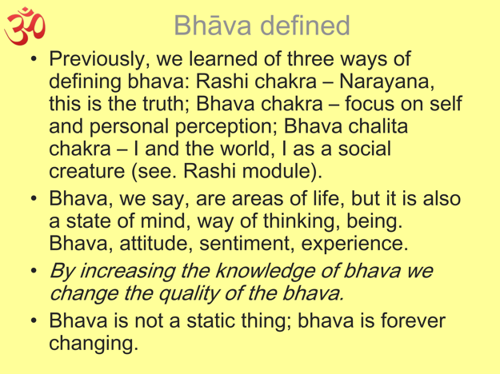


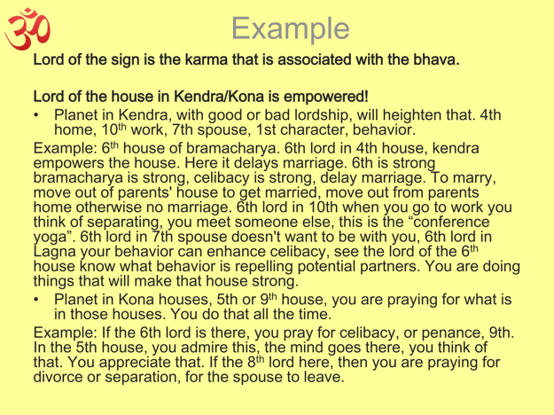

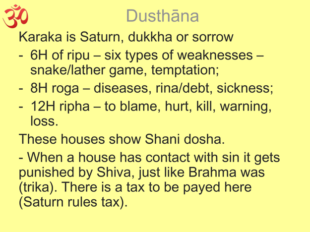

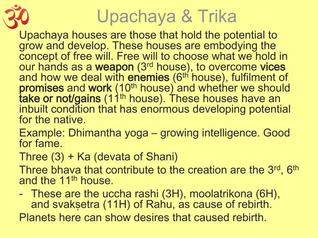

## Lesson 14

<div>

> **Caution**
>
> I’ll provide a comprehensive summary of this Vedic astrology lesson on
> Bhava lords (house lords). This is a detailed technical lecture, so
> I’ll organize it systematically.
>
> ## Core Framework: Four Essential Templates
>
> The instructor emphasizes creating **templates** for understanding how
> bhava lords function, focusing on the first four house lords.
>
> ------------------------------------------------------------------------
>
> ## 1. LAGNESHA (1st Lord) - The Fire Element
>
> **Key Principle**: Lagnesha functions like **Agni (fire)** - similar
> to Mars and Surya, as they rule the 1st house in Kalpurusha.
>
> **The Burning/Digesting Effect**: - Wherever Lagnesha sits, it “burns”
> or “digests” that house’s resources - Even Lagnesha in Lagna causes a
> burning/cleansing process before positive outcomes - Resources are
> taken from the house where Lagnesha sits and added to the 1st house
>
> **Houses from Lagnesha (Pacha Lagna)**:
>
> **Positive Houses (what we like/support)**: - **Kendras (1st, 4th,
> 7th, 10th)**: Houses we can directly access, our pillars of life -
> **Konas (5th, 9th)**: Knowledge and resources we can obtain - **3rd
> house**: Parakrama - courage, spiritual potential, effort - **4th
> house (Mars aspect)**: Joy, security (but also Mars’s neecha -
> fragile, needs protection) - **7th house**: How people feel when
> interacting with us; cooling effect - **8th house (Mars aspect)**:
> Desire to intervene; what we must resolve to rise - **10th house**:
> Success, exalted state (Mars’s uchcha)
>
> **Negative Houses (Gupthanas - what we reject)**: - **6th, 8th, 12th
> from Lagnesha**: Things we don’t like or want
>
> **Additional Layers**: - **2nd house**: Public/professional enjoyment
> (dhyana) - **12th house**: Private life/intimacy (mining) - **High
> tide houses (1st, 7th)**: High emotions, strong attachment - **Low
> tide houses (4th, 10th)**: Rest, less emotional charge
>
> **Three Ganas from Lagnesha**: - **6th house**: Rakshasa gana - where
> we show no mercy; people may fear us - **8th house**: Deva gana -
> enjoyment without control; addictions/obsessions - **12th house**:
> Manushya gana - selfishness, hoarding tendencies
>
> ------------------------------------------------------------------------
>
> ## 2. DHANESHA (2nd Lord) - Wealth & Attitude
>
> **Key Principle**: Shows our **attitude toward wealth** and what we
> consider valuable (not just money).
>
> **Important Houses from Dhanesha**: - **3rd house**: Social
> enterprise - efforts to gain wealth - **4th house**: Attitude toward
> wealth (sharing vs. hoarding) - **5th house**: **Source of wealth** -
> **6th house**: Meetings/interactions needed to gain wealth - **7th
> house**: Debts we must take - **9th house**:
> Agreements/responsibilities for wealth - **11th house**: Source of
> expenditure (opposite of 5th) - **12th house**: **Who controls the
> wealth** (if afflicted, can lose everything)
>
> ------------------------------------------------------------------------
>
> ## 3. SAHAJAYESHA (3rd Lord) - Efforts & Spirituality
>
> **Key Principle**: Shows where we put **effort** and our **Guru
> Padasha** (spiritual path). Also relates to
> **copulation/relationships**.
>
> **Important Houses from Sahajayesha**: - **3rd house**: Object of
> efforts - where we gladly work hard - **4th house**: Where we’re
> tired/impatient, don’t want effort - **5th house**: **Reasons for
> interaction/copulation** - **7th house**: Fulfillment of desires
> (especially sexual/relationship) - **9th house**: What comes
> naturally/easily to us - **10th house**: Source of partners (including
> sexual partners); also moksha through guru padasha
>
> **Note**: 3rd house combines Mars (courage, aggression) with Mercury
> (intellect) - creates the dilemma between spiritual path (flute) and
> worldly action (mace).
>
> ------------------------------------------------------------------------
>
> ## 4. SUKHESA (4th Lord) - Happiness & Purity
>
> **Key Principle**: The **guardian** providing sukha (happiness).
> Functions like Moon (both karaka and lord). Represents **purity** and
> Vishnu consciousness.
>
> **Important Houses from Sukhesa**: - **3rd house**: Tarana -
> tests/conditions we must pass to reach happiness - **4th house**:
> Places of comfort/enjoyment - **5th house**: **What we fear** (Moon’s
> neecha in Scorpio) - fragile area causing anxiety - **7th house**:
> Icha - desires we think will make us happy - **8th house**: What we
> neglect (people who may be unhappy due to our happiness) - **9th
> house**: **Vishnu - ultimate objective of happiness** - **10th
> house**: Negative karma preventing happiness - **11th house**: Values
> of our purity (Moon’s uchcha in Taurus)
>
> ------------------------------------------------------------------------
>
> ## Critical Counting Rules
>
> **From Lagna Lord ONLY** (exception): - Lagna → Lord = suffering -
> Lord → Lagna = achievement
>
> **For ALL other lords**: - Lord → Bhava = suffering - Bhava → Lord =
> achievement
>
> ------------------------------------------------------------------------
>
> ## Methodology Guidance
>
> 1.  **Draw these templates first** - they’re your foundation
> 2.  **Add details gradually** - karakas, yogas, aspects, etc.
> 3.  **Use real charts** from astro-databank for practice
> 4.  **Mark exceptions** in red to investigate later
> 5.  **Don’t judge from one placement** - need confirmation from
>     multiple angles
> 6.  **Natural lords matter**: Each bhava lord carries essence of
>     Kalpurusha lord (e.g., all lagneshas have Mars/Surya qualities)
>
> ------------------------------------------------------------------------
>
> ## Key Teaching Points
>
> - Bhavas are **dynamic**, not static - they grow with knowledge
> - Lords show **karma associated with that bhava**
> - Lord in Kendra/Kona from Lagna = **empowered bhava**
> - Bhava groups (Kendra, Kona, Dusthana, Upachaya, Trika) have
>   **underlying principles**
> - This is **first layer only** - more layers (yogas, arudhas, etc.)
>   come later
>
> The instructor emphasized this is a **template approach** - learn the
> systematic framework first, then add complexity through practice and
> additional study.

</div>


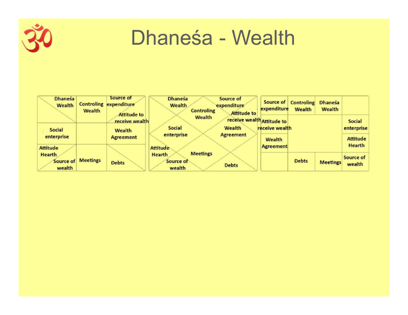


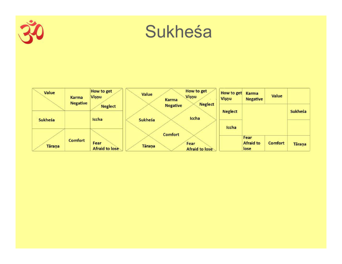

## Lesson 15

<div>

> **Caution**
>
> I’ll provide a comprehensive summary of this Jyotish webinar on
> Bhavesha (house lords). This covers lessons on the 4th-7th house
> lords:
>
> ## Core Teaching Philosophy
>
> **Bhava as Dynamic Experience** - Bhavas are not static but grow with
> knowledge and awareness - They represent states of mind, attitudes,
> and experiences - “By increasing knowledge of bhava we change the
> quality of the bhava”
>
> ## 5th House Lord (Mantraesha) - Key Principles
>
> **Natural Energies:** - Carries energy of Surya (natural 5th lord) and
> Jupiter (karaka) - Creates “trines” that shine - wherever 5th lord
> sits, 5th and 9th from there also illuminated
>
> **Main Effects:** - Shows where we apply ourselves, what we study and
> learn - House opposite (7th from 5th lord) stays in darkness - what we
> neglect - Linked to Agni planets (Sun/Mars/Ketu) = love of Jyotish
> study - Shows what we love and have devotion for
>
> **Negative:** When linked to 6th/8th/12th houses (Saturn’s domain) =
> clash of Sun/Saturn energies, can show taxation through that house
>
> ## 6th House Lord (Shastraesha) - Detailed Template
>
> **Core Nature:** - “Master of vices” - represents shadripu (six
> weaknesses/toxic thoughts) - Has “dirt” that contaminates 2nd and 12th
> houses from its placement - Karaka: Saturn; Natural lord: Mercury
>
> **Key Drishtis to Check:** - **3rd from 6th lord:** Growth potential
> (Saturn’s future aspect) - **10th from 6th lord:** What mind dwells on
> (Saturn’s past focus) - **7th from 6th lord:** What enemies/thieves
> want to steal
>
> **Special Combination:** - 6th lord in 1st/8th house: Anger when
> hungry (due to Agni/Mars connection)
>
> **Important:** 6th house = lifestyle choices (free will), unlike 8th
> house (karmic debt, no free will)
>
> ## 7th House Lord (Daresha) - Most Complex
>
> **Natural Energies:** - Heavy Rajas (Shukra as lord and karaka) -
> Connected to Vaiyo (movement) and Shiva Linga - Saturn has digbala
> here
>
> **Relationship Protection:** - **4th from 7th lord:** Internal
> protection in relationship (if afflicted = internal
> problems/bickering) - **8th from 7th lord:** External protection
> (affairs, outside dangers) - **7th from 7th lord:** Highest desire for
> relationship (Shukra’s icha)
>
> **Other Key Houses:** - **9th from 7th lord:** Vivaha dharma - where
> marriage finds fulfillment - **3rd from 7th lord:** Shiva’s
> blessing/curse on couple - **10th from 7th lord:** Related to Shiva’s
> blessings - **11th from 7th lord:** Potential health issues
>
> **Compatibility Rule (VERY IMPORTANT):** - For couples, 7th lords
> should be in kendra to each other - This = blessing of Vayu and Shiva
> = couple walks life path together - Alternative: 7th lords in signs of
> same planet, or connected by parivartana - Without this: Bio
> (separation) through coldness, distance, lack of communication
>
> **Critical Distinction:** - 7th house = your state/experience of
> relationships - 7th lord = the actual partners/people coming into your
> life - 7th lord in dusthana from 7th = lack of availability of
> partners - BUT once you have partner, then Parashara’s results
> manifest
>
> ## 8th House Lord (Ashtamesha) - The Redemption House
>
> **Core Understanding:** - Shows past life karma - both blessings and
> debts - “Why did this happen to me?” feeling = past life deeds - Two
> types of taxes: **Health tax** (2nd from 8th lord) and **Wealth tax**
> (5th from 8th lord)
>
> **Key Principles:** - **Stay with 8th lord and clean it up** - this is
> your debt to pay - Check who the 8th lord is (Moon/Mercury/Venus etc.)
> to understand type of suffering
>
> **Three Salvations (Relief from 8th Lord):** 1. 8th lord in good house
> 2. 8th lord in good sign  
> 3. **8th lord conjoined benefic** = blessing from past life (Rudra’s
> blessing)
>
> **Important Houses from 8th Lord:** - **2nd:** Health tax (check graha
> there for body part affected) - **3rd:** Where coldness helps
> spiritual progress (Saturn’s growth) - **4th:** Immediate relief (run
> here when pressure is high) - **5th:** Wealth tax, who suffers
> financially - **7th:** Icha (desire) but manifests as **cruelty** -
> DON’T RUIN THIS HOUSE - **8th:** External pressure - best to avoid/run
> away from - **9th:** Naraka (hell), places you get kicked out of -
> **10th:** Mantra that can heal 8th house - **11th:** Snakes talking -
> backstabbing, cruel language, provocation (don’t respond!)
>
> **Remedies (Natural 8th House Solutions):** - Respect astrologers and
> doctors - Work on higher/spiritual self - Follow yamas/niyamas (do’s
> and don’ts) - Rishi mantras - Don’t kill, steal, lie, betray - Observe
> dietary discipline
>
> **Teacher’s Personal Example:** - Dhanu lagna, 8th lord Moon in 9th
> with Sun (Amavasya dosha) - Malefic effect: War trauma, alcoholic
> father, many deaths witnessed - BUT Jupiter conjunct = blessing
> activated at age 15-16 - Result: Became vegetarian, started meditation
> = complete life change - 4th from 8th lord (12th house) gave relief
> through meditation and living abroad
>
> ## Critical Teaching Points
>
> **Common Mistakes to Avoid:** 1. Not checking both karaka AND natural
> lord of house 2. Forgetting that lord’s placement from lagna = our
> experience 3. Forgetting that lord’s placement from bhava = resources
> available to that bhava 4. Not considering dignity
> (exaltation/debilitation), yogas, parivartana, combustion, curses 5.
> Relying on ready-made tables instead of understanding principles
>
> **Why No Ready-Made Tables:** - Creates lazy minds - Growth comes from
> working through each combination - Must understand WHY rishis said
> what they said
>
> **When Two Lords (Dual Signs):** - Study both lords - See which is
> stronger, more prominent - Check which links to lagna or atmakaraka -
> Two lords = confusion in that area of life - For 7th house: Be careful
> if 7th and 12th share same lord
>
> **Philosophy on 8th House:** - Never discuss 8th lord problems with
> clients directly (energy too heavy) - Instead: Give remedies, show
> relief paths, warn what to avoid - Focus on solutions, not doom -
> Nothing is black and white - always many layers and colors - Nothing
> lasts forever
>
> ## Practical Application
>
> The teacher emphasized that for any prediction, you need: - Who is the
> lord (planet) - What is the dignity (exalted/debilitated/etc.) - What
> yogas are formed - Any parivartana - Any combustion/afflictions -
> Conjunction with benefics/malefics
>
> This is a complete framework for understanding how house lords operate
> based on their natural lordship, karaka, and the specific principles
> governing each house.
>
> Would you like me to elaborate on any specific house lord or
> principle?

</div>


## Lesson 16

<div>

> **Caution**
>
> I’ll provide a comprehensive summary of this Jyotish lesson on
> Bhavesha (house lordships), focusing on the final four houses
> (9th-12th).
>
> ## Core Teaching Principles
>
> **Important Limitations:** - Cannot make final conclusions based
> solely on bhavesha placement - Must consider: strength (bala), yogas,
> karaka influences, and divisional charts - Bhavesha analysis is one
> layer of a complete chart reading
>
> **Two Ways to Analyze Bhavesha:** 1. **As Karaka**: Shows
> destiny/divine support (hand of God) 2. **As Natural Lord**: Shows
> external efforts required
>
> ## 9th House - Bhagyesha (Lord of Fortune)
>
> **Primary Concept:** Source of fortune and luck
>
> **Key Analysis Points:** - Where 9th lord is placed = source of your
> fortune - 9th lord well-placed from lagna = experience happiness from
> that house - 9th lord well-placed from 9th house = resources available
> to that bhava
>
> **Critical Houses from Bhagyesha:**
>
> **Rudra Tests (3rd & 10th from 9th lord)** - Shani’s 3rd & 10th
> drishti: - Must keep these houses pure - 3rd from 9th lord: Financial
> issues if afflicted - 10th from 9th lord: Sorrow/depression if
> afflicted - Failure in these tests blocks fortune
>
> **Security Houses (4th & 8th from 9th lord)** - Mangal’s aspects: -
> 4th: Security in birth family - 8th: Security in established family -
> Malefics here = insecurity, not belonging
>
> **Kama Drishti (7th from 9th lord)**: - Shows what you think you need
> to achieve for happiness - Very sensitive house
>
> **Expansion (2nd from 9th lord)**: - What naturally expands your
> fortune - Malefics here block this expansion
>
> **Rishi Entrance (12th from 9th lord)**: - Where spiritual knowledge
> enters - Malefics block this flow - Check sapta rishis and lordship
>
> **Bhakti & Support:** - 5th from 9th lord: Seed of bhakti, mantra -
> 9th from 9th lord: Highest fortune support
>
> **Critical Rule:** 9th house must be kept pure - remedies essential
> for tamasic grahas in 9th house, especially Rahu (biggest problem)
>
> ## 10th House - Karmesha (Lord of Karma/Work)
>
> **Primary Concept:** HOW we work (not what job we do) - our work
> attitude
>
> **Four Karakas:** 1. **Budha** (primary): Skills and desire for work
> 2. **Shani**: Labor/effort willing to put in, failures 3. **Guru**:
> Success and fruits of work 4. **Surya**: Societal need for our work
>
> **Grahas in 10th Show Work Style by Ritu (Season):** -
> **Surya/Mangal/Ketu** (Grishma-summer): Work intensely early, need
> rest after - hot season pattern - **Shukra** (Vasant-spring): Demand
> comfort, aesthetics in workplace - **Chandra** (Varsha-rainy): Prefer
> closed spaces, need roof overhead - **Budha** (Sharad-autumn): Must
> know fruits of labor before starting - **Guru** (Hemanta-festival):
> Positive attitude, enjoy work itself - **Shani/Rahu** (Shishira-cold):
> Slow but steady, can work in difficult conditions
>
> **Key Houses from Karmesha:**
>
> **Labor Houses (3rd & 10th from 10th lord)** - Shani drishti: - 3rd:
> Mental labor, new ideas, new projects (Budha brings new) - 10th:
> Physical labor, mastering old projects (Shani improves existing)
>
> **Success & Dharma (5th & 9th from 10th lord)** - Guru aspects: - 5th:
> Attainment of fruits of labor - 9th: Dharma in how we do work
>
> **Job Changes:** - 8th from 10th lord: New job (same field, different
> company) - 11th from 10th lord: Complete career change (engineer to
> painter) - 4th from 10th lord: Why we stop working (health leave,
> vacation, firing)
>
> **Motivation (7th from 10th lord)**: - Shows what motivates us to
> work - Malefics here affect motivation quality
>
> **Blessings:** Where 10th lord placed = blessings of Durga and Kubera
> (energy to do work)
>
> ## 11th House - Labesha (Lord of Gains)
>
> **Primary Concept:** Measurement of time in this life, rebirth house
>
> **Karaka:** Guru (so 5th & 9th from 11th lord = confusion, lack of
> knowledge)
>
> **Key Houses from Labesha:**
>
> **Effort & Transformation (3rd & 10th from 11th lord)** - Shani
> drishti: - 3rd: Intelligence efforts to increase gains - 10th:
> Ability/willingness to transform for quality time on earth
>
> **Objective (11th from 11th lord)**: - Shows what we really want to
> gain
>
> **Wealth (2nd & 4th from 11th lord)**: - 2nd: Daily cash flow - 4th:
> Actual stored wealth
>
> **Balance & Rejuvenation:** - 7th from 11th lord: Perfect balance in
> gains/losses, satisfaction point - 6th from 11th lord: Where we
> rejuvenate, energy flows
>
> **Spiritual Perspective:** Gaining = buying (future payback); Losing =
> liberation (spiritually better)
>
> ## 12th House - Vyayesha (Lord of Liberation/Loss)
>
> **Primary Concept:** Liberation, moksha - lord wants to set us free
>
> **Karakas:** - Shani (primary) - Ketu (exalted) - Shukra (exalted) -
> Together = Tapasvi Yoga (great spiritual achievement ability)
>
> **Critical Concept - HAMMER HOUSES (3rd, 10th, & placement of 12th
> lord)**: - These are where losses can hit hard - Shani drishti from
> Vyayesha
>
> **The Requirement:** Must not be greedy, must be willing to
> give/sacrifice
>
> **TRIGGER (4th from 12th lord)**: - This is the “rope” holding the
> hammers - Keep this house clean = hammers won’t hit - If 12th lord in
> lagna, respect mother - If in 2nd, respect kids/students, pure mantras
>
> **Other Key Houses:**
>
> **Vices (7th from 12th lord)**: - What vices we’re prone to - Must be
> very careful here
>
> **Prayer & Temple (5th & 9th from 12th lord)**: - 5th: How we
> pray/meditate (graha shows deity preference) - 9th: Our temple, puja
> place
>
> **12th House Rules:** Immune system, losses, very important for
> marriage, requires regular meditation
>
> ## General Principles Across All Houses
>
> **Malefic Influence Levels:** 1. One malefic = nervousness (comes and
> goes) 2. Two malefics = problem requiring solution (has solution) 3.
> Three malefics = problem from inside, very difficult to remedy (both
> vayu and agni present)
>
> **Mitigation:** Benefic conjunct malefic provides some relief
>
> **Retrograde Benefics:** Bring stubbornness, won’t give up easily
>
> **Multiple Lordships:** Stronger lord determined by: - More
> conjunctions - Higher dignity - “Democracy principle” - majority rules
>
> This lesson emphasizes understanding the underlying principles and
> logic of why classical texts say what they do, preparing students for
> the Bhavadhyaya module where they’ll study all 144 combinations of
> house lords in houses.

</div>

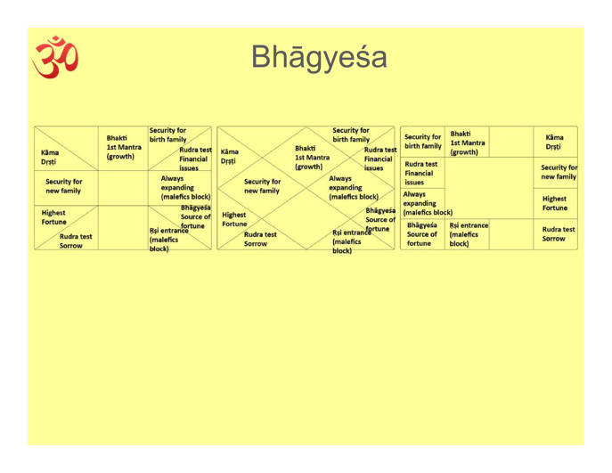

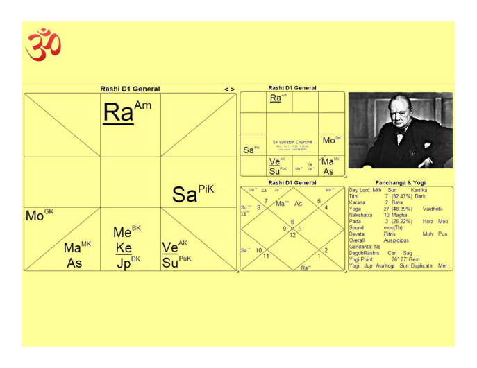


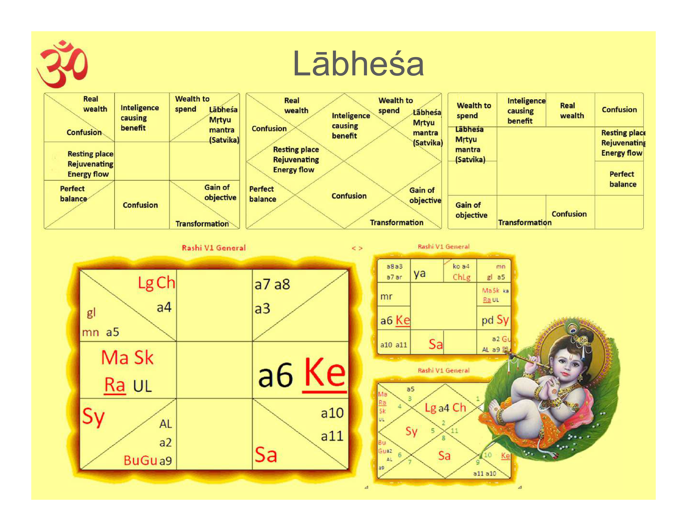


## Lesson 17

<div>

> **Caution**
>
> I’ll provide a comprehensive summary of this Vedic astrology lesson on
> Aprakasha Grahas (invisible planets). This is quite detailed, so let
> me break it into digestible sections.
>
> ## Core Concept: What are Aprakasha Grahas?
>
> **Aprakasha Grahas** are five invisible celestial points (not physical
> planets) that can eclipse or disturb the five Pancha Tattwas
> (elements). They are:
>
> 1.  **Dhuma** - afflicts Agni (fire)
> 2.  **Vyatipata** - afflicts Prithvi (earth)
> 3.  **Parivesha** - afflicts Akasha (space/ether)
> 4.  **Indrachapa** - afflicts Jala (water)
> 5.  **Upaketu/Apaketu** - afflicts Vayu (air)
>
> These are called “aprakasha” (without light) because they are
> invisible points that can disturb or destroy the light/purity of the
> tattwas.
>
> ## The Papa Purusha Chakra
>
> This is visualized as an **upside-down man** (stick figure in black),
> representing how these points function:
>
> - **Dhuma** - in the head (starts from Scorpio, moves forward)
> - **Vyatipata** - right hand (starts from Libra, moves backward)
> - **Parivesha** - left hand (starts from Virgo, moves forward)
> - **Indrachapa** - right leg (starts from Leo, moves forward)
> - **Upaketu** - left leg (starts from Cancer, moves backward)
>
> **Key principle**: Left arm and right leg work together (move in
> harmony), as do right hand and left leg.
>
> ## How to Read Results
>
> When reading Parashara’s results for these grahas in houses, you read
> from the Lagna BUT the results correspond to their “starting” rashi:
>
> - Dhuma in 1st house = Scorpio-like results (8th house nature)
> - Dhuma in 2nd house = Sagittarius-like results (9th house nature)
> - And so on…
>
> ## Three Levels of Interpretation
>
> **Level 1: Rashi Dispositor (Physical Manifestation)** - If Aprakasha
> graha is alone in a house, see the **lord of that rashi**
> (dispositor) - The dispositor’s placement shows WHERE and HOW the
> affliction manifests physically - **Exception**: If dispositor is in
> own sign/mulatrikona/exaltation, the sin is cleared - the graha cannot
> reach that high dignity
>
> **Level 2: Nakshatra Dispositor (Mental/Emotional)** - See the
> nakshatra lord (using **reversed order** for Papa Purusha) - Shows
> mental attachments, emotional afflictions, what the mind gets stuck
> on - Uses special reversed nakshatra lordship (Ketu↔Buddha, etc.)
>
> **Level 3: Conjunction with Planets** - If Aprakasha graha is
> **conjoined another planet**, that planet gets afflicted - Most
> important to check: **Surya dispositor, Chandra dispositor, and Lagna
> lord** (the three “self points”) - Surya dispositor afflicted →
> affects progeny, lineage, wealth - Chandra dispositor afflicted →
> affects body, health, longevity (sharira) - Lagna lord afflicted →
> affects intelligence, knowledge, brain, fame
>
> ## Practical Application Steps
>
> 1.  Calculate the five Aprakasha grahas
> 2.  Check if any conjoin the three critical dispositors (Sun, Moon,
>     Lagna)
> 3.  If yes, note which one and what it afflicts
> 4.  If not conjoined, see the rashi lord to understand manifestation
> 5.  Read Parashara’s results for that house placement
> 6.  Optionally check nakshatra dispositor for mental/emotional
>     dimension
>
> ## Example: Aishwarya Rai’s Chart
>
> - Only **Parivesha** (afflicts Akasha) was conjoined a planet
> - It conjoined **Buddha** (Lagna lord) in 3rd house
> - Affliction to Lagna = affliction to intelligence/brain
> - Akasha affliction = things spreading wild, too much importance/fame
> - Dispositor: Ketu in 10th house (work) + Mars in 8th
> - Manifestation: Issues with work due to volatile relationship with
>   boyfriend at the time
> - **Parivartana** between Buddha and Ketu = eventual resolution
>
> ## Remedies
>
> - Don’t worship Papa Purusha itself
> - If you find a dosha/curse linked to Aprakasha graha:
>   1.  Remedy the main issue/curse directly, OR
>   2.  Do specific Shiva mantra for that Aprakasha graha
> - Only remedy if it’s causing actual problems in the chart
>
> ## Important Notes
>
> - These are NOT more important than other chart factors - see the
>   chart holistically first
> - They manifest through their dispositors - they cannot act alone
> - If dispositor is in high dignity, the affliction is neutralized
> - Always use reversed nakshatra order for Papa Purusha calculations
>
> Would you like me to clarify any specific aspect of this material?

</div>

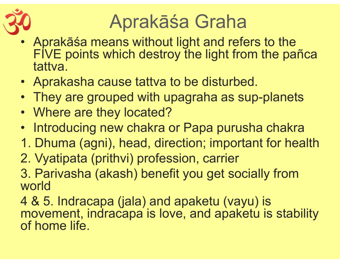

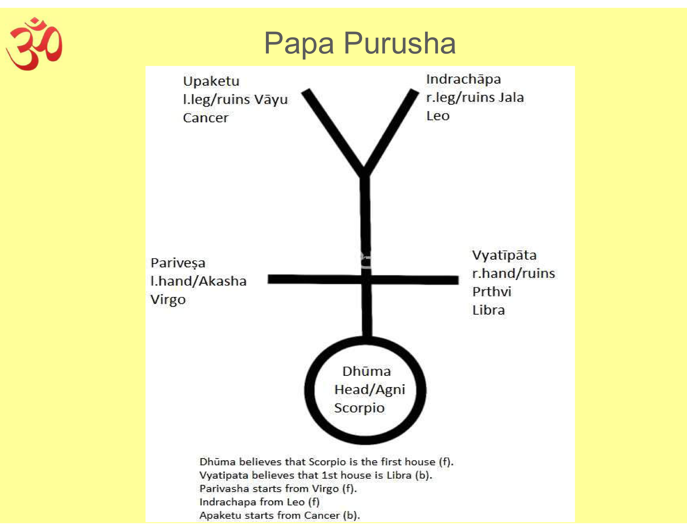


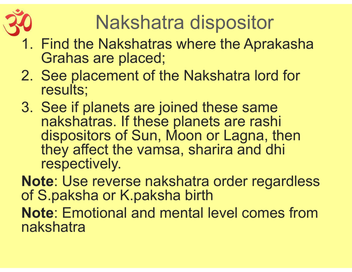

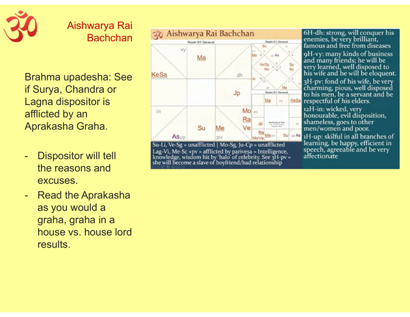

## Lesson 18

<div>

> **Caution**
>
> I’ll provide a comprehensive summary of this Vedic astrology lecture
> on **Upagrachas (shadow planets)** from the PJC-1 course.
>
> ## Core Concepts
>
> **What are Upagrachas?** - Mathematical points (not physical bodies)
> showing the strongest influence of planets on Earth - Called “children
> of the grahas” who do the actual work of their parent planets -
> Calculated at beginning, middle, or end of time portions (velas) -
> This course focuses on 7 Upagrachas calculated at the middle point
>
> **Two Key Analysis Points:** 1. **Rashi Lord** - Shows how the karma
> manifests in life (what actually happens) 2. **Nakshatra Lord** -
> Shows the thoughts/desires before action (what you want/think)
>
> ------------------------------------------------------------------------
>
> ## The Seven Upagrachas
>
> ### 1. **KALA (Child of Surya/Sun)**
>
> - **Signifies:** Resources, life path, wealth and power potential
> - **Rashi Lord:** Shows HOW you get resources
> - **Nakshatra Lord:** Shows WHAT you want/why you want to establish
>   yourself in society
> - Related to Raja Yoga concepts
> - Exalted/debilitated lords bring abundance
>
> **Example - Steve Jobs:** - Kala in Makara (6th house) with Buddha -
> Shani (rashi lord) exalted in 3rd house → resources through own
> effort, discipline - Mars (nakshatra lord) in 9th house → global
> ambitions, protection-focused - Shows journey from orphanage to
> massive wealth through communication/technology
>
> ### 2. **PARIDHI (Child of Chandra/Moon)**
>
> - **Signifies:** Spiritual success, empathy, how we function with
>   living beings
> - **Rashi Lord:** Shows spiritual progress achieved
> - **Nakshatra Lord:** Shows diksha (spiritual inputs/information)
>
> **Example - Swami Vivekananda:** - Paridhi in Tula (11th house) -
> Venus (rashi lord) + Buddha parivartana with Shani → Tapasvi Yoga
> (spiritual achievement) - Guru (nakshatra lord) in 11th house →
> formalizing occult knowledge globally - Created famous divisions of
> yoga (Karma, Bhakti, Jnana, Raja)
>
> ### 3. **MRITYU (Child of Mangala/Mars)**
>
> - **Signifies:** Death, demise
> - **Rashi Lord:** Shows bodily protection
> - **Nakshatra Lord:** Shows prana (life energy) sustenance
>
> **Example - Christopher Reeve (Superman actor):** - Mrityu in
> Vrishabha - Moon (rashi lord) debilitated, conjunct Mars, with Ketu
> influence → body lost protection (spine damaged) - Mars (nakshatra
> lord) in home sign → strong prana, survived decades in wheelchair
>
> ### 4. **ARTHA PRAHARA (Child of Buddha/Mercury)**
>
> - **Signifies:** Learning and earning from profession
> - **Rashi Lord:** Shows how much you EARN from profession
> - **Nakshatra Lord:** Shows what you LEARN for profession
>
> **Example - Albert Einstein:** - Nakshatra lord Ketu in 2nd house →
> endless learning, thinking beyond boundaries - Ketu in 6th lordship →
> Manta Yoga (high intelligence, wants to change things) - Ketu-Moon
> parivartana → infinite learning potential - Surya (rashi lord) in 10th
> house → fame and earning through position
>
> ### 5. **YAMAGHANTAKA (Child of Guru/Jupiter)**
>
> - **Signifies:** Divine protection, self-realization, warning system
> - **Rashi Lord:** Shows how you EARN protection (what deeds)
> - **Nakshatra Lord:** Shows what you LEARN about protecting yourself
> - Rings the bell when danger comes
>
> **Example - Abraham Lincoln:** - Yamaghantaka in Rishabha - Mars
> (nakshatra lord) in 9th house → wanted to establish protection
> globally (fight against slavery) - Venus (rashi lord) exalted with
> Guru → protection established - Mars-Rahu conjunction + Rahu in Marana
> Karaka Sthana → died after winning war
>
> ### 6. **KODANDA (Child of Shukra/Venus)**
>
> - **Signifies:** How you fight battles to protect yourself
> - Defense vs. offense approach
> - Related to **Graha Nitis** (four strategies):
>   1.  **Sama** (Guru/Moon) - Compromise, debate
>   2.  **Dana** (Venus/Buddha) - Bribing (smile or money)
>   3.  **Danda** (Surya/Mars/Ketu) - Direct physical conflict
>   4.  **Bheda** (Shani/Rahu) - Strategic, finding weaknesses, divide
>       and rule
>
> **Example - Adolf Hitler:** - Kodanda in Vrishchika - Shani (nakshatra
> lord) in Karka 10th house → Bheda niti (strategic, persistent,
> building revenge plans) - Mars (rashi lord) in Marana Karaka Sthana →
> death when revealing plans
>
> ### 7. **GULIKA (Child of Shani/Saturn)**
>
> - **Signifies:** Poison, staying clean
> - **Rashi Lord:** Shows what you DO to stay clean
> - **Nakshatra Lord:** Shows how you LEARN to stay clean
> - Too much poison can kill (Gulika dasha can be dangerous)
>
> **Example - Ramakrishna Paramahamsa:** - Gulika in Sagittarius (11th
> house) - Guru (rashi lord) in 5th house, aspected only by exalted
> Venus → high purity achieved - Venus (nakshatra lord) exalted → very
> high ambition for purity - Guru-Venus (Guru Yoga) → learned both
> spiritual and material
>
> **Contrast - Hitler:** - Both rashi and nakshatra lords in Marana
> Karaka Sthana → collecting poison, not cleansing
>
> ------------------------------------------------------------------------
>
> ## Important Bhava Groups Review
>
> ### **Kendras (1, 4, 7, 10)** - Vishnu/Moon concept
>
> - Four pillars of life (four-petal lotus)
> - Only houses we can directly access
> - Planets cooperate with each other
> - 1st & 7th: High tide (high emotions)
> - 4th & 10th: Low tide (rest/low emotions)
> - Lord in Kendra/Kona = house empowered
>
> ### **Konas (5, 9)** - Lakshmi/Shiva concept
>
> - Resources that sustain life
> - Knowledge houses
> - 5th: Future, mantra, prayers, visualization
> - 9th: Past, guru, father, dharma
> - Lord in Kona = praying for that house
>
> ### **Dusthanas (6, 8, 12)** - Shani concept
>
> - Saturn’s sorrow, sin, taxes
> - 6th: Weaknesses (shadripu), free will, lifestyle choices
> - 8th: Past sins (rina), no free will, karmic debts
> - 12th: Losses, foreign residence
>
> ### **Upachaya (3, 6, 10, 11)** - Free will houses
>
> - Growth and development potential
> - Lagna lord in 3rd/6th: Manta Yoga (intelligence)
> - Lagna lord in 10th/11th: Siddha Yoga (achievements)
>
> ### **Trika (3, 6, 11)** - Brahma houses
>
> - Contribute to creation
> - 3rd & 6th: Creation part
> - 11th: Delivery part
> - 6th: Body created (with Brahma)
> - 12th: Mind created (with Saraswati)
>
> ------------------------------------------------------------------------
>
> ## Key Principles
>
> 1.  **Exalted planets** show high ambition/dignity, but position
>     matters for power
> 2.  **Debilitated planets** show low ambition/bars set too low
> 3.  **Parivartana** (exchange) needs to be triggered to manifest
> 4.  **Marana Karaka Sthana** planets bring death/problems when
>     activated
> 5.  **9th house placements** indicate global/worldly scope
> 6.  **Nodes (Rahu/Ketu)** show thinking beyond boundaries
> 7.  Check **conjunctions** and **parivartanas** to understand full
>     picture
>
> ------------------------------------------------------------------------
>
> ## Practical Notes
>
> - Software: Sri Jyoti Star and Deva.Guru calculate properly
> - Monday (Mandi) will be studied later with conception charts
> - Study groups being formed for next module (Bhavadhipati)
> - Always analyze from **Lagna** for personal experience
> - Always check both rashi lord AND nakshatra lord
>
> This comprehensive system shows how mathematical points reveal the
> deepest karmic patterns and life purposes through planetary children
> doing their parent’s work.

</div>

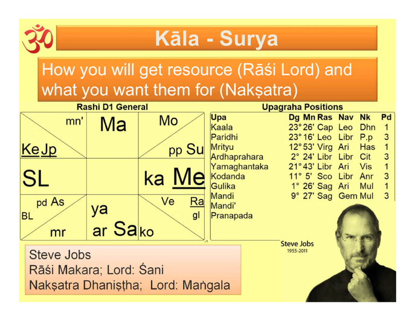

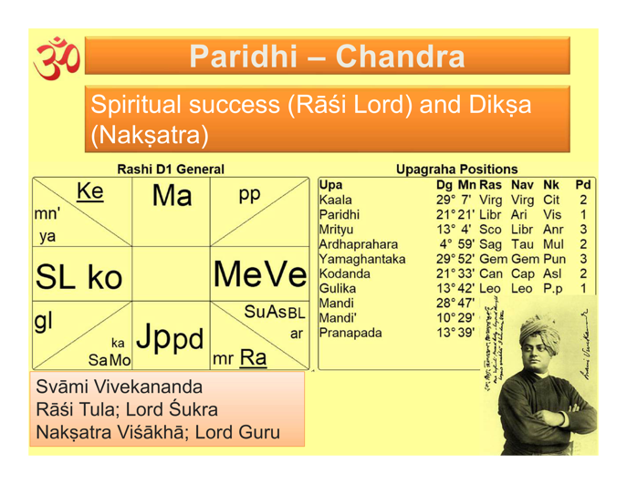


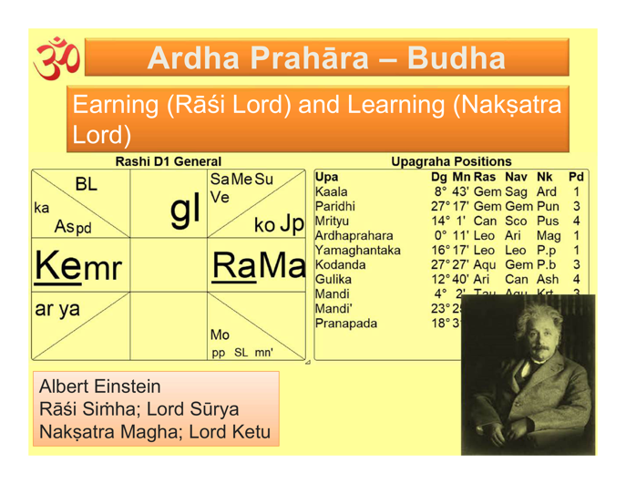


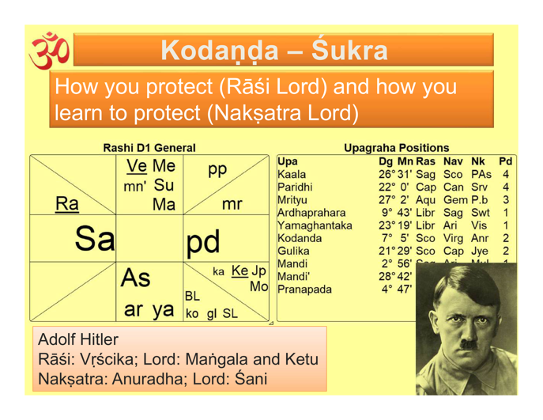

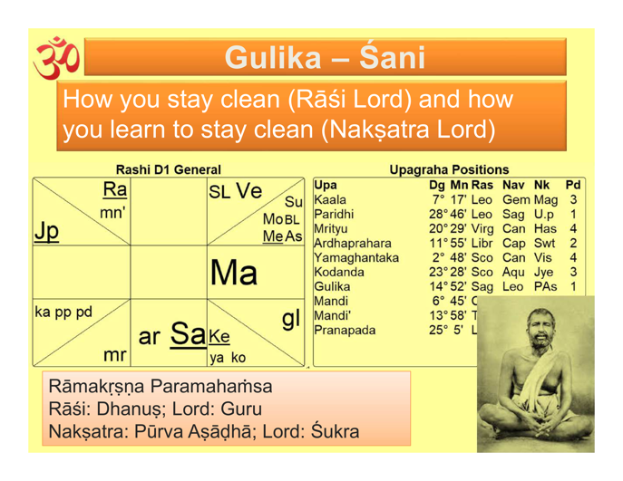

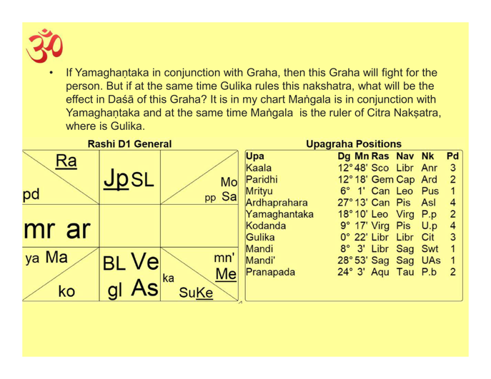

## Lesson 19

<div>

> **Caution**
>
> I’ll provide a comprehensive summary of this Vedic astrology (Jyotish)
> lesson on Vishesha Lagnas (Special Ascendants).
>
> ## Overview of Vishesha Lagnas
>
> **Five Special Lagnas** - calculated with uniform circular motion,
> independent of regular lagna: - Based on Pancha Mana (five aspects of
> mind) - Calculated from sunrise + sun’s degree at sunrise - Move at
> uniform speed (unlike regular lagna’s 2-hour average)
>
> **Formula**: Time from sunrise (in hours) × multiplier + Sun’s degree
> at sunrise - Bhava Lagna: ×1 (maps to 1st house) - Hora Lagna: ×2
> (maps to 2nd house)  
> - Ghatika Lagna: ×5 (maps to 5th house) - Prana Pada: ×20 (maps to 8th
> house) - Vighati Lagna: ×25 (advanced study)
>
> ## Three Main Vishesha Lagnas (studied as group)
>
> ### 1. Bhava Lagna - The Self’s Perception
>
> **Represents**: Mind’s impression of 1st house matters - approach,
> attitude, views of self
>
> **Key Points**: - Can fall in 1st, 2nd, 3rd, 11th, or 12th from
> lagna - Distance from lagna = degree of distortion in self-view - 2nd
> house placement: ahead of yourself, progressive, future-thinking -
> 12th house placement: behind yourself, regressive, dwelling in past -
> Makes you “not a typical \[sign\]” - attitudes differ from lagna
>
> **Connection to Lagna**: - If linked: self-knowledge, self-realization
> possible - If unlinked: distortion remains, but still influences
> behavior - Graha linking them acts as bridge for understanding
>
> **Example - Barack Obama**: - Makara lagna (shy from conflict,
> work-focused) - Bhava lagna in Kumbha (2nd house) with Ketu - Result:
> Progressive thinker, welcomes debate (unlike typical Makara) - Ketu:
> possibly introverted, introspective
>
> ### 2. Hora Lagna - Wealth & Resources
>
> **Represents**: Mind’s perception of wealth, what you value, resources
> available
>
> **Key Principle**: “Hari sustains us” - all resources, food,
> sustenance
>
> **Critical Rules**: - **Agni planets** (Sun, Mars, Ketu) needed for
> earning capacity - Agni should be in Hora lagna OR 2nd OR 10th from
> Hora lagna - **Ketu in 1st or 8th from Hora**: destiny loss of wealth
>
> **What You Value** (by house placement): - 1st/7th: Self/spouse -
> 2nd/8th: Family, community/debts, hidden wealth - 3rd/9th: Courage,
> siblings/knowledge, dharma (check Mangal/Guru for honesty) - 4th/10th:
> Home, mother/work, karma - 5th/11th: Children, creativity/gains,
> friendships - 6th/12th: Service, health/foreign, spirituality
>
> **Important Houses**: - 5th from Hora: What motivates you to earn -
> Connection to lagna: Brain knows where to find money
>
> **Spiritual Warning**: Don’t dirty where Hora lagna is placed - keep
> that house pure or lose resources
>
> **Example - Obama**: - Hora lagna in 9th house (values knowledge,
> education, worldview) - Rahu (hora lord) aspects lagna - creates
> link - Mercury also links (7th house, graha drishti) - Earnings: Books
> and speaking (Mercury), hidden sources (Rahu-Mangal in 8th)
>
> ### 3. Ghatika Lagna - Power & Position
>
> **Represents**: Emotions, power, fame, position - “makes things
> happen”
>
> **Key Principle**: Jala (water) connection essential - Need emotional
> connection with people - Support from right people to gain/maintain
> power
>
> **Critical Analysis**: - **Jala on Ghatika**: Can have power - **4th
> from Ghatika**: Popularity, connection to people (need more jala) -
> **5th from Ghatika**: Where you seek power - **12th from Ghatika**:
> Who/what can pull you down
>
> **Tactics to Pull Down** (12th house planets): - Shani: Scandal, bad
> health, fall from grace, retirement - Rahu: Speculation, scandal,
> doubt - Shukra: Bribery through sweet talk - Buddha: Bribery with
> money
>
> **Yogas**: - Planet linking lagna + Ghatika = **Yogada** - Planet
> linking lagna + Hora = **Varada**  
> - Planet linking all three = **Mahayogada** (can activate with
> mantra/gemstone)
>
> **Example - Obama**: - Ghatika in 5th house with Moon (strong jala) -
> Shani aspects lagna - creates link - Power source: 9th house
> (education, mentors) - 4th from Ghatika (8th house): Rahu-Mangal, no
> jala - disconnect from people due to military/war affairs - Gained
> power in Guru-Guru, Guru-Chandra dashas (both link to Ghatika)
>
> ### 4. Prana Pada - Life Force
>
> **Represents**: Where sun’s ray/prana falls at birth - source of
> strength
>
> **Calculation**: Same formula ×20, **plus correction**: - Sun in
> movable sign: no correction - Sun in dual sign: +120° - Sun in fixed
> sign: +240°
>
> **Auspicious Placements** (per Parashara): - Lagna, 5th, 9th (konas) -
> 4th, 10th (kendras) - 11th house - *Note: Some debate about 2nd house*
>
> **Key Concepts**: - House with Prana Pada = empowered, has most
> prana - Lord of Prana Pada = also empowered - Planets joining Prana
> Pada = get life force - Weak Prana Pada = lack of vitality, strength
>
> **Advanced Uses**: - Birth time rectification - Link to devatas -
> Spiritual practices - What you love/hate (6th/8th from Prana Pada) -
> Controlling prana through pranayama
>
> ## Practical Application
>
> **Charts to Create**: - Can make separate Bhava/Hora/Ghatika chakras
> (add ±15° from special lagna degree) - These show pure mind perception
> (no rashis, no resources) - Useful for psychological understanding
>
> **When to Use**: - Check D1 first for connections - If no link in D1,
> check D3 (karma can bridge gap) or D9 (destiny/post-marriage) - For
> Hora: also check D2 - For Ghatika: also check D5
>
> **What Links Mean**: - Rashi drishti: Permanent, always there - Graha
> drishti: Need desire/effort, dasha-dependent - Parivartana: Exchange
> bridges gap - Any connection helps
>
> ## Important Warnings
>
> 1.  **Gemstones**: Can activate Mahayogada but use caution - may
>     strengthen one area while weakening another (Rajas, not Satwa)
>
> 2.  **Keep Pure**: Don’t “dirty where you eat” - maintain purity of
>     house where Hora/special lagnas fall
>
> 3.  **Free Will**: Remember these are mind perceptions - actual
>     manifestation depends on lagna applying itself
>
> ## Key Takeaway
>
> Vishesha Lagnas show how your mind perceives different life areas.
> When connected to lagna, you can access these resources/understanding.
> When disconnected, potential exists but you may not utilize it. They
> work as independent “candles” in your chart that lagna can reach for.
>
> Would you like me to clarify any specific aspect of these special
> lagnas?

</div>


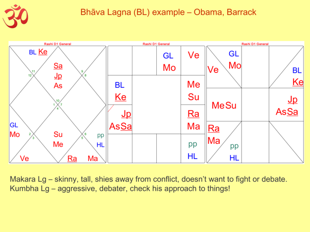


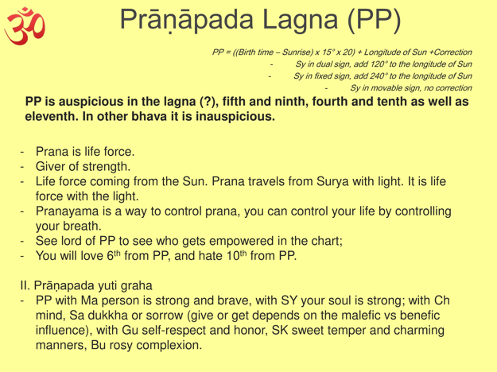

## Lesson 20

<div>

> **Caution**
>
> I’ll provide a comprehensive summary of this Jyotish webinar on
> **Achada Nadrishti** (Auspicious Aspects):
>
> ## Core Concept
>
> Achada Nadrishti refers to special planetary aspects that form *before
> birth* and reveal what brings happiness, security, and fulfillment.
> The term “achada” means auspicious - this technique focuses on
> positive indications only.
>
> ## The Seven Achadas
>
> **1. Surya Bhava (7th from Sun)** - Shows what the *soul* desires -
> Represents karma resolution - either through family (pitris) or
> spiritual path (devatas) - Can indicate life purpose and soul-level
> intentions
>
> **2. Chandra Bhava (9th from Moon)** - What the *mind* needs to feel
> happy and secure - If unfulfilled, person cannot be truly happy -
> Multiple planets here = multiple conditions for happiness (can be
> challenging to balance)
>
> **3. Mangala Bala (11th from Mars)** - Shows our *strength* and how we
> deal with the material world (bhuloka) - Not just physical strength -
> includes logic, strategy, how we “fight” - More planets here = more
> strength sources
>
> **4. Buddha (1st house - where Buddha is placed)** - Related to
> *speech, friends, and what we study* - Shows communication style and
> social circle - Dispositor reveals quality of friendships
>
> **5. Guru Upadesha (3rd from Jupiter)** - What *advice/teachings* we
> receive - Shows nature of gurus and spiritual guidance - Can reveal
> pressure or burden from teachings
>
> **6. Shukra (5th from Venus)** - Related to *progeny* - ability to
> have children - Most important house for assessing fertility - If
> blocked here, other indications won’t manifest
>
> **7. Shani** - Not covered (Shani, Rahu, Ketu don’t have achadas as
> they’re malefic)
>
> ## Key Principles
>
> **Overlapping Achadas**: Same house can be multiple achadas
> simultaneously - these work together, not in conflict
>
> **Parivartana**: Don’t shift planet positions when calculating
> achadas - keep planets where they are
>
> **Retrograde**: Don’t change counting direction for retrograde planets
>
> **Afflictions**: Check if achada house/lord is afflicted - shows
> obstacles to fulfillment
>
> **Dispositors**: Always check where the lord of achada house is placed
> and its condition
>
> ## Chart Examples Analyzed
>
> 1.  **Henry VIII** - 7th from Sun (Taurus) afflicted by Rahu/Shani
>     scissors = marriage problems; 9th from Moon has Rahu (7th lord) =
>     security through marriage but unstable
>
> 2.  **Osho** - 9th from Moon (Leo) lord in 12th from Moon in 6H =
>     desires things he rejects when obtained; Ketu (6L) in 3rd from
>     Jupiter = controversial teachings
>
> 3.  **Nick Vujicic** (born without limbs) - 11th from Mars has 4
>     planets = great inner strength despite physical challenges
>
> 4.  **Amma (Hugging Mother)** - Buddha conjunct Sun = not known for
>     speeches but for touch/hugging; 4th house focus = purity brings
>     security
>
> 5.  **Jiddu Krishnamurti** - 3rd from Jupiter (8H) with Ketu, lord
>     (Sun) in zero digbala = burdened by spiritual organization,
>     eventually rejected it
>
> 6.  **Octuplet Mother** - 5th from Venus (Sagittarius) is also 7th
>     from Sun, lord (Jupiter) is atmakaraka in 2H = soul’s desire for
>     large family; Mars in 9th from Moon = prefers independence
>
> ## Important Technical Points
>
> - **Papa Kartari**: Malefics flanking a house (12th and 2nd from it)
>   creates problems
> - **Shubha Kartari**: Benefits flanking strengthens the house
> - **Marana Karaka Sthana**: When planet is in difficult house from
>   itself (Sun/Jupiter/Shani in 6th from themselves, Venus in 4th,
>   Mars/Moon in 12th, Buddha in 3rd)
> - **Dignity matters**: Always check strength, dignity, and aspects on
>   achada house and its lord
>
> Would you like me to elaborate on any specific achada or example?

</div>

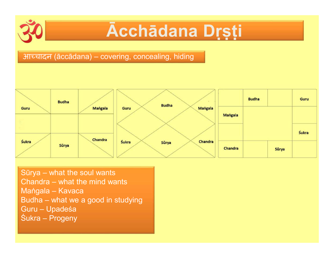

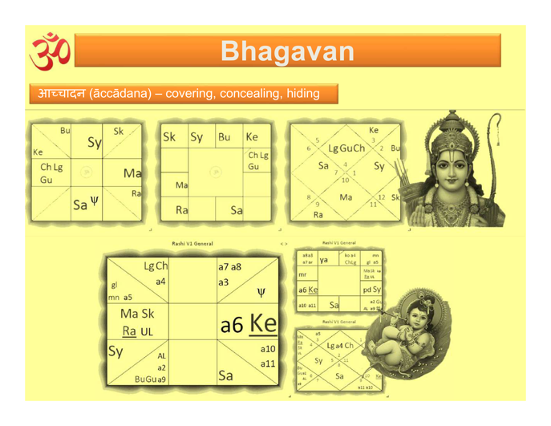


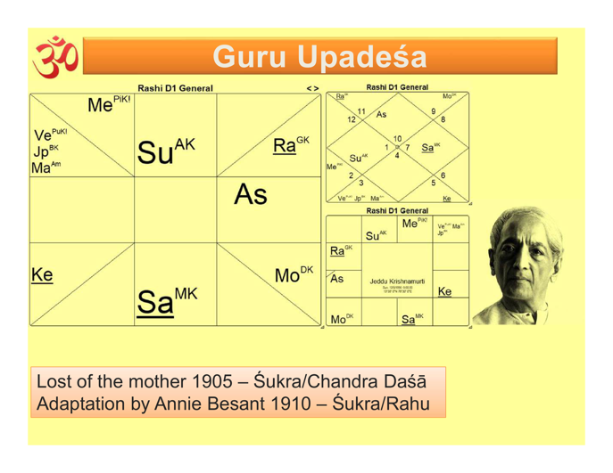

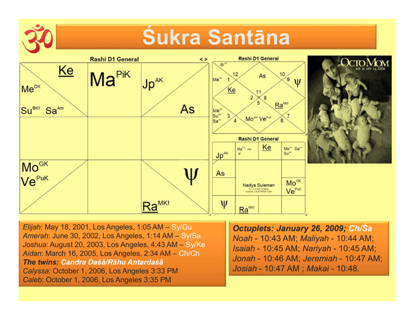

## Lesson 21

<div>

> **Caution**
>
> I’ll provide a comprehensive summary of this Jyotish webinar on
> Arishta (afflictions) and longevity. This is quite extensive, so I’ll
> organize it by major topics:
>
> ## Core Principles of Longevity Analysis
>
> **Age Restrictions**: Never predict longevity until a person is over
> 24 years old. Three categories exist: - **Balarishta**: Death in first
> 12 years (linked to Moon karma/mother’s side) - **Yogarishta**: Death
> between 12-20 years  
> - **Janamarishta**: Death between 20-24 years (linked to Sun
> karma/father’s side)
>
> Predicting longevity before 24 can cause the astrologer to acquire
> Gayatri dosha.
>
> ## Moon as Sustainer vs Sun as Initiator
>
> **Sun’s Role**: Brings the soul (father conceives soul through food
> months before conception), shows hereditary issues, ignites all
> beginnings
>
> **Moon’s Role**: Sustains life (mother provides blood/tissue, gives
> milk), represents body rejuvenation and longevity. Most arishta yogas
> involve afflicted Moon because Moon = sustainer of life.
>
> ## Saturn’s Essential Role
>
> No longevity discussion occurs without Saturn. In all dangerous
> combinations, Saturn is either: - Directly causing affliction, OR -
> Acting as karaka for the afflicted planet
>
> Saturn represents dukkha (sorrow), delay, decay, weakness—the
> underlying principle of Dusthana houses.
>
> ## Bhava Groups & Their Principles
>
> **Kendras (1,4,7,10)** - Vishnu/Moon concept: - Most important
> houses—the four pillars of life (visualized as 4-petal lotus) - Only
> houses we have direct access to - 1st & 7th = high tide (high
> emotions): birth/coming and going/journey - 4th & 10th = low tide
> (rest/relaxation): home and work - Planets in kendras cooperate and
> support each other
>
> **Konas (5,9)** - Lakshmi/Shiva concept: - Resources and knowledge
> that sustain life - 5th house: Future, mantra, prayers, visualization,
> children - 9th house: Past, guru knowledge, father, dharma - When
> bhava lords placed in konas: shows what you pray for/admire
>
> **Dusthanas (6,8,12)** - Shani concept: - Represent sin, sorrow,
> karmic debts (“taxes to be paid”) - 6th: Weaknesses (shadripu),
> lifestyle choices, temptations—HAS FREE WILL - 8th: Past sins (rina),
> karmic debts, unseen diseases—NO FREE WILL  
> - 12th: Losses, foreign residence, blame
>
> **Upachaya (3,6,10,11)** - Free will houses: - Can grow and develop
> through effort - Lagna lord in 3rd/6th = Dhimantha Yoga (extreme
> intelligence) - Lagna lord in 10th/11th = Siddha Yoga (great
> achievements)
>
> **Trika (3,6,11)** - Brahma houses: - Contribute to our creation - 6th
> house: Body creation (Brahma sits here) - 12th house: Mind creation
> (Saraswati sits here)
>
> ## Afflictions & Curses
>
> **Papakartari Yoga**: Planet “scissored” between two malefics (one in
> 12th, one in 2nd from it). Considered a type of curse.
>
> **Papa Yoga**: Malefic in 2nd OR 12th from planet (less severe)
>
> **Curse Definition**: Benefic afflicted by 2+ malefics (by conjunction
> or aspect). Requires remedy.
>
> **Severe Longevity Threat**: 3-4+ malefics afflicting longevity
> houses/Moon. Can reduce longevity by decades or entire “compartments”
> (36-year periods).
>
> ## Drishti Distinctions
>
> **Rashi Drishti**: Constant, permanent influence - Malefic rashi
> drishti: Permanent affliction affecting longevity - Benefic rashi
> drishti: Permanent protection (like mother always doing pujas)
>
> **Graha Drishti**: Desire-based, can be activated - Malefic graha
> drishti: Desire to inflict pain (shows specific emotions: Mars=anger,
> Rahu=betrayal/shock, Saturn=delay/sorrow, Ketu=accidents/mistakes) -
> Benefic graha drishti: Desire to protect (can activate through mantra)
>
> ## Marana Karaka Sthana
>
> Planets in specific houses become “death-inflicting”: - Shows dharmic
> debt related to that planet - Planet/person it represents may
> sacrifice most for you (often unrecognized) - **Key insight**: Houses
> lorded by Marana Karaka planets are MOST afflicted - Remedy: 40 days
> of Vishnu avatar mantra for that planet
>
> ## Naisargika Graha (12th House Planets)
>
> Any planet in 12th house = offering/sacrifice/expenditure
>
> **Four Main Marriage-Givers** (want marriage): 1. **Surya** (Sattva):
> Spiritual, dharmic marriage 2. **Chandra** (Sattva): Emotional,
> nurturing  
> 3. **Shukra** (Rajas): Physical attraction, aesthetics, “tall dark
> handsome” 4. **Rahu** (Tamas): Foreign, experimental,
> research-oriented
>
> **Marriage-Preventers** (cause celibacy/delay): - **Mars**: Celibacy,
> conflict, lack of sleep - **Ketu**: Wants children first (tests
> marriage), chaos - **Saturn**: Old man energy, delays, “no time” -
> **Mercury**: Excuses (need more education, not mature, money issues) -
> **Jupiter**: Most balanced (wants dharma + children, but also
> learning)
>
> **Key Points**: - Afflicted Naishta graha = suffering in
> finding/maintaining marriage - Multiple planets in 12th = they “fight”
> over who brings marriage - Rashi drishti to 12th by these 4 main
> planets = can bring spouse - Graha drishti to 12th = temporary
> relationships, affairs
>
> 12th house also shows: who you trust to sleep next to, rejuvenation,
> feet (direction you’re walking), gunas of mind.
>
> ## Protection Principles
>
> **Benefits Protect**: - Guru, Buddha, Shukra in kendras = always
> protect - Guru = protects life (Jiva karaka) - Buddha = protects
> body - Shukra = rejuvenation (Mritunjaya, nectar keeper) -
> **Shubhapati always protects** (dispositor of Moon = your sustainer)
>
> **One strong benefic in kendra can save everything** (kendras
> cooperate—Vishnu/Moon concept)
>
> **Nodes multiply effects** (retrograde planets behave similarly—3x
> strength)
>
> ## Protective Practices for Astrologers
>
> 1.  Only see charts during daylight (Sun’s protection)
> 2.  Regular mantra practice
> 3.  **Narayana Kavach** (procedural mantras for anyone):
>     - 6th house issues: Om Vishnave Namaha
>     - 8th house issues: Om Madhusudhanaya Namaha  
>     - 12th house issues: Om Vasudevaya Namaha / Om Namo Bhagavate
>       Vasudevaya
> 4.  If Buddha afflicted in your chart: Do all 3 Narayana mantras (40
>     days each)
> 5.  Ideal mantra rounds = number of words in mantra (minimum 108)
>
> ## Travel & Foreign Residence
>
> - 7th house: Journey, movement (NOT residence)
> - 10th house: Away from home
> - 12th house: Foreign residence/settlement
> - 3rd house: Short-term travel, neighboring areas
> - 9th house: Freedom to travel (visas, permits, law)
>
> ## Children in Charts
>
> - Male chart: 5th house for progeny
> - Female chart: 9th house (specifically conception/pregnancy)
>
> ## Practical Analysis Guidelines
>
> **When judging bhava lord placement**: - **From Lagna**: Shows YOUR
> experience of that bhava - **From the bhava itself**: Shows resources
> available TO that bhava
>
> **Example given**: 6th lord (celibacy) in kendras strengthens
> celibacy: - In 4th: Move out of parents’ home to marry - In 10th: Work
> causes separation (Conference Yoga) - In 7th: Partner-related reasons
> for celibacy - In 1st: Your behavior/choices cause celibacy
>
> **Chart Analysis Priority**: 1. First check planet IN the house
> (tenant = most important) 2. Then check lord of house (owner) 3. Then
> check drishtis
>
> ## Key Teaching Methodology
>
> Parashara’s shloka serve multiple purposes: 1. Specific extreme
> combinations (literal interpretation) 2. Teaching principles of
> affliction quantification 3. Basis for understanding curses,
> longevity, various yogas 4. Each shloka teaches different
> timing/prediction principles
>
> **Bhava are dynamic, not static**: They grow/change with knowledge and
> experience. “By increasing knowledge of bhava, we change the quality
> of bhava.”
>
> ## Example Analysis: Clint Black
>
> Chart with 8 planets in 6th house—why no longevity/mental issues?
>
> **Answer**: - No specific arishta yoga present (needs Moon severely
> afflicted + Saturn + longevity house connection) - All those planets
> create **Hora Lagna wealth yogas** (became millionaire musician) -
> Shubhapati (Moon dispositor) in own sign = Shiva’s blessing, mental
> strength - Benefits conjunct = knowledge, protection - 6th house
> planets brought fame, wealth, court cases (6th house themes) - Shukra
> in 6th = sacrificing partner (Marana Karaka principle) - Rahu in 12th
> (7th lord) = possible affairs, foreign elements in marriage
>
> **Lesson**: Don’t judge by house placement alone—look for specific
> yogas, benefic protection, and actual combinations described in
> shastras.
>
> ------------------------------------------------------------------------
>
> This webinar emphasizes that arishta combinations are specific and
> require multiple factors. Protection through benefits, proper
> remedies, and understanding the layered meanings in Parashara’s
> teachings are essential for accurate analysis.

</div>

``` python
# #| echo: false
# # slides(155)
# # slides(166)
# # slides(167)
slides(177)
slides(178)
slides(179)
slides(180)
slides(181)
# slides(182)
# slides(183)
# slides(184)
```

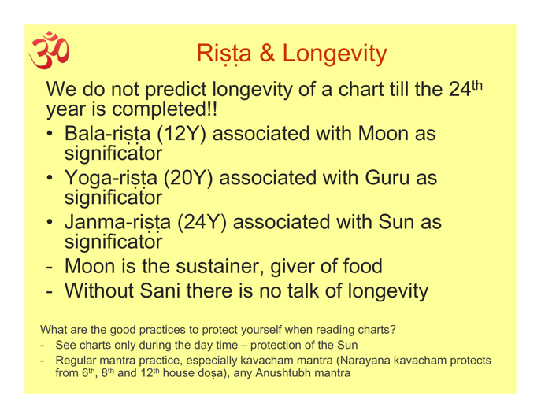


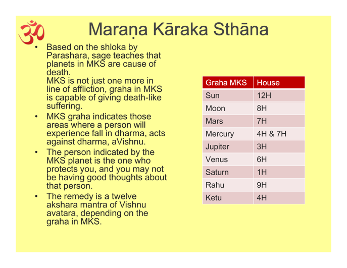


## Lesson 22

<div>

> **Caution**
>
> I’ll provide a comprehensive summary of this Jyotish lesson on
> Arishtas (dangers/misfortunes) related to parents.
>
> ## Core Teaching: Danger to Parents
>
> This lesson focuses on identifying combinations that indicate
> problems, suffering, or death of parents through various yogas
> (planetary combinations).
>
> ## Key Principles
>
> **Moon’s Fundamental Rule** - Moon dislikes the 12th house from
> itself - Moon in 5th house (afflicted by malefics) → danger to mother
> (4th house is 12th from 5th) - Moon in 10th house (afflicted) → danger
> to father - Moon in 8th house → danger to spouse
>
> **Grahas and Houses They Don’t Support** - Surya, Shani, Guru: 6th
> house from themselves - Chandra, Mangala: 12th house from themselves  
> - Buddha: 3rd house from itself - Shukra: 4th house from itself
>
> ## Major Yogas for Parental Danger
>
> **1. Parents Destroyed** - Buddha + Shukra in 2nd house with Surya +
> Rahu + Shani - Two different tattvas (Agni + Vayu) create destruction
> like fire with wind - Shows Pitri dosha; may be raised by aunt/uncle
>
> **2. Matriha (Mother’s Danger)** - Malefics in 7th AND 8th house from
> Moon - 7th house = Maraka (death-inflicting house) - 8th house = house
> of death
>
> **3. Goat Milk (No Mother’s Milk)** - Surya Ucha or Nicha in 7th
> house - Shows separation from mother or her death - 7th house = 4th
> from 4th (relationship with mother) - Strong Agni disrupts Jala tattva
> (emotions/nurturing)
>
> **4. Karaka Bhava Principle** - 4th from Moon = actual mother - 9th
> from Sun = actual father - If these houses are afflicted by malefics →
> danger to respective parent
>
> **5. Mrityu Bhava (Death Houses)** - **Rudras** = 2nd and 8th house
> lords (protect our Prana) - For father: 2nd and 8th from 9th house =
> 10th and 4th houses - For mother: Count Bhava Bhavam from 4th → 6th
> and 12th houses - Malefics in these houses can harm the parent
>
> **6. Blocking/Malika Yoga** - When 2 consecutive houses have malefics,
> the next house is blocked - Example: Guru in 1st + Shani in 2nd + Rahu
> in 3rd → 4th house (mother) destroyed - Must be at least 2 bhavas (one
> odd, one even = Ida and Pingala blocked) - Flow of Prana is
> interrupted
>
> **7. Chandra Kona** - Weak Moon (Krishna Ekadashi to Shukla
> Panchami) + malefics aspecting 5th and 9th from Moon - 5th and 9th =
> support houses; if blocked when Moon weak → danger
>
> **8. Yama Yoga** - Mars + Shani within 1 degree, in Kendra to Moon →
> problems for mother - Two tamasic grahas in Graha Yuddha (planetary
> war)
>
> **9. Unmada (Insanity/Death of Mother)** - Shani in 1st + Mars in
> 7th + Moon in 6th - Both in Marana Karaka Sthana (death-inflicting
> positions) - More severe than Mars in 1st + Shani in 7th (which is
> just tension)
>
> **10. Father Dies** - Guru in 1st + Surya/Mangala/Shani/Buddha in
> 2nd - Guru protects 9th house until marriage - When focus shifts to
> 7th house (marriage), 9th house loses protection
>
> **11. Pitri Karaka Affliction** - Surya Yuti malefics OR Papakartari
> (malefics on both sides) - Plus malefic in 7th from Surya → father’s
> death - Without 7th house malefic → only suffering (Kashta), not death
>
> **12. Pitri Kashta (Father’s Suffering)** - Surya in 7th + Mars in
> 10th + Guru/Rahu in 12th - Mars in 10th = Digbala (very strong) =
> Yama’s power activated - Mars doesn’t protect 9th house from 10th
> position
>
> **13. Surya Amsha** - Shani-Surya connection in Rashi + Surya in Mars
> Navamsha - Gulika (Shani’s child) = illness carrier - Mrityu (Mars’s
> child) = death carrier - Combination makes illness fatal
>
> **14. Parents Live Abroad/Adoption** - Malefics in 4th + 10th + 12th
> houses - All three Marakas afflicted → person completely uprooted -
> Can indicate foreign adoption
>
> **15. Guru Chandala (Guru-Rahu)** - In 6th, 1st, or 4th house →
> problems to father - Rahu eclipses Guru (Karaka of 9th house) - Rahu
> in 9th house = Marana Karaka Sthana - In Dikchakra: Guru = Ishana (NE,
> knowledge), Rahu = Nirriti (SW, chaos) - opposite directions - Rahu
> blocks Ishana direction where Guru aims
>
> ## Important Technical Points
>
> **Tattva Dosha** - One tattva afflicting = manageable (fire alone) -
> Two tattvas = destructive storm (fire + wind) - Three malefics =
> always involves 2 tattvas = curse level
>
> **Gradation of Affliction** - 1 malefic = tension - 2 malefics =
> problems needing solution - 3+ malefics = very serious problem
>
> **Drishti Types** - Graha Drishti = temporary problem, desire-based
> (like book on shelf) - Rashi Drishti = permanent problem,
> knowledge-based
>
> **Papakartari Yoga** - Malefics on both sides of house/planet =
> scissors cutting - The bhava/graha in between is hurt
>
> **12th House in Navamsha** - Acts like 8th house in Rashi chart -
> Related to death/spirituality - Navamsha houses shift: 5th in Navamsha
> = 1st in Rashi, 2nd in Navamsha = 10th in Rashi
>
> **Retrograde Planets** - Don’t shift lordship - Think they’re in the
> Rashi from Lagna - Example: Guru retrograde in 7th (Tula) thinks it’s
> in Mesha, but stays in 7th house - Shows stubbornness and strength
>
> ## Chart Examples Analyzed
>
> **1. Danilo Kiš** - Father alcoholic, violent, institutionalized, died
> in concentration camp - Partial yogas present - Surya-Shani in 2nd
> (Pitri dosha) - Mars in 9th from Surya (afflicting father’s house) -
> Multiple partial combinations = suffering occurred
>
> **2. Malcolm X** - Father died age 6, mother institutionalized age
> 14 - Drishti on Moon (Buddha + Mars connection + Shani aspect) -
> Matriha present (Shani in 7th from Moon, Mars lords 8th) - Karaka
> Bhava: Rahu in 4th from Moon, Ketu in 9th from Surya - Both parents
> were activists (Rahu-Ketu extremes) - Malika Yoga on 9th house
> (blocked by Mars and Rahu)
>
> **3. Bill Clinton** - Father died before birth - Moon in 10th (not
> 5th) = danger to father - Surya in Papakartari - Surya Amsha present -
> Moon afflicted by Mars, Shani, Ketu
>
> **4. Steve Jobs** - Given for adoption at birth - Only minor
> combinations: Ketu in 4th from Moon (conjoined Guru = good intention,
> mistake) - Surya in 7th (partial goat milk = distance from mother) -
> Shows one combination alone won’t cause demise
>
> **5. Harshan’s Chart** - Mother’s death - Only Chandra Kona present -
> Demonstrates one yoga alone typically insufficient
>
> ## Critical Teaching Points
>
> 1.  **Never judge from one principle alone** - Need multiple factors:
>
>     - Karaka (planet as significator)
>     - Bhava (house representing person)
>     - Karaka Bhava (house from karaka)
>
> 2.  **All three must be afflicted for severe results**
>
> 3.  **Use the template/checklist** to systematically check all
>     combinations
>
> 4.  **Partial yogas show suffering, not necessarily death**
>
> 5.  **Full yogas require exact conditions** - modifications reduce
>     severity
>
> 6.  **This is introduction only** - Complete analysis requires D12
>     (Dwadashamsha) chart for parents
>
> 7.  **Don’t jump to conclusions** - These are strong starting points
>     for investigation, not final verdicts
>
> 8.  **Benefits provide protection** - Guru, Shukra, Buddha can save
>     even in difficult combinations
>
> 9.  **Timing requires Dasha** - These yogas show potential, dashas
>     show when
>
> Would you like me to elaborate on any specific yoga or principle?

</div>

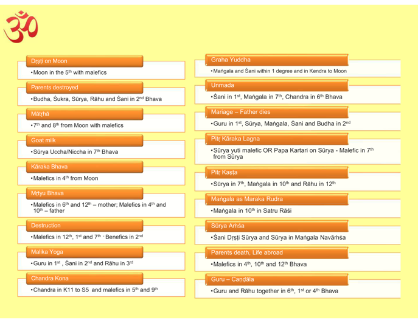

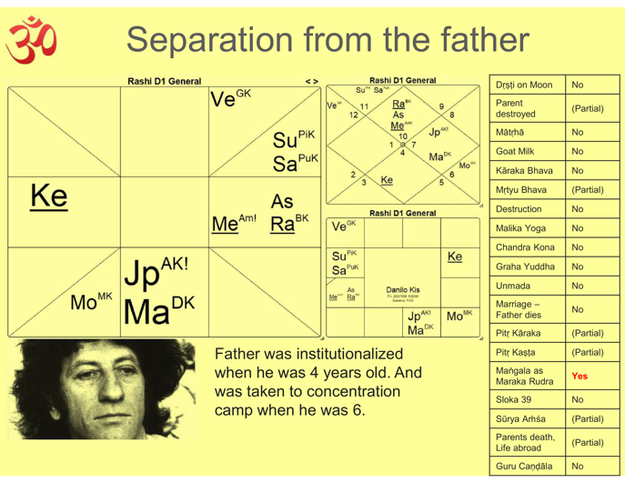

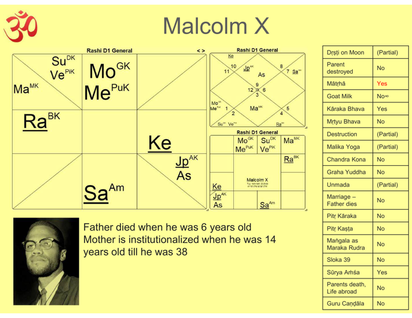


## Lesson 23

<div>

> **Caution**
>
> I’ll provide a comprehensive summary of this Jyotish lesson on the
> Dasavatara (10 incarnations of Lord Vishnu):
>
> ## Introduction & Personal Story
>
> The teacher shares how receiving a jade Ganesha statue and Vyasa
> yantra led to teaching this Parashara Jyotish course, emphasizing that
> students are exactly where they need to be despite difficulties faced
> during the year.
>
> ## Core Concepts of Avatar
>
> **Meaning of Avatar:** - “Ava” (descend) + “tarati” (cross over) =
> deliberate descent of deity from heaven - Avatar = Guru + Shakti of
> the guru coming together - Each avatar has an associated Mahavidya
> (shakti/mother form) - Hidden in Parashara’s first shloka is the
> parampara mantra: “Om Rama Krishnaya Namaha”
>
> **Why Avatars are Different from Humans:** - Souls have two parts:
> Jivatmansha (living being) and Paramatmansha (divine) - Avatars have
> higher proportion of Paramatmansha - We study avatars to increase our
> own divinity/sattvaguna
>
> ## Exaltation & Avatar Connection
>
> - Exalted planets represent the highest energy/purity (sattvaguna) of
>   that graha
> - Exalted planets are said to be avatars
> - Avatars descend from beyond Gunashunya (void beyond material worlds)
> - Mahapurusha yoga occurs when planets are in kendra in own/exalted
>   signs
>
> ## Types of Avatars
>
> - **Purusha avatars**: Uphold dharma/physical creation
> - **Lila avatars**: 25 listed in Bhagavat Purana (22 most crucial,
>   corresponding to 22 steps of Jagannath temple)
> - **Guna avatars**: Based on three gunas
> - **Yuga avatars**: Come at closing of yugas
> - **Manvantara avatars**: Teachers
>
> ## The Two Principal Lists
>
> **Parashara’s List (for Ishta Devata/spiritual practice):** 1. Sun -
> Ramachandra 2. Moon - Krishna 3. Mars - Narasimha 4. Mercury - Buddha
> 5. Jupiter - Vamana 6. Venus - Parashurama 7. Saturn - Kurma
> (tortoise) 8. Rahu - Varaha (boar) 9. Ketu - Matsya (fish) 10. Lagna -
> Kalki
>
> **Jagannath Temple List (for worldly affairs/Dharma Devata):** -
> Mercury: Balarama instead of Buddha (agricultural economy, designed
> plow) - Jupiter: Three stages - Upendra (sansara), Trivikrama (perfect
> brahmana), Vamana (moksha) - Venus: Rishikesh (householders) vs
> Parashurama (monks/overcoming karmas) - Rahu: Also worshipped as
> Sukhara (breath-giver, used during childbirth)
>
> ## Four Purna (Complete) Avatars
>
> Placed in kendras, having more Paramatmansha: 1. **Sri Rama** - Moon
> in lagna, Sun in 10th house (born at noon) 2. **Sri Krishna** - Moon
> in lagna, Sun in 4th house (born at midnight) 3. **Narasimha** - Moon
> and Sun together in lagna (born Krishna Chaturdashi) 4.
> **Varaha/Sukhara** - Moon in lagna, Sun in 7th house
>
> **Key chart requirement**: Moon MUST be in 1st house for any avatar
> (representing sattvaguna, compassion, sustenance)
>
> ## Important Teachings
>
> **Sadhu & Scorpion Story:** - Sadhu repeatedly saves drowning scorpion
> despite being stung - Lesson: Maintain your guna regardless of others’
> nature - Scorpion’s fear caused defensive reactions - We must not
> lower our standards based on others’ behavior
>
> **Krishna’s Gift:** - Sri Krishna came at beginning of Kali Yuga -
> Established Nama mantra (name itself as mantra) for this age - Even
> calling God’s name works as mantra in Kali Yuga - Our own name is our
> first mantra
>
> ## Practical Applications
>
> **Bhagavan Mantras (for vegetarians):** Can perform 40-day mantra
> practice for any troublesome planet/house lord
>
> **Special Mantras:** - For digesting knowledge: “Om Namo Bhagavate
> Vasudevaya” - For Mahapurusha yoga/kendra issues: “Om Namo Bhagavate
> Mahapurushaya”
>
> **Assignment:** Study each Dasavatara, list attributes, find pictures,
> study charts of Sri Rama (with Ramayana) and Sri Krishna (with
> Mahabharata)
>
> ## Key Principles
>
> - Bhavas are dynamic, growing with knowledge
> - Kendras (1,4,7,10) are four pillars we can directly access
> - Vishnu worship requires protecting His creation (vegetarianism,
>   purity)
> - Worshipping avatars increases our sattvaguna
> - Charts should be studied alongside sacred texts
>
> ## Closing Guidance
>
> - Students have learned more than they realize
> - Knowledge is stored within, accessed when needed
> - Focus on progress made, not what’s unknown
> - Keep daily sadhana practice
> - Year 2 enrollment opens in 1-2 months
>
> Is there any specific aspect you’d like me to elaborate on?

</div>


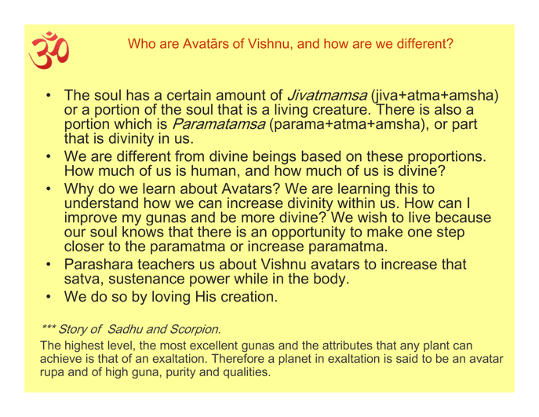

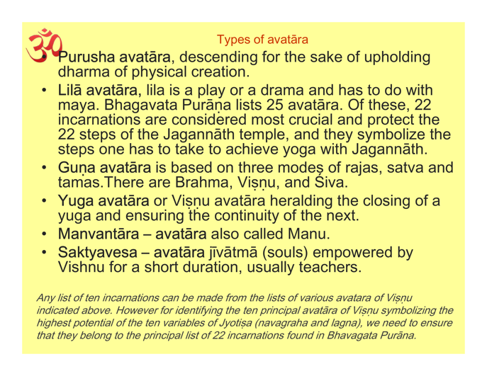

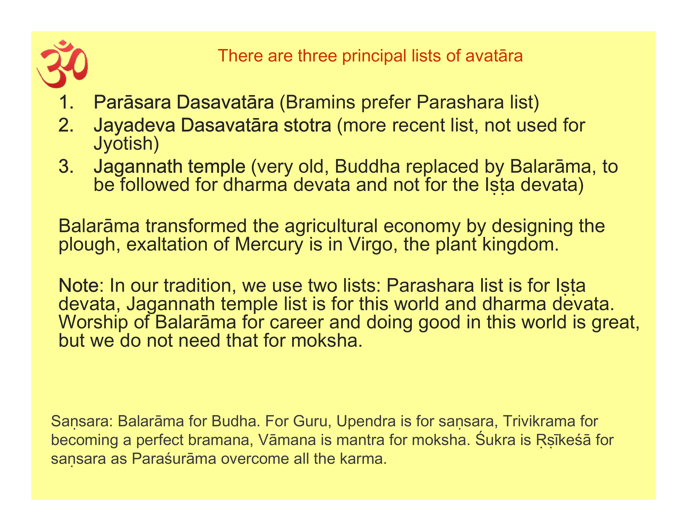

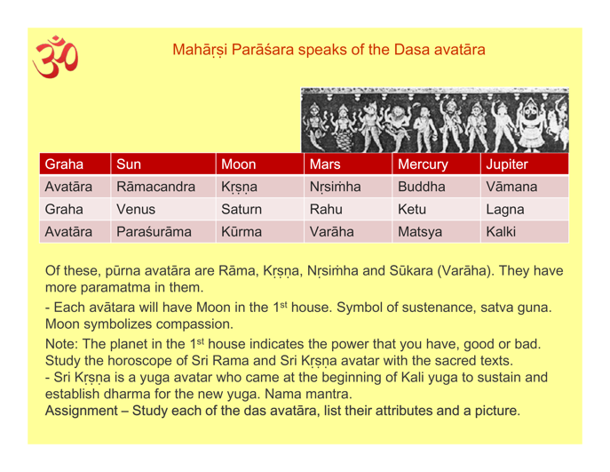

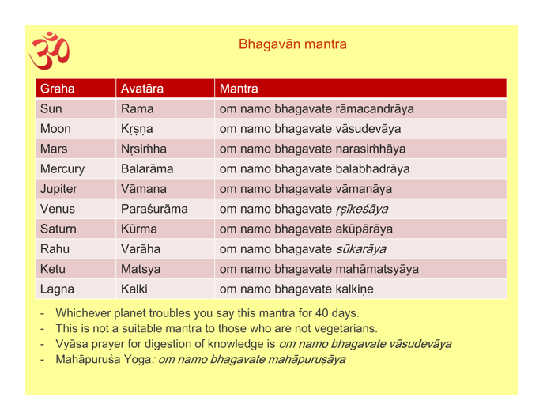


## Lesso 24

<div>

> **Caution**
>
> I’ll provide a comprehensive summary of this Vedic Astrology (Jyotish)
> lesson on **Sutika** (birth circumstances) and **Nisargika Dasha**
> (natural planetary periods).
>
> ## Part 1: Sutika (Birth Circumstances)
>
> **Definition & Scope** - Sutika means circumstances related to birth
> (suta = child, ka = creation) - This is introductory level - full
> analysis requires divisional charts (D9, D7, D8) - Modern hospital
> births make some classical observations difficult
>
> **Key Charts for Birth Analysis** - **Rashi (D1) lagna**: Most
> important for birth circumstances - **Navamsha (D9) lagna**: Shows
> problems/complications during delivery - Strong D1 lagna = normal
> delivery; afflicted D9 lagna = complications
>
> **Navamsha Lagna Afflictions** - **Shani (Saturn)**: Slow, painful
> delivery - **Mars**: Surgical intervention, cesarean, tools used -
> **Ketu**: Forceps, vacuum extraction, instruments - **Rahu/Ketu**:
> Umbilical cord problems; Rahu can show extra membrane on baby
>
> **Birth Timing Karakas** (Day vs Night birth) - **Day birth**: Surya =
> father, Shukra = mother - **Night birth**: Shani = father, Chandra =
> mother - If karaka is in 1st, 7th house or on D9 lagna, that parent
> prayed for the child’s birth - Stronger karaka connection shows which
> parent’s place/lineage the birth occurred in
>
> **Analyzing Birth Circumstances** 1. Check which karaka
> (mother/father) has better connection to lagna 2. Examine 5th house
> from D9 lagna in D1 chart (rashi from navamsha technique) 3. Check
> Moon/Venus in D1 for mother’s circumstances 4. Lagna lord afflictions
> = birth complications
>
> **Breech/Abnormal Birth**: Lagna rising with tail (certain signs) +
> afflicted lagna lord
>
> ## Part 2: Nisargika Dasha (Natural Age Periods)
>
> **The Natural Life Cycle** (108 years total) - **Moon** (0-1):
> Complete dependence on mother - **Mars** (1-3): Learning
> individuality, fighting for self - **Mercury** (3-12): Learning
> language, knowledge; gender doesn’t matter - **Venus** (12-32):
> Material life, relationships, earning, comfort - **first guru**
> (Shukracharya) - **Jupiter** (32-50): Responsibilities, saving money,
> children - **second guru** - **Sun** (50-70): Learning to give up,
> delegate - **Saturn** (70+): Renunciation, ashram life
>
> **Key Concepts** - 108 years = physical maximum (9 signs × 12 = 108) -
> 120 years (Vimshottari) = gift from rishis - Extension beyond 108
> requires karmic blessings - Shows how aligned we are with natural life
> progression
>
> ## Part 3: Calculating Nisargika Antardasha
>
> **Step 1: Assign Weights Based on Drishti**
>
> From mahadasha lord as “lagna”: - **3rd & 10th houses**: 3/4 of
> dasha - **4th & 8th houses** (Mars aspect): 1/4 of dasha  
> - **5th & 9th houses** (Jupiter aspect): 1/3 of dasha - **7th house**:
> 1/7 of dasha - **2nd, 6th, 11th, 12th houses** (no drishti): Full (1)
> dasha - **Dasha lord itself**: 1 - **Nodes (Rahu/Ketu)**: Not used
>
> **Step 2: Calculate ‘M’ Value** - Sum all weights: (1 + 1/3 + 1/3 +
> 1 + 1/7 + 1 + 1) = M - Multiply by mahadasha years (e.g., Jupiter = 18
> years) - Convert to years, months, days
>
> **Step 3: Antardasha Order**
>
> 1.  **Kendras** (strongest to weakest): 10th → 7th → 4th → 1st
> 2.  **Panapharas** (from 5th house perspective): 2nd → 11th → 8th →
>     5th  
> 3.  **Apoklimas** (from 9th house perspective): 6th → 3rd → 12th → 9th
>
> **When Multiple Planets in Same House**: - Exalted planet first - Then
> Mulatrikona - Then own sign (swarashi) - Then lower degree before
> higher degree (natural progression) - Exalted planets DON’T exchange
> in parivartana
>
> ## Part 4: Using Nisargika Dasha
>
> **What It Shows** - How aligned you are with natural life
> progression - Why certain life events happen at unusual ages (e.g.,
> marriage in Jupiter dasha instead of Venus) - Starting point for
> understanding life timing
>
> **Practical Example** (Teacher’s chart) - Venus mahadasha, Sun
> antardasha: Life-threatening car accident - Venus = 6th lord
> (accidents) in 7th (marakasthana, vehicles) - Sun = conjoined Ketu
> (badakesha), afflicted by malefics - Sun-Mercury exchange (Utpanna
> principle) = Sun gives Mercury’s results
>
> - Venus-Mercury antardasha: Started learning Jyotish
>   - Venus = 11th lord (formal occult study)
>   - Mercury = 9th lord exalted in 5th (learning)
>   - Sun-Mercury exchange = Mercury gives Sun’s excellent results
> - Mars antardasha: Marriage (Mars = 12th lord, dispositor of 7th lord)
>
> **Important Principles** - Use 3 dasha systems together: Vimshottari,
> Rashi dasha, Longevity dasha - Mahadasha lord placement shows if
> natural timing is supported - Antardasha shows specific event
> triggers - Utpanna (exchange) principle crucial for timing
>
> ## Additional Key Points
>
> **Types of Karakas** 1. **Naisargika**: Uses all 9 planets, shows
> day-to-day living 2. **Sthira**: Uses 7 planets (no nodes), for
> longevity/health  
> 3. **Chara**: Doesn’t use Ketu, shows soul journey 4. **Hora
> karakas**: Day/night birth parents (this lesson)
>
> **Study Recommendations** - Focus on continuity, not memorization -
> Create good visual notes with colors/markers - Start each day with one
> Jyotish principle - Practice with examples - Next: Students divided
> into study groups for Bhavesha module
>
> Would you like me to elaborate on any specific section?

</div>


