# PJC-1
Prashanth
2025-01-17

<!-- WARNING: THIS FILE WAS AUTOGENERATED! DO NOT EDIT! -->

### Lesson 1

------------------------------------------------------------------------

### slides

``` python

def slides(
    n
):

```

<div>

> **Lesson 1 summary**
>
> **Class Structure & Logistics:** - All webinars will be recorded and
> available within 24 hours for those who can’t attend live - Students
> get 2 years access to course materials (1 year of active study + 1
> additional year) - Two live webinars per month (1 hour each) with
> mentors to summarize lessons, answer questions, and provide examples -
> Telegram group open for daily questions starting immediately - Private
> emails available for personal queries
>
> **Guru Mantra Practice:** - Each class begins with “Om Guruve Namaha”
> repeated 12 times - Thursdays are preferred - Idea is placing Guru on
> lagna - This places Guru in each of the 12 rashis/houses
> symbolically - Ensures blessings for proper learning and understanding
>
> **Parampara Mantra (Main Practice):** - The mantra is: **Hare Rama
> Krishna** (Janaka Shadakshari Mantra - 6 syllables) - Comes from
> Janaka Rishi, passed through Shri Achyutananda tradition - **Daily
> practice:** First thing upon waking, before feet touch ground -
> **Recommended:** 3 rounds of 108 repetitions (324 total) - Can be done
> mentally or with mala/finger counting - Maintains satva, continuous
> learning connection, and parampara flow
>
> **Study Recommendations:** - Keep a special notebook as a Sanskrit
> dictionary for terminology - Keep a separate notebook for all mantras
> (write mantras in red pen - blessing of Ganesha) - Study preparatory
> lessons (Arambha) before official course starts in January - Complete
> homework for self-testing (not graded, but highly encouraged)
>
> **Software & Tools:** - Recommended: Jagannatha Hora (free) or Shri
> Jyoti Star (paid) - iPhone app: “Jyotish” (though no perfect mobile
> solution exists yet)
>
> **Course Philosophy:** - Self-paced online course based on Pandit
> Sanjay Rath’s live teachings - Focus on building solid foundations
> slowly and thoroughly (Saturn/Parashara energy) - Knowledge grows in
> depth and breadth over time - Students learn from each other’s
> questions

</div>

### Lesson 2

<div>

> **Summary of Lesson 2:**
>
> ## Core Philosophy
>
> - **Without spiritual discipline, learning Jyotish is difficult** -
>   understanding all charts (past, present, future) requires spiritual
>   support
> - Parashara Jyotish is deeply connected to spirituality (Vishnu
>   Purana, Rigveda)
> - **Appreciation of Guru** is the first and most important step
>
> ## Key Practices Introduced
>
> ### 1. **Guru Vandana**
>
> - Prayer/worship of the Guru (13 stanzas)
> - Done first thing after morning bath
> - Can be recited in one sitting as daily Guru prayer
> - Traditionally sung at initiations in the parampara
>
> ### 2. **Pancha Devatas (Five Deities)**
>
> These represent the five tattvas and are worshipped in order:
>
> 1.  **Ganesha** (Prithvi/Earth) - Must be worshipped first; sits in
>     Muladhara chakra
> 2.  **Surya** (Agni/Fire) - Establishes energy levels
> 3.  **Vishnu** (Akasha/Space) - Grants purity and connection
> 4.  **Devi** (Jala/Water) - Brings sustenance and empathy
> 5.  **Shiva** (Vayu/Air) - Stops storms in life
>
> **Important**: Any one of these five can lead to moksha if worshipped
> properly.
>
> ## Main Sadhanas for PJC Year 1
>
> ### **Ganesha Sadhana** (Primary - 1 Year)
>
> **Setup:** - Draw Swastika mandala with red powder/paste - Place
> Ganesha picture at eye level (looking slightly up = sattvic) - Light
> ghee lamp (represents your home - keep it clean and personal) - Face
> East or Northeast (or strongest direction in Ashtakavarga of Sun)
>
> **Mantra Selection:** - Use **one of 12 Ganesha names based on YOUR
> LAGNA** (from Sri Narada’s list) - Example: Sagittarius Lagna = “Om
> Soham balachandraya svaha”
>
> **Practice:** - Minimum: **108 times daily for 1 year** - Rigorous:
> **15 malas daily** (22 malas on Chaturthi) - Start on **Chaturthi**
> (Ganesha’s tithi) - Keep pen and paper near Ganesha during sadhana
> (use that pen for Jyotish notes later)
>
> **Purpose:** Strengthens Lagna, Jupiter, and Mercury → supports
> learning and Guru-Shishya connection
>
> ### **Narasimha Sadhana** (40 Days)
>
> **Preparation:** 1. Recite Shanti Mantra (from Rigveda) 2. **Bija
> Pranayama** (10 times): done with Pranayama - Inhale: “Om” - Hold:
> “Hreem” - Exhale: “Shraum” - Use both nostrils
>
> **Main Mantra:** check slide
>
> - **1,008 times daily for 40 days**
> - Start on **Tuesday**
> - Can continue after 40 days
>
> **Purpose:** - Connected to Mangala (Mars) - gives strength (satva) -
> Removes the 6 Ripus (enemies): Moha, Kama, Lobha, Matsarya, Krodha,
> Mada - Purifies luminaries, nakshatras, and agni - Strengthens mind
> for learning negative karmas in Jyotish
>
> ### **Muladhara Chakra Sadhana** (Optional but Recommended)
>
> - Light lamp with “Sri Ram Jai Ram Jai Jai Ram”
> - Drink sweet water (jaggery/brown sugar, NOT white sugar) with “Om
>   Ramachandraya Namaha”
> - Narayana Kavacha procedure
> - Mantra: “Om Hreem Kshraum Hum Phat” - **108 times**
> - **40 days**
>
> **Purpose:** Cleanses first three chakras (Muladhara, Swadhisthana,
> Manipura) related to basic instincts and manifested universe
>
> ## Practical Guidelines
>
> **Mala/Rosary:** - Rudraksha recommended for Ganesha - 54 beads
> preferred (108 also fine) - Don’t touch with index finger (tarjani) -
> Once dedicated to sadhana, don’t use for other purposes
>
> **Diet:** Vegetarian recommended but not mandatory for these sadhanas
>
> **Timing:** - Parampara Mantra (Hare Rama Krishna): First thing upon
> waking - Other sadhanas: After bath, in the morning
>
> **Direction:** East or Northeast best (or use Ashtakavarga of Sun for
> personal direction)
>
> Would you like me to clarify any specific aspect of these practices?

</div>

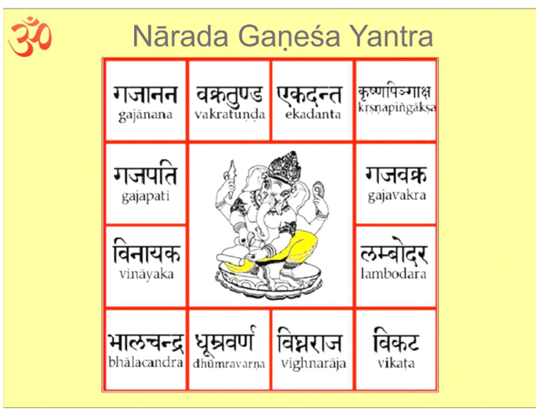

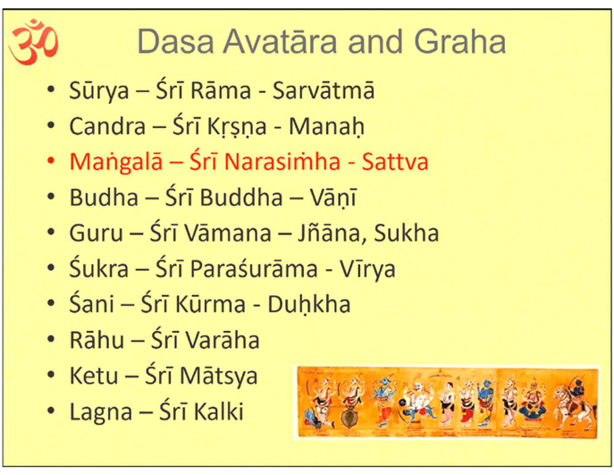

## Lesson 3

<div>

> **Summary of Lesson 3 Transcript**
>
> ## Opening & Structure
>
> - **Started with Guru Mantra** (Om Guruve Namaha) repeated 12 times
> - Course officially begins on **Makara Sankranti** (Sun entering
>   Capricorn) on a **Thursday** - both auspicious for spiritual
>   learning
> - Future webinars will be held **Sundays at 11 AM CET** during Guru
>   Hora
> - Calendar will be shared for planning ahead
>
> ## Course Logistics & Guidelines
>
> **Telegram Group Usage:** - Follow the syllabus/modules
> systematically - Keep questions focused on current module being
> studied - Ask intentional, specific questions (not open-ended “tell us
> more”) - Telegram is just a tool - take your own notes as primary
> resource - Mentors monitor discussions and will intervene if needed
>
> **Learning Approach:** - Self-paced online course with mentor
> support - Guruji’s teaching method: Start with the NAME → meaning →
> application - Not spoon-feeding - some questions left for
> self-research - Learn from each other’s questions and discussions
>
> **Materials:** - Adobe Flash issue being resolved - patience
> requested - All webinars recorded on private YouTube channel
> (permanent access) - 2-year access to PJC Year 1 materials
> (extendable)
>
> ## Main Teaching: What is Jyotish?
>
> **Jyotish = Study of 33 Devas (not just planets/signs)**
>
> ### 1. **Ashtavasu (8 Vassus/Lights)**
>
> - **Sun & Moon** - Original light givers (luminaries)
> - **5 Tatwa Planets** - Give knowledge through their physical nature:
>   - **Mars** (Agni) - Fire, energy, engineering
>   - **Mercury** (Prithvi) - Earth, solid state
>   - **Jupiter** (Akasha) - Space, magnetism, connection
>   - **Venus** (Jala) - Water, liquid state
>   - **Saturn** (Vayu) - Air, movement, breath, longevity
> - **Nakshatras** - Mental desires and emotional states
>
> ### 2. **Dvadasha Adityas (12 Adityas)**
>
> - The 12 months/signs representing **all material resources**
> - Sun’s movement creates 30-degree portions (rashis)
> - Each sign = time period + space
> - **Vishnu Aditya** youngest
>
> ### 3. **Ekadasha Rudra (11 Rudras)**
>
> - Address **destruction energies** in horoscope
> - 10 hold prana (life force) in body
> - 11th relates to individual soul (calculated from Atmakaraka)
> - Connected to **Rudra Bhavas** (houses that can end life)
>
> ### 4. **Indra & Prajapati (2)**
>
> - **Prajapati** = Lagna/1st house (our creation/birth)
> - **Indra** = 10th house (throne, control of senses, karma)
>
> ## Key Concepts Clarified
>
> **Rashis vs Bhavas:** - **Rashis** = Material resources, physical
> quantities (“heap”) - **Bhavas** = Our thoughts/perceptions about life
> aspects
>
> **Important Axes:** - **1st-7th**: Birth-Death, Me-Others (horizontal,
> eye-level) - **4th-10th**: Midnight-Noon, Lowest-Highest point
> (vertical)
>
> **Three Material Worlds:** - **Bhuloka** - Earth (where we are) -
> **Bhuvarloka** - Solar system (Sun, planets) - **Svargaloka** - Sky
> (nakshatras, constellations)

</div>


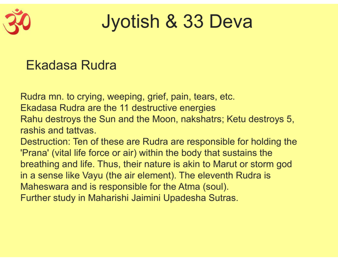

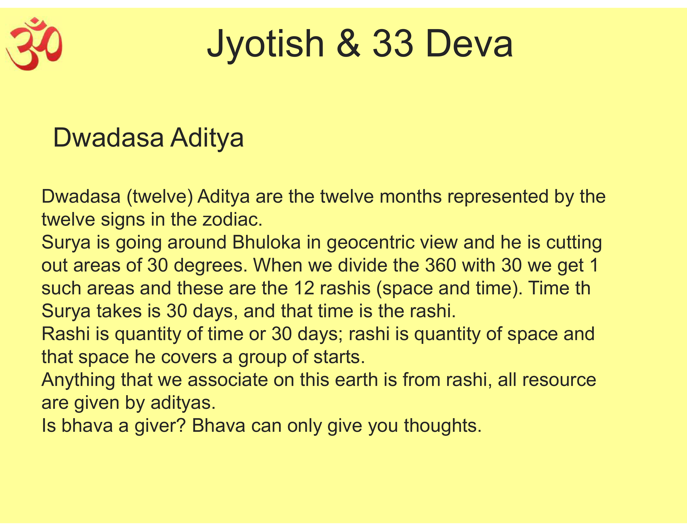

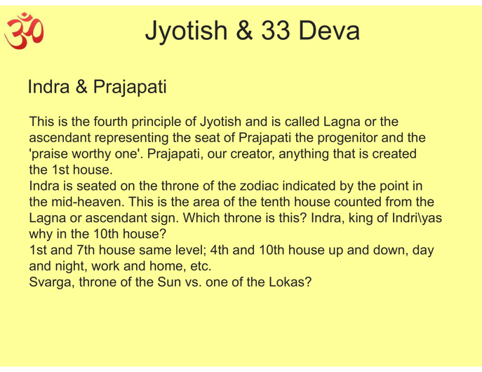

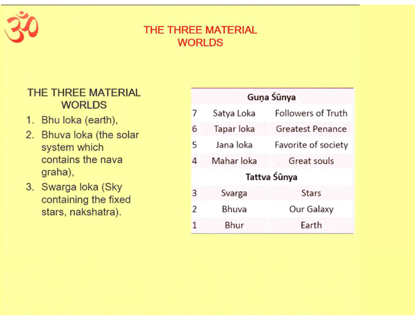

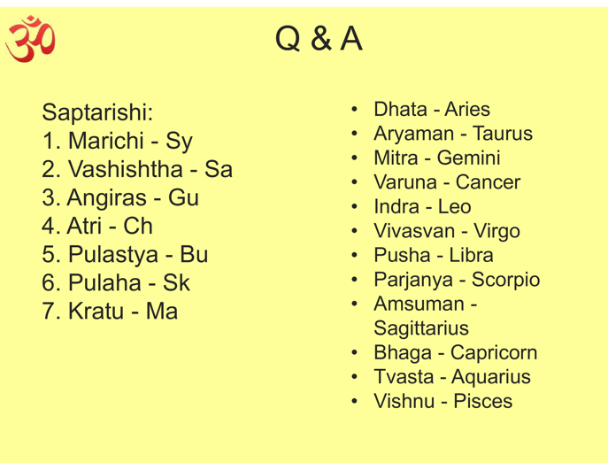

## Lesson 4

<div>

> **Summary of Lesson 4: Panchanga (Five Limbs of Time)**
>
> ## Opening Context
>
> - This is part of the **Aramba (preparatory) portion** of PJC Year 1
> - Aramba introduces many concepts that students will revisit
>   throughout the year
> - Focus is on understanding basic concepts before diving deeper
>
> ## What is Panchanga?
>
> **Pancha** = Five, **Anga** = Limbs
>
> The five fundamental divisions of time that form the **foundation of
> any horoscope**. Panchanga must be examined **before** looking at
> planetary positions, as it shows the **quality of time** for that
> birth.
>
> ### The Five Limbs:
>
> 1.  **Vara** (Day) - Agni Tatva
> 2.  **Tithi** (Lunar day) - Jala Tatva  
> 3.  **Karana** (Half-tithi) - Prithvi Tatva
> 4.  **Nakshatra** (Lunar mansion) - Vayu Tatva
> 5.  **Yoga** (Sun-Moon combination) - Akasha Tatva
>
> ## Benefits of Learning Panchanga
>
> - **Vara** - Prolongs life
> - **Tithi** - Brings prosperity
> - **Karana** - Gives success in all tasks
> - **Nakshatra** - Removes sin
> - **Yoga** - Immunity from disease
>
> ## 1. VARA (The Day)
>
> **Connection**: Agni (fire), energy levels, physical health
>
> **Calculation**: Sunrise to next sunrise
>
> **Seven Varas**: Ravivara (Sunday), Somavara (Monday), Mangalavara
> (Tuesday), Buddhavara (Wednesday), Guruvara (Thursday), Shukravara
> (Friday), Shanivara (Saturday)
>
> **Analysis**: - Check **Varesha** (lord of the day) placement from
> **Lagna** - Also check Varesha placement from **Surya**
>
> **Example Given**: Franklin D. Roosevelt - Born Monday (Varesha =
> Moon) - Moon in 10th house conjunct Mars - Moon has **zero Digbala**
> (directional strength) in 10th - Moon-Mars = Gandanta (fire-water
> conflict) - Moon in 6th from Sun (enemy position) - Result: Polio
> (health issues related to movement on 4th-10th axis)
>
> ### Vara Chakra Concepts:
>
> - **6th graha** = enemy (Shatru)
> - **8th graha** = eclipse (Grahana) - blocks manifestation
>
> ## 2. TITHI (Lunar Day)
>
> **Connection**: Jala Tatva, relationships, emotional content,
> interactions
>
> **Calculation**: Sun-Moon relationship; 1 tithi = 12 degrees of zodiac
>
> **30 Tithis total**: 15 in Krishna Paksha (waning), 15 in Shukla
> Paksha (waxing)
>
> **Eight Lords**: Surya, Chandra, Mangala, Budha, Guru, Shukra, Shani,
> Rahu (Ketu has no lordship)
>
> **Analysis**: Check Tithi lord placement from **4th house**
>
> ### Problematic Tithis:
>
> **Rikta Tithis** (4th, 9th, 14th) - Most problematic: - Too much
> emotion, self-centered - **Chaturthi** - Ganesha (deity) -
> **Navami** - Durga (deity) - **Chaturdashi** - Shiva (deity)
>
> **Other Doshas**: - **Ekadashi** (11th) - Addiction/anger issues
> (Mars/Agni) → fasting advised - **Trayodashi** (13th) - Wealth
> problems - **Krishna Chaturdashi** & **Shukla Pratipada** - Serious
> relationship issues (related to Soma’s sin with Tara)
>
> **Example Given**: Marilyn Monroe - Tithi lord = Venus - Venus in 10th
> house in Aries (enemy sign) - Zero Digbala - Had relationships but
> they were problematic
>
> ## 3. DIG CHAKRA (Directional Strength)
>
> Eight directions where grahas have **full potential**:
>
> - **East** (Indra) - **Surya** - Self-realization
> - **Southeast** (Agni) - **Shukra** - Details, art
> - **South** (Yama) - **Mangala** - Warrior energy
> - **Southwest** (Niriti) - **Rahu** - Chaos
> - **West** (Varuna) - **Shani** - Detachment
> - **Northwest** (Vayu) - **Chandra** - Movement
> - **North** (Kubera) - **Budha** - Wealth, profession
> - **Northeast** (Ishana) - **Guru** - Knowledge
>
> Plus: **Upward** (Ketu/Ananta - Moksha), **Downward** (Lagna/Brahma -
> Rebirth)
>
> ## 4. KALA CHAKRA (Time/Blockage Wheel)
>
> Shows which grahas **block** each direction:
>
> - Mangala blocks Shukra (Agni corner)
> - Guru blocks Mangala (Yama corner)
> - Budha blocks Rahu (Niriti corner)
> - Shukra blocks Shani (Varuna corner)
> - Chandra blocks Budha (Kubera corner)
> - Rahu blocks Guru (Ishana corner)
> - Ketu blocks Surya (Indra corner)
>
> **Key Point**: These are **pairs** that create either debate (Sattvic)
> or war (Tamasic)
>
> ------------------------------------------------------------------------
>
> ## Important Reminders:
>
> - Panchanga is the **first layer** - more factors will be added
> - Cannot make final judgments from Panchanga alone
> - Must learn grahas, rashis, bhavas before complete analysis
> - Return to Aramba concepts throughout the year as understanding
>   deepens
>
> Would you like me to clarify any specific aspect of Panchanga?

</div>


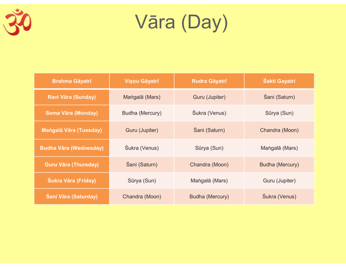

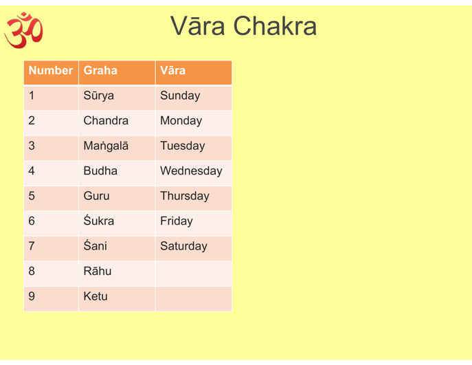

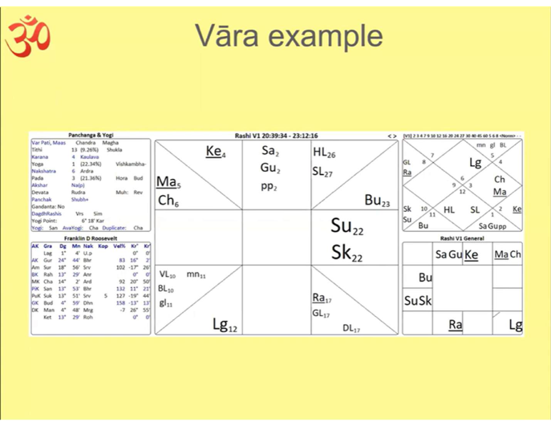

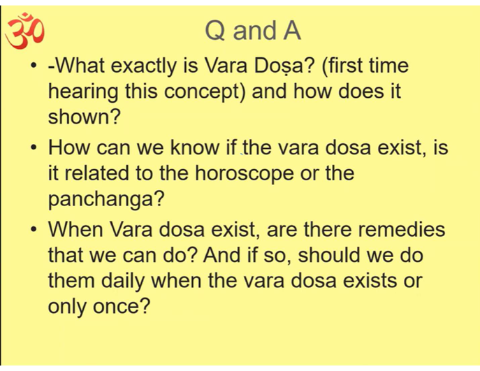

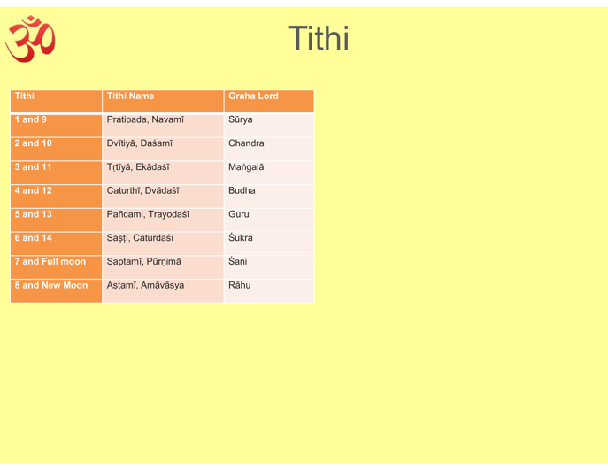

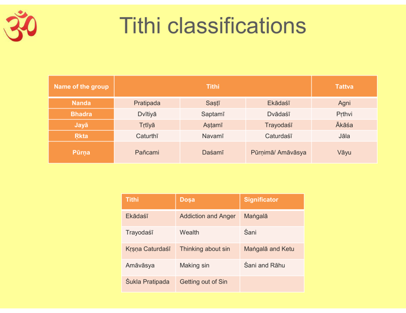

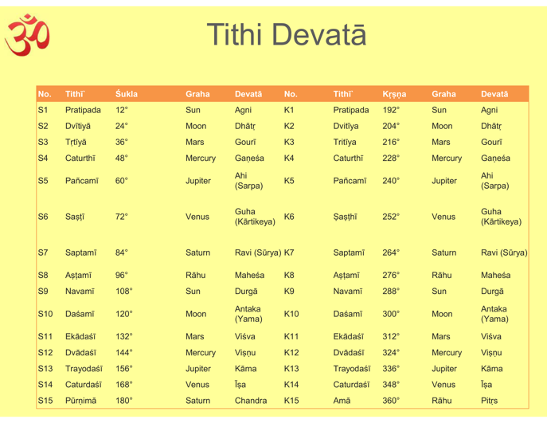

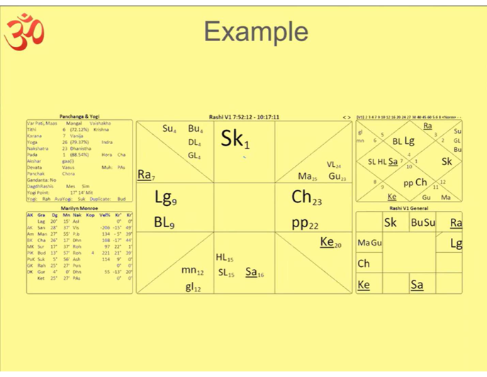

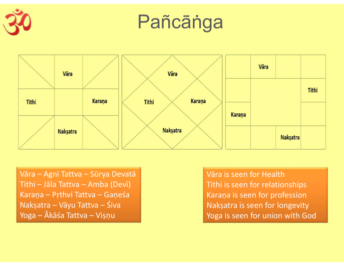

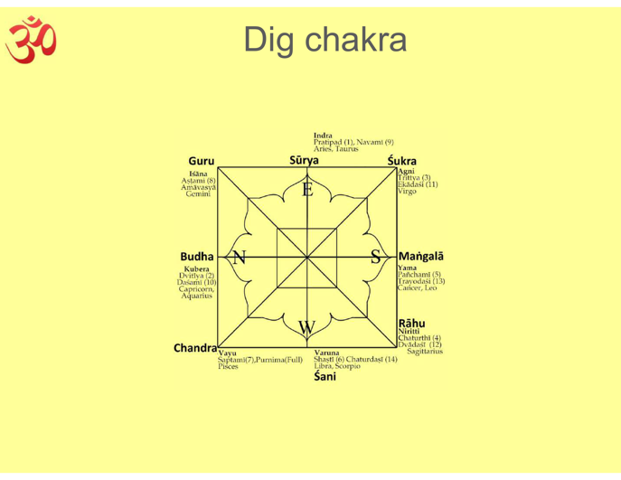

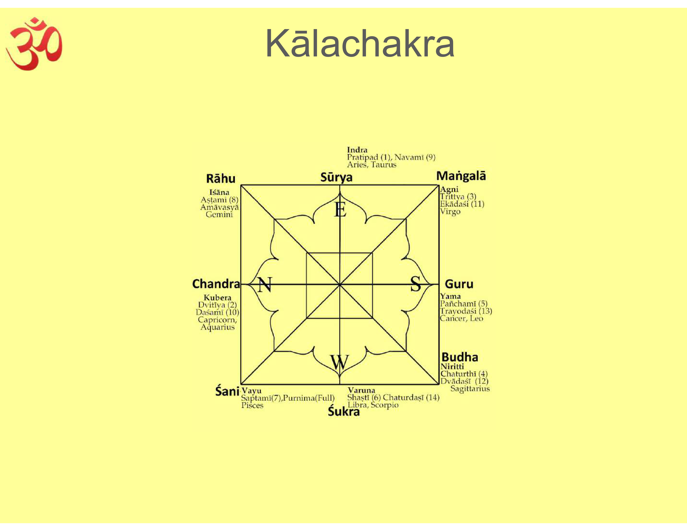

## Lesson 5

<div>

> **Summary of Lesson 5: Rashi Swarupa (Nature of Signs)**
>
> ## Opening Context & Housekeeping
>
> **Learning Process:** - Jyotish learning is **spiral** - same topics
> revisited from different angles/levels - Currently using “microscope”
> approach (detailed) vs “telescope” (broad picture from Aramba) -
> Learning Jyotish is like performing Brahma Yagya - devas work on you
> as you learn - Don’t fear Panchanga doshas you discover - you’re only
> seeing small details, not full picture
>
> **Important Clarifications:** - **Do NOT worship Sanjay Rath** or put
> his picture on altar - He is **Shiksha Guru** (5th house - teacher of
> subject) - NOT Diksha Guru (9th house - spiritual guide who takes
> responsibility for soul)
>
> ------------------------------------------------------------------------
>
> ## RASHI NAMES (Parashara-Specific)
>
> **Names that differ from popular usage:** - **Mesha** (Aries) - Ram -
> **Vrishabha/Vrisha** (Taurus) - Bull - **Mithuna** (Gemini) - Couple -
> **Karkata** (Cancer) - Crab - **Simha** (Leo) - Lion - **Kumari**
> (Virgo) - **Young virgin girl** (not just Kanya) - **Tula** (Libra) -
> Scale/Balance - **Ali** (Scorpio) - NOT Vrishchika; means **blessing,
> bridge, or exalted** (refers to semen storage) - **Dhanu**
> (Sagittarius) - Bow/Archer - **Makara/Nakra** (Capricorn) - **Reversal
> of hell** (karma determines direction) - **Kumbha** (Aquarius) -
> Pot/Water bearer - **Meena** (Pisces) - Fish
>
> ------------------------------------------------------------------------
>
> ## BRAHMA DOSHA (Creation Flaw)
>
> **Key Principle:** Rashis with **unclear/multiple symbols** carry
> Brahma Dosha
>
> ### **5 Rashis WITHOUT Dosha:**
>
> Clear, single-element symbols: 1. **Mesha** - Ram (clear) 2.
> **Vrishabha** - Bull (clear) 3. **Karkata** - Crab (clear) 4.
> **Simha** - Lion (clear) 5. **Vrishchika/Ali** - Scorpion (clear)
>
> ### **7 Rashis WITH Dosha:**
>
> <table>
> <colgroup>
> <col style="width: 11%" />
> <col style="width: 34%" />
> <col style="width: 26%" />
> <col style="width: 27%" />
> </colgroup>
> <thead>
> <tr>
> <th>Rashi</th>
> <th>Planet Showing Dosha</th>
> <th>Devata Angered</th>
> <th>Nature of Dosha</th>
> </tr>
> </thead>
> <tbody>
> <tr>
> <td><strong>Meena</strong></td>
> <td>Surya (Sun)</td>
> <td><strong>Agni</strong></td>
> <td>Fish cursed to never see sunlight; <strong>Remedy:
> Pranayama</strong></td>
> </tr>
> <tr>
> <td><strong>Kumbha</strong></td>
> <td>Chandra (Moon)</td>
> <td><strong>Jala</strong></td>
> <td>Water gets spoiled/fermented in pot; emotions problematic</td>
> </tr>
> <tr>
> <td><strong>Makara</strong></td>
> <td>Guru (Jupiter)</td>
> <td><strong>Indra</strong></td>
> <td>Loss of senses/direction; alcohol issues</td>
> </tr>
> <tr>
> <td><strong>Dhanu</strong></td>
> <td>Budha (Mercury)</td>
> <td><strong>Vishnu</strong></td>
> <td>Battlefield; right vs wrong obsession; <strong>righteous
> anger</strong></td>
> </tr>
> <tr>
> <td><strong>Tula</strong></td>
> <td>Mangala (Mars)</td>
> <td><strong>Skanda</strong></td>
> <td>War vs prosperity conflict; “all fair in love and war”</td>
> </tr>
> <tr>
> <td><strong>Kanya</strong></td>
> <td>Shani (Saturn)</td>
> <td><strong>Brahma</strong></td>
> <td>Purity vs impurity; obsession with cleanliness</td>
> </tr>
> <tr>
> <td><strong>Mithuna</strong></td>
> <td>Shukra (Venus)</td>
> <td><strong>Lakshmi</strong></td>
> <td>Boy + girl + club + instrument; <strong>dominant Bhuloka
> dosha</strong>; relationship/emotion issues</td>
> </tr>
> </tbody>
> </table>
>
> **Usage:** Check dosha planet in chart when analyzing that ascendant -
> may not be as helpful as expected
>
> ------------------------------------------------------------------------
>
> ## RASHI COLORS
>
> - **Mesha** - Blood red/royal red
> - **Vrishabha** - Milk white
> - **Mithuna** - Green (all shades)
> - **Karkata** - White with red tinge (light pink)
> - **Simha** - White with yellow tinge (off-white/sand)
> - **Kanya** - **Gray** (intestines; discernment)
> - **Tula** - **Black**
> - **Vrishchika** - Light yellow (brownish due to Ketu)
> - **Dhanu** - Dark yellow/turmeric/golden
> - **Makara** - **Dark blue** (industrial)
> - **Kumbha** - **Purple** (Rahu; fermentation/poison/medicine)
> - **Meena** - Light blue (sky blue)
>
> ------------------------------------------------------------------------
>
> ## BODY PARTS (Kalapurusha)
>
> Natural zodiac = God’s body template: 1. Mesha - **Head** 2.
> Vrishabha - **Face & neck** 3. Mithuna - **Arms & shoulders** 4.
> Karkata - **Chest, heart, breast** 5. Simha - **Stomach & liver** 6.
> Kanya - **Intestines, navel** 7. Tula - **Below navel, kidneys** 8.
> **Vrishchika - Genitalia** (HORIZONTAL - Ketu reverses) 9. Dhanu -
> **Thighs** 10. Makara - **Knees** 11. Kumbha - **Calves** 12.
> **Meena - Feet** (HORIZONTAL - Ketu reverses)
>
> **Exception:** Ketu-ruled parts are horizontal, not vertical
>
> ------------------------------------------------------------------------
>
> ## GUNA OF RASHIS (Two Systems)
>
> ### **System 1: By Creation/Mobility**
>
> <table style="width:100%;">
> <colgroup>
> <col style="width: 16%" />
> <col style="width: 22%" />
> <col style="width: 16%" />
> <col style="width: 22%" />
> <col style="width: 22%" />
> </colgroup>
> <thead>
> <tr>
> <th>Type</th>
> <th>Rashis</th>
> <th>Guna</th>
> <th>Energy</th>
> <th>Devata</th>
> </tr>
> </thead>
> <tbody>
> <tr>
> <td><strong>Chara</strong> (Movable)</td>
> <td>Mesha, Karkata, Tula, Makara</td>
> <td><strong>Rajas</strong></td>
> <td>Excess energy, pioneers, creative</td>
> <td><strong>Brahma</strong></td>
> </tr>
> <tr>
> <td><strong>Sthira</strong> (Fixed)</td>
> <td>Vrishabha, Simha, Vrishchika, Kumbha</td>
> <td><strong>Tamas</strong></td>
> <td>Inert, stable, sustaining</td>
> <td><strong>Rudra</strong></td>
> </tr>
> <tr>
> <td><strong>Dwi</strong> (Dual)</td>
> <td>Mithuna, Kanya, Dhanu, Meena</td>
> <td><strong>Sattva</strong></td>
> <td>Balanced between mobile &amp; fixed</td>
> <td><strong>Vishnu</strong></td>
> </tr>
> </tbody>
> </table>
>
> ### **System 2: By Lordship**
>
> Rashi lord’s guna adds layer to rashi: - **Sattva planets:** Surya,
> Chandra, Guru - **Rajas planets:** Budha, Shukra - **Tamas planets:**
> Mangala, Shani
>
> **Example:** Mesha = Chara (Rajas by creation) + Mars lord (Tamas) =
> High energy but can be lazy/uninformed
>
> **How to Read:** Check which guna dominates based on lord’s strength
> in chart
>
> ------------------------------------------------------------------------
>
> ## MALE/FEMALE SIGNS
>
> ### **Krura (Cruel/Male) - ODD signs:**
>
> Mesha, Mithuna, Simha, Tula, Dhanu, Kumbha - Aggressive, assertive,
> extroverted, outspoken - Make own decisions, less likely to seek
> advice
>
> ### **Saumya (Gentle/Female) - EVEN signs:**
>
> Vrishabha, Karkata, Kanya, Vrishchika, Makara, Meena - Passive,
> introverted, sustaining - More likely to seek guidance/advice
>
> **For Child Gender (Saptamsha only):** - **Mithuna & Karkata SWAP** -
> **Kumbha & Meena SWAP**
>
> ------------------------------------------------------------------------
>
> ## YUGA RASHIS (Dharma/Light Level)
>
> - **Krita/Satya:** Simha, Vrishchika, Kumbha, Vrishabha - Things come
>   easily, 100% support
> - **Treta:** Mesha, Karkata, Tula, Makara - 75% support, some effort
>   needed
> - **Dwapara:** Dhanu, Meena, Mithuna, Kanya - 50% support
> - **Kali:** (remaining context) - Least support
>
> **Usage:** Shows how much support/ease person has in getting
> knowledge, solutions
>
> ------------------------------------------------------------------------
>
> ## PLANETARY CABINET (Lordship Logic)
>
> From **Sun & Moon** (King & Queen): 1. **Sun & Moon** - Leo & Cancer
> (King & Queen’s quarters) 2. **Budha** - Gemini & Virgo
> (Prince/Princess - next to parents) 3. **Shukra** - Taurus & Libra
> (Court ladies) 4. **Mangala** - Aries & Scorpio (Guards/Knights;
> Scorpio also has spies via Ketu) 5. **Guru** - Sagittarius & Pisces
> (Advisors/Priests/Ministers) 6. **Shani** - Capricorn & Aquarius
> (Workers/Commoners/Labor)
>
> **Also shows:** Speed of planets from Earth (geocentric view)
>
> ------------------------------------------------------------------------
>
> ## MEMORY AID: Hand Method
>
> **Fingers = 12 Rashis** (4 fingers × 3 parts = 12)
>
> - **Fingertips** (top part) = **Chara rashis** (Mesha, Karkata, Tula,
>   Makara) - Most mobile, doing karma
> - **Middle sections** = **Sthira rashis** (Vrishabha, Simha,
>   Vrishchika, Kumbha) - Fixed, no free will
> - **Base/Root** = **Dwi rashis** (Mithuna, Kanya, Dhanu, Meena) -
>   **Most controlling lagnas!**
>
> **Dual lagnas control through:** - **Budha lagnas** (Mithuna/Kanya) -
> Control via **information/details** - **Guru lagnas** (Dhanu/Meena) -
> Control via **knowledge/belief systems**
>
> ------------------------------------------------------------------------
>
> **Next Steps:** This foundational knowledge will be layered with
> grahas (planets), bhavas (houses), and yogas in upcoming lessons.
>
> Would you like me to clarify any specific concept?

</div>

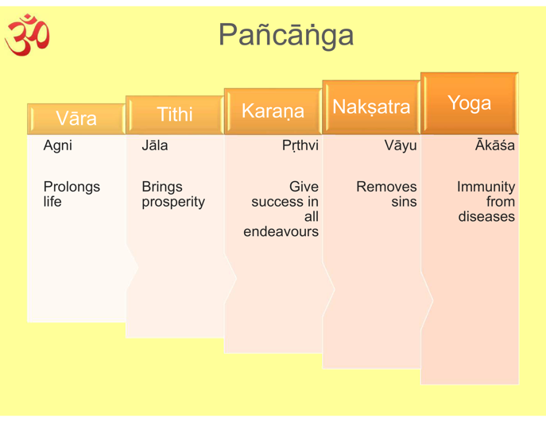


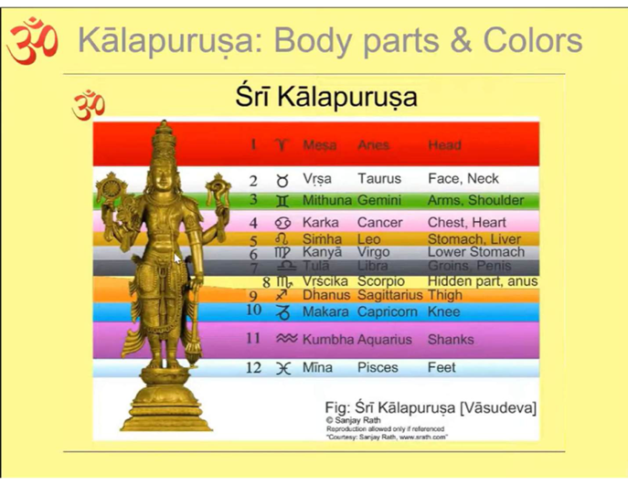


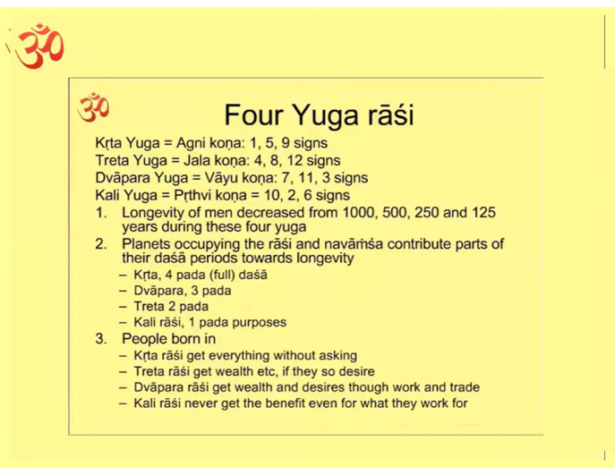

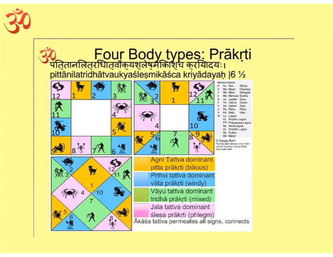


## Lesson 6

<div>

> **Summary of Lesson 6: Katapayadi & Bhava Chakras**
>
> ## 1. KATAPAYADI SYSTEM (Numerical Values from Names)
>
> **Core Principle:** Sanskrit consonants have numerical values (0-9)
>
> **Key Rules:** - **Vowels = 0** (only counted if name starts with
> vowel) - Use **pronunciation**, not spelling - Drop incomplete
> consonants (without following vowel) - **Ra/La rule:** If consonants
> joined with R or L, keep only initial consonant - **Reverse the
> number** after calculation - **Divide by 12** to get remainder = Rashi
>
> **Example: Vivekananda** - Consonants: Va-Ve-Ka-Na-Na-Da - Values:
> 4-4-1-0-8 - Number: 44108 → Reversed: 80144 - After dividing by 12 →
> Remainder = **4** (karka rahsi)
>
> **Usage:** - **Rashi** (sign) = interaction with people - **House
> number** = inner manifestation
>
> ------------------------------------------------------------------------
>
> ## 2. ASTRONOMICAL BASICS
>
> **Horizon:** Where earth and sky meet (observer-dependent)
>
> **Key Points:** - **Udaya Lagna** = Eastern horizon (rising point) -
> **Asta Lagna** = Western horizon (setting point) - 180° from Udaya -
> **MC (Mid-Heaven/Zenith)** = 90° above observer - **Ecliptic** =
> Horizontal plane between Sun & Earth
>
> **Directional Degrees:** - North = 0°/360° - East = 90° - South =
> 180° - West = 270°
>
> ------------------------------------------------------------------------
>
> ## 3. BHAVA CHAKRA (House System)
>
> **Method:** Take Lagna degree ± 15 degrees = 30° house span
>
> **Example: Swami Vivekananda (26° Dhanu Lagna)** - 1st House = 11°
> Dhanu to 11° Makara - 2nd House = 11° Makara to 11° Kumbha - And so
> on…
>
> **Result:** Planets may **shift houses** if they’re within 15° of cusp
>
> **In Vivekananda’s chart:** - Mars shifted from 5th → 4th house -
> Venus shifted from 2nd → 1st house - Jupiter shifted to 10th house
>
> **Significance:** When many planets shift = **major life
> transformations**
>
> ------------------------------------------------------------------------
>
> ## 4. BHAVA CHALIT CHAKRA
>
> **Starting Point:** Uses **Bhava Lagna** (special lagna, moves 2
> hours/sign)
>
> **Same process:** Bhava Lagna degree ± 15°
>
> **Key Difference:** - Bhava Chakra starts from **Udaya Lagna** - Bhava
> Chalit starts from **Bhava Lagna** (calculated separately)
>
> ------------------------------------------------------------------------
>
> ## 5. BIOLOGICAL CLOCK CHART (Practical Application)
>
> **Setup:** 1. Draw Bhava Chalit Chakra 2. Place **6 AM** where Sun is
> located 3. Place **6 PM** in 7th house from Sun 4. Each house =
> **2-hour period**
>
> **Planet Activities & Best Times:**
>
> <table>
> <colgroup>
> <col style="width: 27%" />
> <col style="width: 34%" />
> <col style="width: 37%" />
> </colgroup>
> <thead>
> <tr>
> <th>Planet</th>
> <th>Activity</th>
> <th>Best Time</th>
> </tr>
> </thead>
> <tbody>
> <tr>
> <td><strong>Surya</strong></td>
> <td>Spiritual practice, energy level</td>
> <td>Sun’s house + aspects</td>
> </tr>
> <tr>
> <td><strong>Chandra</strong></td>
> <td>Eating/food</td>
> <td>Moon’s house + aspects</td>
> </tr>
> <tr>
> <td><strong>Mangala</strong></td>
> <td>Exercise, physical strength</td>
> <td>Mars house + aspects (4th, 7th, 8th from itself)</td>
> </tr>
> <tr>
> <td><strong>Budha</strong></td>
> <td>Reading, learning, playing</td>
> <td>Mercury’s house + aspects</td>
> </tr>
> <tr>
> <td><strong>Guru</strong></td>
> <td>Big decisions, digestion, conclusions</td>
> <td>Jupiter’s house + aspects</td>
> </tr>
> <tr>
> <td><strong>Shukra</strong></td>
> <td>Relationships, indulgence</td>
> <td>Venus’s house + aspects</td>
> </tr>
> <tr>
> <td><strong>Shani</strong></td>
> <td>Resting (15 min minimum)</td>
> <td>Saturn’s house + aspects</td>
> </tr>
> <tr>
> <td><strong>Rahu</strong></td>
> <td><strong>NO activity</strong> - meditation time</td>
> <td>Rahu’s house + aspects</td>
> </tr>
> <tr>
> <td><strong>Ketu</strong></td>
> <td><strong>Avoid activities</strong> - meditation</td>
> <td>Ketu’s house + aspects</td>
> </tr>
> </tbody>
> </table>
>
> **Important Notes:** - Check planet’s **aspects** (5th, 7th, 9th, 2nd
> from itself for Rahu) - When planets conjunct = divide time between
> both activities - Each house = 2 hours, but find at least 15 min for
> that activity - Movement is **anti-zodiacal** (Sun moves through
> houses, not signs)
>
> ------------------------------------------------------------------------
>
> ## 6. CHART TYPES (Three Representations)
>
> 1.  **Surya Chakra** (East Indian) - for spirituality
> 2.  **Brigu Chakra** (North Indian) - for Bhava Chakra
> 3.  **Guru Chakra** (South Indian) - for Vastu
>
> **Practice tip:** Use each chart exclusively for 1-3 months to master
> all types
>
> ------------------------------------------------------------------------
>
> **Homework:** Draw your Bhava Chalit Chakra and create your biological
> clock timing table!
>
> Would you like clarification on any specific concept?

</div>

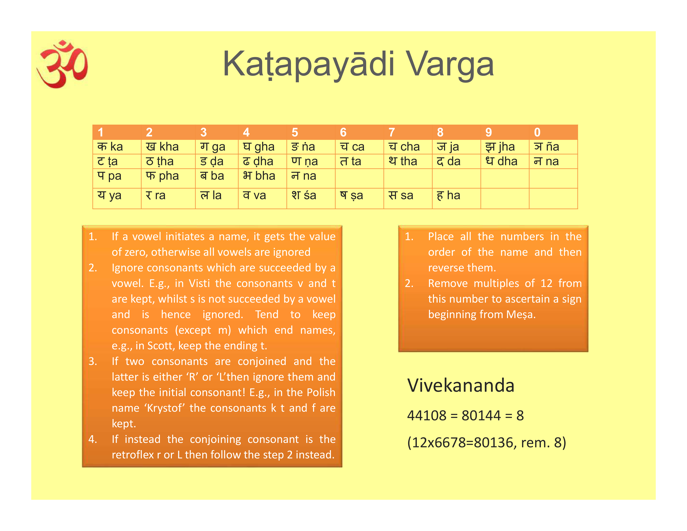

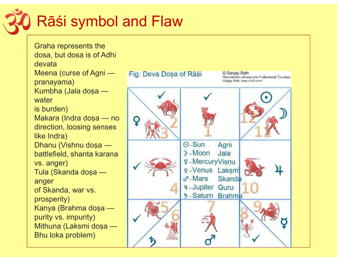


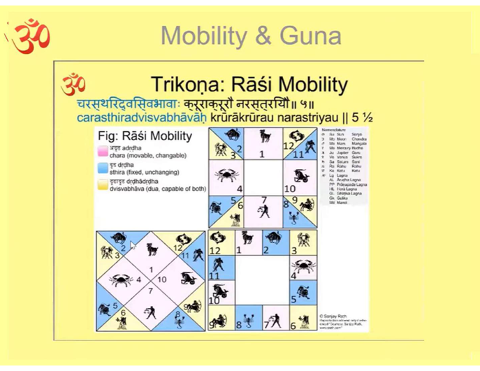

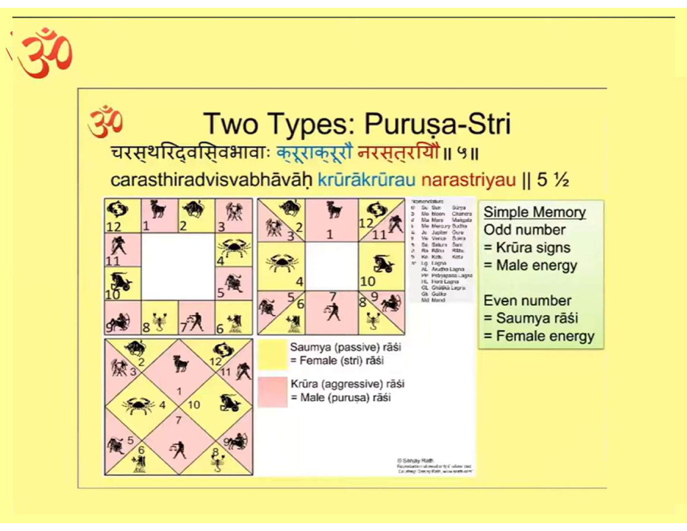

## Lesson 7

<div>

> **Summary of Lesson 7: Grahas (Planets) - Introduction**
>
> ### Opening Context
>
> - This is the **first of three webinars** on Grahas (planets)
> - Traditionally, Jyotish teaching **starts with Chapter 3** (Grahas),
>   not Chapters 1-2 (Creation/Philosophy)
> - Students should study Parashara shlokas **at least 3 times** to
>   truly digest them
> - Use audio recordings from other batches as supplementary material
>
> ------------------------------------------------------------------------
>
> ### CORE DEFINITION: What is a Graha?
>
> **Parashara’s Definition (Chapter 3, Shloka 1):** Heavenly bodies
> classified by: 1. **Visibility** (can we see them?) 2. **Movement**
> (do they move?)
>
> - **Moving bodies** = **Graha** (from root “grahana” = to
>   seize/eclipse)
> - **Fixed bodies** = **Nakshatra** (fixed stars)
>
> **KEY POINT:** Grahas have the inherent nature to **eclipse the
> mind** - this is their fundamental characteristic.
>
> ------------------------------------------------------------------------
>
> ### Why Rahu & Ketu are Grahas (Despite Having No Physical Body)
>
> **Question addressed:** If we only count visible bodies, why include
> Rahu/Ketu?
>
> **Answer:** - They are **mathematical points** (nodes of the Moon) -
> They create **inverse light/shadow** (like closing eyes after seeing
> sun = black circle) - They represent **extremes of the mind**: -
> **Rahu** = Fully material, maximum desire, wants to consume
> everything - **Ketu** = Fully detached, wants nothing, renunciation
>
> **Manifestations:** - **Rahu:** Foreigners, different cultures,
> borders, geographical boundaries, fermentation, alcohol, medicine -
> **Ketu:** Outcasts, monks/nuns, spiritual people, those who renounce
> society - **Example given:** Man who moved to attic for years, refused
> all contact = clear Ketu influence
>
> ------------------------------------------------------------------------
>
> ### PLANETARY MOTION (Critical Concept)
>
> ### Three Categories of Motion:
>
> 1.  **Always Direct (Forward):**
>     - **Surya (Sun) & Chandra (Moon)** - the Luminaries
>     - Establish dharma, predictable, “one foot after another”
> 2.  **Always Retrograde (Backward):**
>     - **Rahu & Ketu** - the Nodes
>     - Move opposite to all other planets
>     - Cause eclipses when they meet luminaries
> 3.  **Can Be Either (Tara Grahas - 5 Planets):**
>     - **Mangala, Budha, Guru, Shukra, Shani**
>     - When **direct** → behave like Luminaries (normal, predictable)
>     - When **retrograde** → behave like Nodes (unpredictable,
>       unfulfilled desires)
>
> ------------------------------------------------------------------------
>
> ### RETROGRADE PLANETS (Vakri)
>
> **Nature:** Planet behaves like Rahu/Ketu
>
> **Characteristics:** - **Not progressing** - standing still or
> pacing - **Unfulfilled desire/karma** with that planet -
> **Unpredictable, odd behavior** - **Cannot be trusted** (unexpected
> turns) - **May not give results** (especially in Prashna/horary)
>
> **Strength Implications:** - Retrograde = **Extremely strong** (like
> nodes) - Has **Cheshtabala** (directional strength) - Can cause
> **highest grahana** (eclipse power)
>
> **Prashna (Horary) Rules:** - If significator is vakri → **Won’t
> happen** (or needs 3 attempts) - **3x multiplier:** 3x more effort, 3
> attempts, or 3 blessings/children
>
> ------------------------------------------------------------------------
>
> ### EIGHT TYPES OF MOTION
>
> **5 Direct Motions:** 1-5. (Various speeds of forward movement)
>
> **3 Retrograde Motions:** 1. **Vakra** - Standard retrograde 2.
> **Anu-vakra** - Slowing down in retrograde 3. **Kutila** -
> **Stationary** (about to change direction)
>
> **IMPORTANT:** Kutila applies to **both** transitions: - Direct →
> Retrograde - Retrograde → Direct
>
> ------------------------------------------------------------------------
>
> ### WHEN DO PLANETS GO RETROGRADE?
>
> **Outer Planets (Mars, Jupiter, Saturn):**
>
> **Exercise given:** Draw blank chart, place Jupiter on Lagna
>
> - **120° from Sun** (5th or 9th house) = **Kutila (Stationary)**
>   - 5th house = Just entering retrograde
>   - 9th house = Just finishing retrograde
> - **180° from Sun** (7th house) = **Highest retrograde motion**
> - **6th house** = Vakra (Mars nature)
> - **8th house** = Anu-vakra (Rahu nature)
> - **4th/10th houses** = Direct motion range
>
> **Inner Planets (Mercury, Venus):** - Requires deep astronomical study
> (Surya Siddhanta) - Not explained in basic course
>
> ------------------------------------------------------------------------
>
> ### CHART EXAMPLE: Pandit Sanjay Rath
>
> **Jupiter:** Sun in 5th from Jupiter → Jupiter **stationary**
> (velocity = 7, very low)
>
> **Saturn:** Opposite Sun (7th house) → **Highest retrograde**
> (velocity = -223%)
>
> **Velocity Interpretation:** - **Minus (-)** = Retrograde - **Close to
> 0** = Stationary - **High positive** = Fast direct motion - **High
> negative** = Fast retrograde (double speed)
>
> **Note:** No exact ranges given for motion types - must observe
> velocity values
>
> ------------------------------------------------------------------------
>
> ### DO WE MOVE RETROGRADE PLANETS IN THE CHART?
>
> **NO!** Planet stays where it is.
>
> **Example:** Retrograde boyfriend still behaves oddly, but he’s still
> your boyfriend in the same place.
>
> **What changes:** - Planet gets **nature of nodes** - Can cancel
> exaltation/debilitation (taught in next lesson) - Creates yogas from
> its actual position
>
> ------------------------------------------------------------------------
>
> ### NAKSHATRA vs RASHI (Critical Distinction)
>
> **Question:** Why do grahas show different colors in nakshatra vs
> rashi?
>
> **Answer - The Three Lokas:**
>
> 1.  **Bhuloka (Earth)** - Where we are
>     - **Rashis** = All material resources, physical interactions
> 2.  **Bhuvarloka (Solar System)** - Above us
>     - **Grahas** = Moving planets, casting shadows
> 3.  **Svargaloka (Sky)** - Above that
>     - **Nakshatras** = Fixed stars, mental/emotional plane, devatas
>
> **How Grahas Work:** - Grahas move through nakshatras (truth) - Cast
> shadow on both nakshatras AND rashis - **Bind** nakshatra
> significations with rashi significations
>
> **Nakshatras** = Your **thoughts, emotions, ideas** (lunar, night
> concept) - Where graha is = your specific lens of thinking/feeling
>
> **Rashis** = **Material resources, physical things** (everything you
> can see/touch) - Where graha is = where you experience grahana
> materially
>
> **Example: Two planets in same rashi but different nakshatras:** -
> Working on same project (rashi) - But have different ideas/emotions
> about it (nakshatra)
>
> **Direction of influence works both ways:** 1. Mental → Material:
> Thoughts manifest as actions 2. Material → Mental: Events cause us to
> think certain thoughts
>
> ------------------------------------------------------------------------
>
> ### FOUR TYPES OF LAGNA (Briefly Mentioned)
>
> Not explained in detail (covered in separate lesson), but:
>
> **Birth Time Indicators:** - **Sun in 1st** (Udaya Lagna) = Sunrise
> birth - **Sun in 7th** (Asta Lagna) = Sunset birth - **Sun in 10th**
> (Akasha Lagna) = Midday birth (~noon) - **Sun in 4th** (Jala Lagna) =
> Midnight birth
>
> ------------------------------------------------------------------------
>
> ### SAM-YOGA (Combinations)
>
> **Sam-yoga** = ALL ways planets can combine (with planets, nakshatras,
> rashis)
>
> **Sam-bandha** = **Important** combinations that have great impact -
> This is the term we use most - 4 specific types (one being
> conjunction/yuti)
>
> **Sam-yoga Sphuta** = Mathematical meeting point of two planets -
> Calculated even if not in same rashi - Shows where yoga will manifest
>
> **Later:** Yoga Sphuta can combine ANY two points (e.g., Lagna lord +
> 7th lord)
>
> ------------------------------------------------------------------------
>
> ### BHAVISHYA vs ATITA YOGA
>
> **Bhavishya Yoga** = Yoga that **will happen in future** - Planets
> moving toward conjunction
>
> **Atita/Veeta Yoga** = Yoga that **happened in past** - Planets moving
> apart after conjunction
>
> **Why calculate Atita Yoga Sphuta?** - See where past yoga had
> impact - Useful for research/deep study of charts - Example: Two
> people with Chandra-Ketu in 11th - did it happen already or will it
> happen?
>
> **If yoga rashi not visible from yoga:** - Don’t use seasons
> (mentioned but corrected) - Use **Samukha-rashi**
> (opposite/complementary signs) - Taught in Rashi Drishti module
>
> ------------------------------------------------------------------------
>
> ### GRAHA YUDHA (Planetary War)
>
> **Not taught in detail yet** - comes in Year 3
>
> - 4 types of interpretation
> - Related to Bala (strength) calculations
> - Just introduced as concept for now
>
> ------------------------------------------------------------------------
>
> ### KEY TERMINOLOGY TO REMEMBER
>
> - **Graha** = Planet that eclipses mind
> - **Vakri** = Retrograde
> - **Kutila** = Stationary
> - **Sam-bandha** = Important combination
> - **Sam-yoga Sphuta** = Meeting point of yoga
> - **Bhavishya Yoga** = Future yoga
> - **Atita/Veeta Yoga** = Past yoga
> - **Prasanga** = Planet that bridges gap (Year 3/4 topic)
>
> ------------------------------------------------------------------------
>
> ### HOMEWORK/NEXT STEPS
>
> - Study planetary motions in your own chart
> - Observe velocity values in software
> - Check if any retrograde planets present
> - Note which nakshatras vs rashis planets occupy
> - Prepare questions for next Graha webinar
>
> ------------------------------------------------------------------------
>
> **Next Topics:** Exaltation, debilitation, planetary relationships,
> yogas in detail
>
> Would you like me to clarify any specific concept from this lesson?

</div>

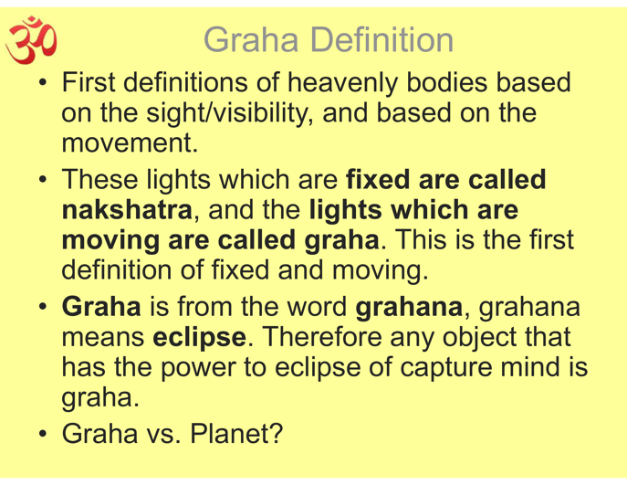

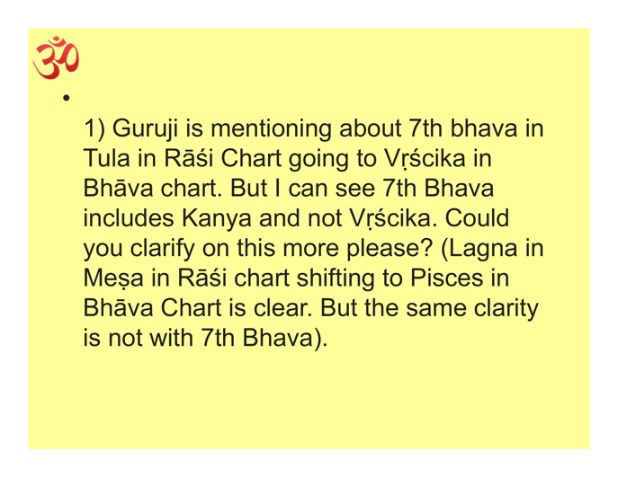

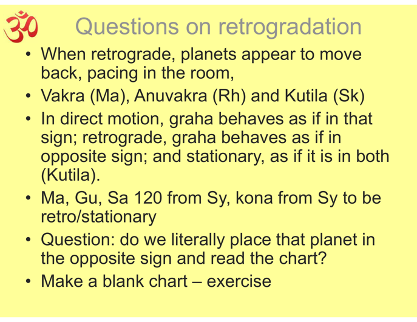

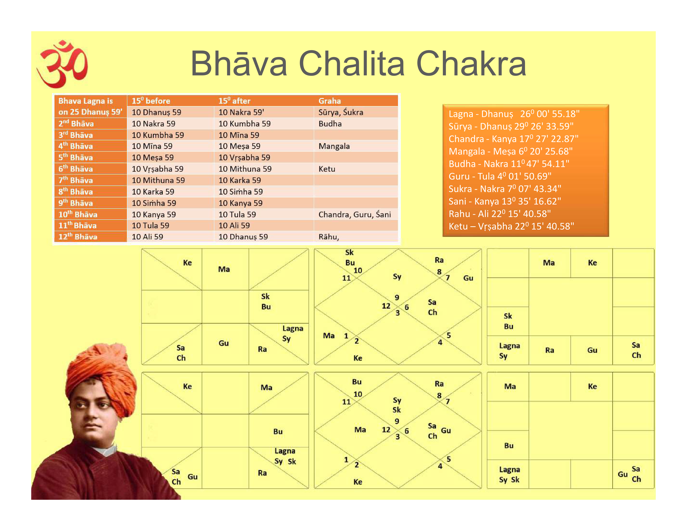

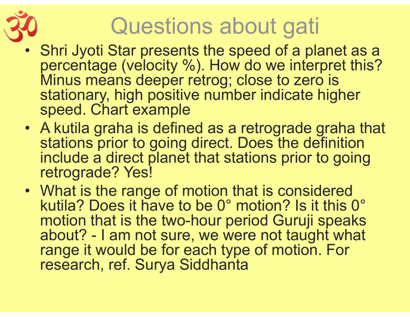

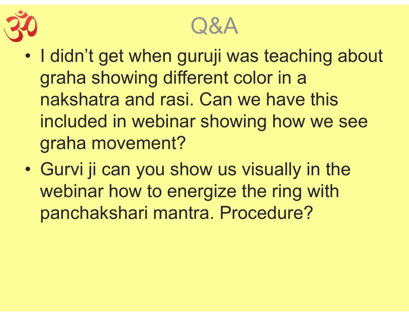


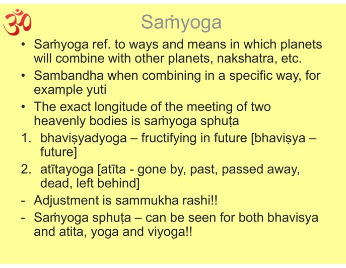


## Lesson 8

<div>

> **Summary of Lesson 8: Graha Devatas & Karakas**
>
> ### 1. ADI DEVATA MANTRAS (For Auspicious Beginnings)
>
> **Purpose:** Worship when **starting** something new (job, family,
> project, book)
>
> <table>
> <colgroup>
> <col style="width: 25%" />
> <col style="width: 40%" />
> <col style="width: 33%" />
> </colgroup>
> <thead>
> <tr>
> <th>Graha</th>
> <th>Adi Devata</th>
> <th>Purpose</th>
> </tr>
> </thead>
> <tbody>
> <tr>
> <td><strong>Surya</strong></td>
> <td>Vahni (Agni)</td>
> <td>Awakens purpose, takes prayers to devas</td>
> </tr>
> <tr>
> <td><strong>Chandra</strong></td>
> <td>Ambika</td>
> <td></td>
> </tr>
> <tr>
> <td><strong>Mangala</strong></td>
> <td>Subramanya</td>
> <td>Auspicious form (NOT Skanda/warrior form)</td>
> </tr>
> <tr>
> <td><strong>Budha</strong></td>
> <td>Rama (0-10°), Krishna (10-20°), Vishnu (20-30°)</td>
> <td>Choose based on degree</td>
> </tr>
> <tr>
> <td><strong>Guru</strong></td>
> <td></td>
> <td></td>
> </tr>
> <tr>
> <td><strong>Shukra</strong></td>
> <td></td>
> <td></td>
> </tr>
> <tr>
> <td><strong>Shani</strong></td>
> <td></td>
> <td></td>
> </tr>
> </tbody>
> </table>
>
> **Key Point:** Adi devatas are for **awakening/starting** activities.
>
> ------------------------------------------------------------------------
>
> ### 2. PRATIYADI DEVATA MANTRAS (For Control & Sustenance)
>
> **Purpose:** **Control, sustain, protect, remove obstacles, complete
> karmas**
>
> <table>
> <colgroup>
> <col style="width: 21%" />
> <col style="width: 53%" />
> <col style="width: 25%" />
> </colgroup>
> <thead>
> <tr>
> <th>Graha</th>
> <th>Pratiyadi Devata</th>
> <th>Nature</th>
> </tr>
> </thead>
> <tbody>
> <tr>
> <td><strong>Surya</strong></td>
> <td>Shiva</td>
> <td>Manifested form (with form)</td>
> </tr>
> <tr>
> <td><strong>Chandra</strong></td>
> <td>Gauri</td>
> <td></td>
> </tr>
> <tr>
> <td><strong>Mangala</strong></td>
> <td>Subramanya</td>
> <td>Same as Adi devata</td>
> </tr>
> <tr>
> <td><strong>Budha</strong></td>
> <td>Narayana</td>
> <td>Unmanifested, above avatars</td>
> </tr>
> <tr>
> <td><strong>Guru</strong></td>
> <td>Sadashiva</td>
> <td><strong>Unmanifested</strong> Shiva (no form)</td>
> </tr>
> <tr>
> <td><strong>Shukra</strong></td>
> <td>Lakshmi</td>
> <td>Sustains relationships, love</td>
> </tr>
> <tr>
> <td><strong>Shani</strong></td>
> <td>Krishna Narayana (Jagannath)</td>
> <td>Relieves sins, without form</td>
> </tr>
> <tr>
> <td><strong>Rahu</strong></td>
> <td>Chandi (Durga)</td>
> <td></td>
> </tr>
> <tr>
> <td><strong>Ketu</strong></td>
> <td>Ganesha</td>
> <td></td>
> </tr>
> </tbody>
> </table>
>
> **Key Difference:** - Adi devata = Start things - Pratiyadi devata =
> Sustain, protect, correct, complete
>
> **When to Use:** Based on **dasha** and **current need** (not all at
> once!)
>
> ------------------------------------------------------------------------
>
> ### 3. FOUR KENDRAS & FOUR LAGNAS
>
> **Kendras represent Vishnu’s sustaining power**
>
> <table>
> <colgroup>
> <col style="width: 9%" />
> <col style="width: 19%" />
> <col style="width: 8%" />
> <col style="width: 16%" />
> <col style="width: 25%" />
> <col style="width: 20%" />
> </colgroup>
> <thead>
> <tr>
> <th>Lagna</th>
> <th>Sun Position</th>
> <th>Time</th>
> <th>Represents</th>
> <th>Bija (Vaishnava)</th>
> <th>Bija (Shaiva)</th>
> </tr>
> </thead>
> <tbody>
> <tr>
> <td><strong>Udaya</strong> (1st)</td>
> <td>Sunrise</td>
> <td>~6 AM</td>
> <td>Life beginning, Buddhi (intelligence)</td>
> <td>Hare</td>
> <td>Om</td>
> </tr>
> <tr>
> <td><strong>Asta</strong> (7th)</td>
> <td>Sunset</td>
> <td>~6 PM</td>
> <td>Moon rises, social life, Shuddhi (cleansing)</td>
> <td>Rama</td>
> <td>Hreem</td>
> </tr>
> <tr>
> <td><strong>Jala</strong> (4th)</td>
> <td>Midnight</td>
> <td>~12 AM</td>
> <td>Moon’s full potential, rest, forgiveness</td>
> <td>Krishna</td>
> <td>Kleem</td>
> </tr>
> <tr>
> <td><strong>Akasha/Svarga</strong> (10th)</td>
> <td>Midday</td>
> <td>~12 PM</td>
> <td>Sun’s full potential, Siddhi (accomplishment), karma burning</td>
> <td>Hare</td>
> <td>Shreem</td>
> </tr>
> </tbody>
> </table>
>
> **SAMADHI = Balance of all 4:** Buddhi + Shuddhi + Siddhi + Riti
>
> ------------------------------------------------------------------------
>
> ### 4. JOB/CAREER ANALYSIS (Practical Application)
>
> #### **Sattva Houses (Sustaining Job):**
>
> From **Akasha Lagna (10th)**, count 4th, 5th, 9th, 12th houses. These
> become from your **Lagna**: **1st, 2nd, 6th, 9th**
>
> - **1st house** = Mental ability to do job
> - **2nd house** = Wealth accumulated from job
> - **6th house** = Hard work capacity
> - **9th house** = Knowledge/education for job
>
> #### **Rajas Houses (Job Fluctuations):**
>
> Venus & Mercury signs from Akasha = **3rd, 4th, 11th, 12th** from
> Lagna
>
> - **3rd** = Daily efforts, enterprise
> - **4th** = Love for job
> - **11th** = Income
> - **12th** = Losses from job
>
> #### **Tamas Houses (Job Changes):**
>
> Mars & Saturn signs from Akasha = **5th, 7th, 8th, 10th** from Lagna
>
> - **5th** = New job appears
> - **7th** = Social responsibilities cause change
> - **8th** = Retirement, weakness
> - **10th** = Progress/ambition
>
> ------------------------------------------------------------------------
>
> ### 5. ABHIJIT RASHI (4th from Sun)
>
> **Two Devatas:** 1. **Kubera** = Wealth 2. **Vishnu** =
> Purity/Enlightenment
>
> **Choice:** Do we choose wealth or enlightenment?
>
> **Reversal Principle:** - **12th from Sun** = What we GAIN (nature
> loses, we gain) - **2nd from Sun** = What we LOSE (we give back to
> nature)
>
> ------------------------------------------------------------------------
>
> ### 6. GUNA CHAKRA (Quality of Grahas)
>
> #### **Three Gunas with Borders:**
>
> **SATTVA:** Surya, Chandra, Guru (sustenance, protection) ↓ **RAHU**
> (border - attacks sattva) ↓ **RAJAS:** Budha (5), Shukra (6) ↓
> **KETU** (border) ↓ **TAMAS:** Mangala, Shani
>
> **Numbers:** Sy=1, Ch=2, Gu=3, Ra=4, Bu=5, Sk=6, Ke=7, Sa=8, Ma=9
>
> ------------------------------------------------------------------------
>
> ### 7. FOUR GUNA TYPES (Character Classification)
>
> <table>
> <colgroup>
> <col style="width: 18%" />
> <col style="width: 24%" />
> <col style="width: 24%" />
> <col style="width: 33%" />
> </colgroup>
> <thead>
> <tr>
> <th>Type</th>
> <th>Nature</th>
> <th>Grahas</th>
> <th>Character</th>
> </tr>
> </thead>
> <tbody>
> <tr>
> <td><strong>Uttama</strong></td>
> <td>Purest sattva</td>
> <td>Saumya &amp; Punya (Moon, Guru, Venus, Mercury)</td>
> <td>Forgiveness, control, calm, humble</td>
> </tr>
> <tr>
> <td><strong>Madhyama</strong></td>
> <td>Kshatriya, harsh but auspicious</td>
> <td><strong>Surya only</strong></td>
> <td>Protects dharma, corrects (like prison)</td>
> </tr>
> <tr>
> <td><strong>Udashina</strong></td>
> <td>Sad, depressed, greedy</td>
> <td>Venus, Mercury (rajas)</td>
> <td>Never satisfied, sorrowful</td>
> </tr>
> <tr>
> <td><strong>Adhama</strong></td>
> <td>Evil, harsh</td>
> <td>Mars, Saturn (tamas)</td>
> <td>Lies, lazy, violent</td>
> </tr>
> </tbody>
> </table>
>
> **Problems to Develop:** - **Tamas (Rakshasa)** = Empathy (Daya) -
> **Rajas (Manushya)** = Donation (Dana) - **Sattva (Deva)** = Control
> senses
>
> **Goal:** Become **Gunatita** (beyond gunas)
>
> ------------------------------------------------------------------------
>
> ### 8. SHADRIPUS (6 Enemies) & PANCHAMAKARAS (5 Elements to Avoid)
>
> #### **Shadripus (Mars karaka):**
>
> 1.  **Kama** - Desire
> 2.  **Krodha** - Anger
> 3.  **Lobha** - Greed
> 4.  **Moha** - Attachment
> 5.  **Mada** - Pride
> 6.  **Matsarya** - Jealousy
>
> #### **Panchamakaras (Saturn karaka):**
>
> 1.  **Madya** - Alcohol/intoxication
> 2.  **Mamsa** - Flesh/blood (damages Moon/Shanti)
> 3.  **Matsarya** - Desire for others’ possessions
> 4.  **Maithuna** - Copulation
> 5.  **Mudra** - Inappropriate postures/touching
>
> **Relationship:** Panchamakaras **cause** Shadripus
>
> ------------------------------------------------------------------------
>
> ### 9. BHAVA KARAKAS (House Significators)
>
> <table>
> <colgroup>
> <col style="width: 20%" />
> <col style="width: 32%" />
> <col style="width: 47%" />
> </colgroup>
> <thead>
> <tr>
> <th>House</th>
> <th>Karaka(s)</th>
> <th>What They Show</th>
> </tr>
> </thead>
> <tbody>
> <tr>
> <td>1st</td>
> <td>Surya</td>
> <td>Self</td>
> </tr>
> <tr>
> <td>2nd</td>
> <td>Guru (wealth), Budha (speech)</td>
> <td></td>
> </tr>
> <tr>
> <td>3rd</td>
> <td>Mangala</td>
> <td>Courage, siblings</td>
> </tr>
> <tr>
> <td>4th</td>
> <td>Chandra (mother), Mangala (property)</td>
> <td></td>
> </tr>
> <tr>
> <td>5th</td>
> <td>Guru</td>
> <td>Children, intelligence</td>
> </tr>
> <tr>
> <td>6th</td>
> <td>Shani, Mangala</td>
> <td>Enemies, disease</td>
> </tr>
> <tr>
> <td>7th</td>
> <td>Shukra</td>
> <td>Spouse</td>
> </tr>
> <tr>
> <td>8th</td>
> <td>Shani</td>
> <td>Longevity</td>
> </tr>
> <tr>
> <td>9th</td>
> <td>Surya, Guru</td>
> <td>Father, dharma</td>
> </tr>
> <tr>
> <td>10th</td>
> <td>Budha (job ability), Surya (need), Shani (effort), Guru
> (fruits)</td>
> <td>Career</td>
> </tr>
> <tr>
> <td>11th</td>
> <td>Guru</td>
> <td>Gains</td>
> </tr>
> <tr>
> <td>12th</td>
> <td>Shani</td>
> <td>Loss, expenses</td>
> </tr>
> </tbody>
> </table>
>
> **Technique:** Place karaka as lagna to see specific relationships -
> E.g., 4th from Guru = knowledge from mother - 5th from Budha =
> communication with children
>
> ------------------------------------------------------------------------
>
> ### 10. 12 ADITYAS (One for Each Sign)
>
> <table>
> <thead>
> <tr>
> <th>Sign</th>
> <th>Aditya</th>
> <th>Sign</th>
> <th>Aditya</th>
> </tr>
> </thead>
> <tbody>
> <tr>
> <td>Mesha</td>
> <td>Dhata</td>
> <td>Tula</td>
> <td>Indra</td>
> </tr>
> <tr>
> <td>Vrishabha</td>
> <td>Aryaman</td>
> <td>Vrishchika</td>
> <td>(Ali)</td>
> </tr>
> <tr>
> <td>Mithuna</td>
> <td>Mitra</td>
> <td>Dhanu</td>
> <td>Bhaga</td>
> </tr>
> <tr>
> <td>Karkata</td>
> <td>Varuna</td>
> <td>Makara</td>
> <td>Bhaga</td>
> </tr>
> <tr>
> <td>Simha</td>
> <td>Indra</td>
> <td>Kumbha</td>
> <td></td>
> </tr>
> <tr>
> <td>Kanya</td>
> <td>Vivasvan</td>
> <td>Meena</td>
> <td>Vishnu</td>
> </tr>
> </tbody>
> </table>
>
> \*\* above table is incorrect please check the slides \*\*
>
> **Two Adityas matter:** 1. **Lagna Aditya** = Defines YOU,
> intellectual functioning (personal) 2. **Sun sign Aditya** = What you
> do to the WORLD (external)
>
> **House where Sun placed** = Area blessed by that Aditya
>
> ------------------------------------------------------------------------
>
> ### 11. RASHI DOSHA APPLICATION
>
> **Key Point:** Look at **placement** of dosha-carrying planet
>
> **Example:** Mithuna lagna (Lakshmi dosha via Shukra) - Where is Venus
> placed? = Problematic area - Lordship also matters - Must check if
> planet is **afflicted** for bigger problems
>
> **Not all doom!** Even afflicted placements in upachaya houses can
> give benefits.
>
> ------------------------------------------------------------------------
>
> **Questions to explore:** - Which dasha are you in now? - What
> specific area needs remedy? - Want to understand your chart’s specific
> dosha?

</div>


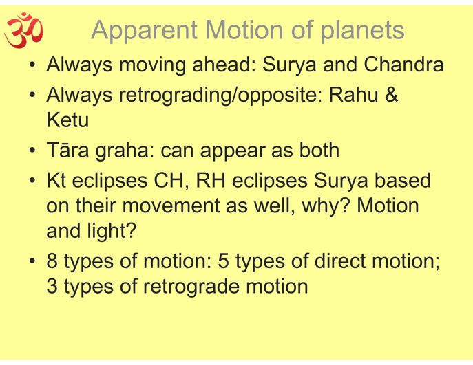


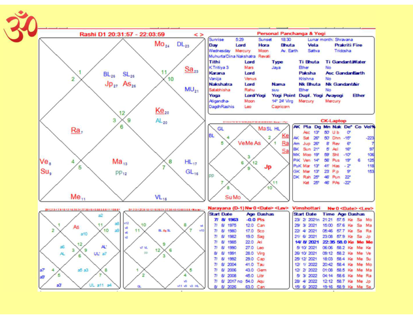

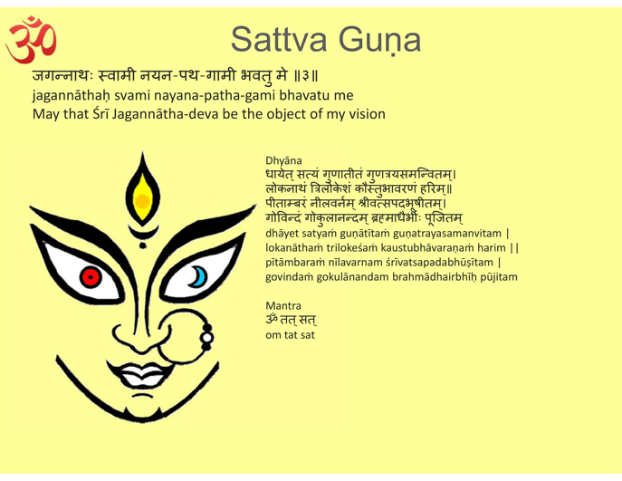

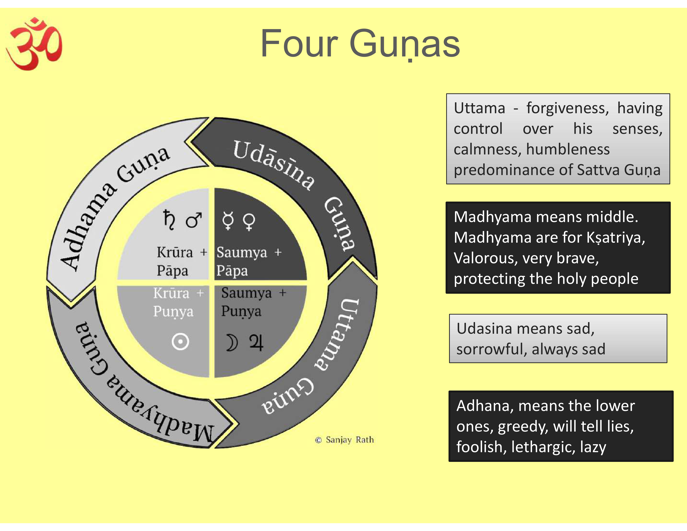

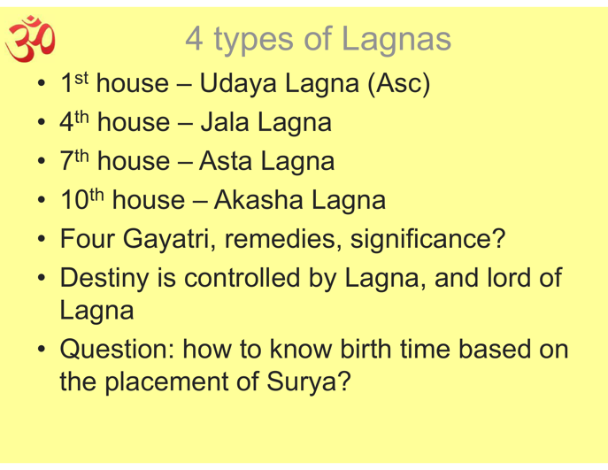

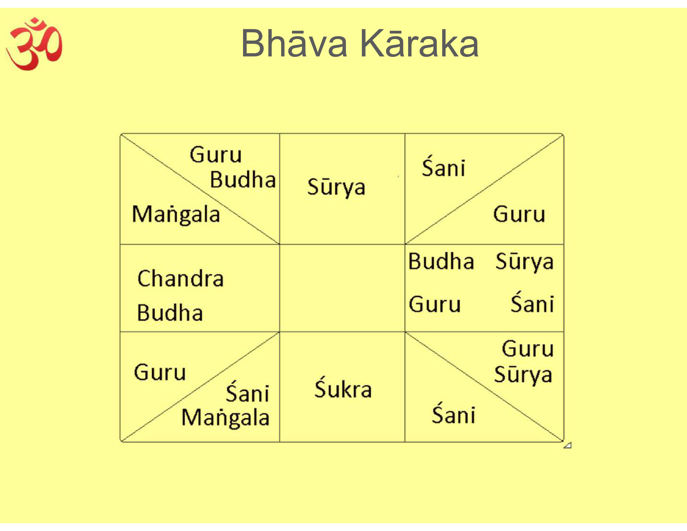


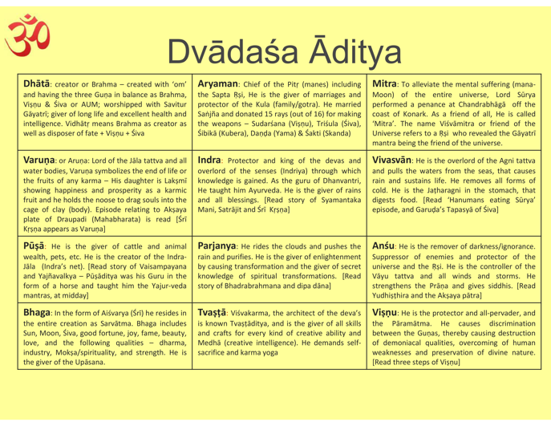

## lesson 9

<div>

> **Core Concept: Dig Bala (Directional Strength)**
>
> **What it is:** Planets gain special strength when placed in specific
> houses (kendras) from the lagna. Behind each planet in dig bala is a
> devata (deity) blessing that position.
>
> **Key Principle:** Dig bala is a **kendra-based concept** - planets
> gain this strength in the 1st, 4th, 7th, or 10th houses from lagna.
>
> ## The 10 Directions & Deities
>
> Each of the 9 grahas plus lagna has a specific dig bala position: -
> **Surya** (10th house) - Indra’s blessing: oversight, control,
> statesmanship - **Chandra** (4th house) - Vayu’s blessing: speed,
> pranayama knowledge - **Mangal** (10th house) - Yama’s blessing:
> knowledge of borders, longevity, dasha - **Budha** (1st house) -
> Kubera’s blessing: knowledge of wealth - **Guru** (1st house) -
> Ishana’s blessing: full knowledge, reasoning (viveka) - **Shukra**
> (4th house) - Agni’s blessing: vision, ability to envision - **Shani**
> (7th house) - Varuna’s blessing: carrying burdens, labor knowledge -
> **Rahu** (7th house) - Niriti’s blessing: understanding chaos and its
> removal - **Ketu** (10th house) - Ananta’s blessing: meditation,
> spiritual introspection - **Lagna** (vargottama) - Mritunjaya
> blessing: longevity
>
> ## How Dig Bala Works
>
> **From Lagna:** The devata gives **knowledge** to the person - this is
> a blessing that can be strengthened through remedies
>
> **From Arudha Lagna:** Shows the **physical direction** where
> blessings manifest (useful for relocation advice)
>
> ## Important Rules
>
> 1.  **Conjunctions:** When a dig bala planet conjoins another planet,
>     it **spills the blessing** onto that planet (like an expensive
>     house raising the value of a neighboring cheap house)
>
> 2.  **Dispositor is Key:** The dispositor can lock or unlock the
>     blessing - check its condition first. If doing remedies, worship
>     the dispositor first, then the dig bala planet.
>
> 3.  **Zero Dig Bala:** Opposite placement shows **lack of knowledge**
>     in houses ruled by that planet - the person may be capable but
>     unable to apply themselves in those areas
>
> 4.  **Independent of Sign:** Dig bala works regardless of whether the
>     planet is exalted, debilitated, or in own sign - these are
>     separate layers of analysis
>
> ## Practical Applications
>
> - Use dig bala as a **remedy tool** - it’s a blessing that can be
>   strengthened
> - One strong benefit can lift an entire chart
> - For malefics in kendras, we prefer them weak (unless they’re lagna
>   lord or have dig bala blessing)
> - Don’t do all remedies at once - address current dasha issues only
>
> ## Examples Given
>
> **Abraham Lincoln:** Budha (lagna lord) in 1st house conjunct Surya -
> Kubera’s wealth blessing manifested through Surya’s statesmanship.
> Rahu-Mangal in 9th activated through war/law-making but ultimately led
> to his death (Rahu in marana karaka sthana defeated by Mangal).
>
> Would you like me to clarify any specific aspect of dig bala?

</div>


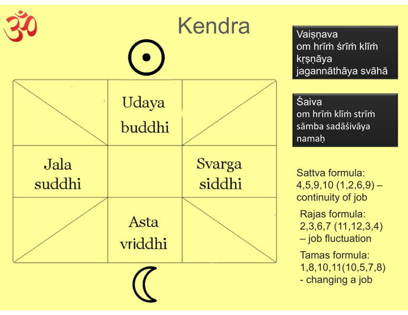

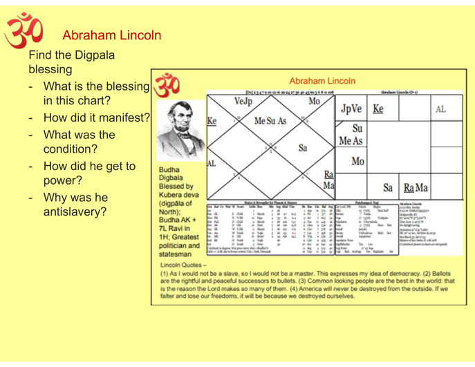


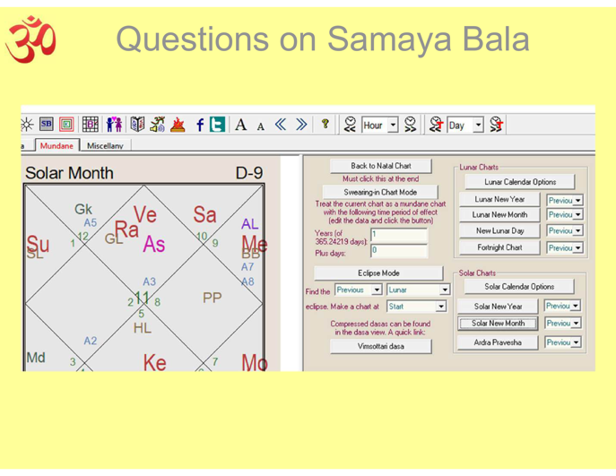

## lesson 10

<div>

> **Caution**
>
> I’ll summarize this Vedic astrology lesson on Nakshatras. This is
> quite extensive, so let me break it into key sections:
>
> ## Core Concept: Nakshatras & Thought Creation
>
> - **27/28 Nakshatras** are the Moon’s mansions, above and outside the
>   Rashi chart
> - They represent **thought creation** - thoughts start in nakshatras,
>   bubble up through divisional charts, and manifest in the Rashi chart
> - After manifestation, they return to nakshatras as **emotions**
>
> ## Janma Nakshatra (Birth Moon’s Nakshatra)
>
> The lord of your Janma Nakshatra shows your mental attitude:
>
> - **Sun**: Need to find a boss/God; work for others
> - **Moon**: Function best in family/gurukul settings
> - **Mars**: Prone to conflicts; must avoid them
> - **Mercury**: Difficulty finishing projects (Gandanta)
> - **Jupiter**: Seek knowledge, uphold tradition/dharma
> - **Venus**: Need purity/respect in relationships
> - **Saturn**: Break boundaries; good for innovation/research
> - **Rahu**: Face betrayal/disappointment; must stay honest
> - **Ketu**: Unsettled mind; need meditation (Gandanta)
>
> ## Navtara Chakra (Three Columns)
>
> - **Buloka** (1st column): Personal well-being, youth
> - **Buvaloka** (2nd column): Career, social life, adulthood
> - **Svargaloka** (3rd column): Spiritual matters, elder age
>
> Odd nakshatras (1st, 3rd, 5th, 7th) in first two columns are
> problematic; in spiritual column, challenges are beneficial.
>
> ## Important Nakshatras from Moon
>
> - **10th Nakshatra** (Karma): Shows career/action capacity; same lord
>   as Janma
> - **25th Nakshatra** (Manas): The pillar - most critical mental
>   support point
> - **7th & 22nd**: Death/endings (Vadha)
>
> ## Special Considerations
>
> - **Shunya Nakshatra**: Shows emptiness in certain rashis
> - **Gandanta**: Mercury (can’t finish) and Ketu (can’t start) create
>   problems
> - **Combustion by Sun**: Cleansing through humiliation before
>   improvement
> - **Masa Nakshatra**: Check Atmakaraka’s rashi to find problematic
>   nakshatra lords
>
> ## Key Teaching Points
>
> - Nakshatras show **mental capacity**, but Rashi chart shows
>   **manifestation**
> - Both must support each other - genius without opportunity
>   accomplishes nothing
> - Use 27-nakshatra scheme for practical work; 28 for spiritual matters
> - Check nakshatra lord’s placement in Rashi chart for full
>   understanding
>
> Would you like me to elaborate on any specific section?

</div>

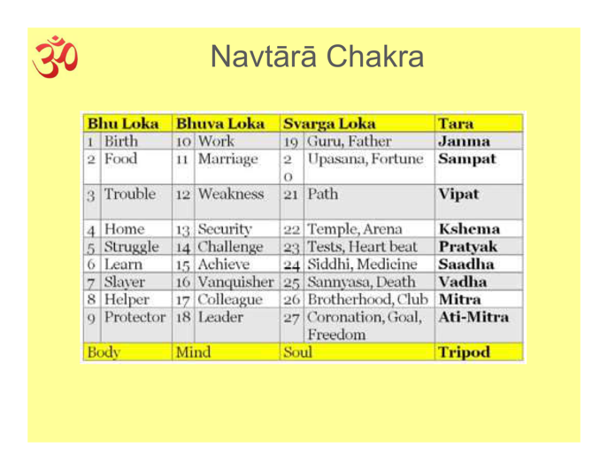

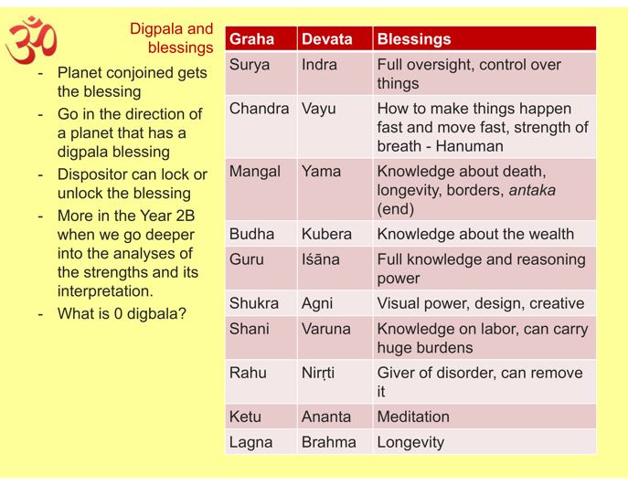


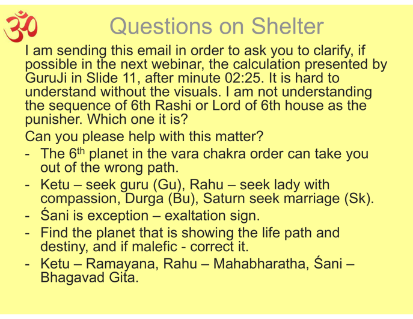

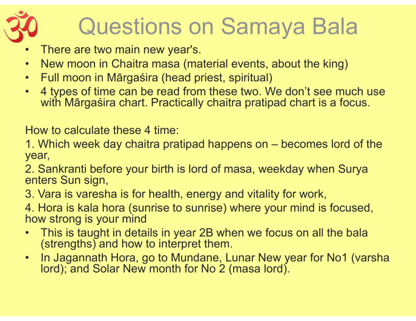

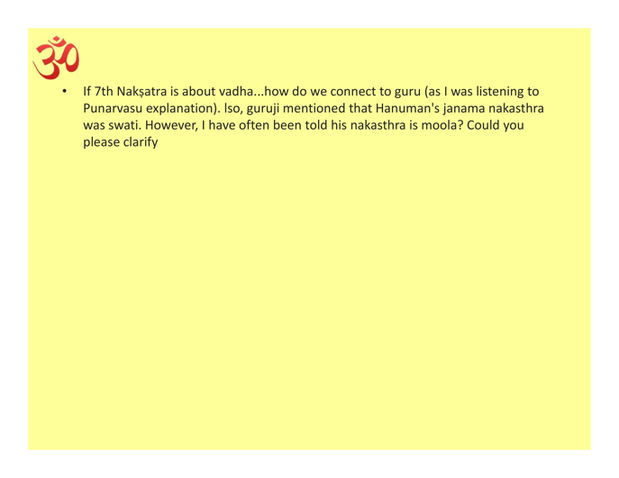

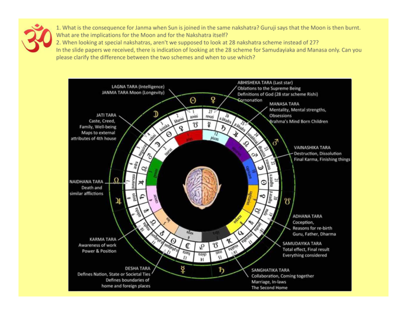

## lesson 11

<div>

> **Caution**
>
> I’ll create a comprehensive summary of this Vedic astrology lesson on
> Graha Drishti (planetary aspects). This is quite detailed, so let me
> break it into key sections:
>
> ## **Lesson 11: Graha Drishti (Planetary Aspects) - Summary**
>
> ### **Course Logistics**
>
> - Monthly webinars recorded and available within 24 hours
> - 2 years access to materials
> - Telegram group for daily questions
> - Daily practice: “Hare Rama Krishna” mantra (3 rounds of 108) upon
>   waking
> - Recommended software: Jagannatha Hora (free) or Shri Jyoti Star
>   (paid)
>
> ### **Core Concepts of Graha Drishti**
>
> **Definition:** Graha drishti is planetary aspect - the ability of
> planets (movable bodies) to influence other bodies from certain
> positions. It represents: - Expression of desire (temporary, activated
> during dashas or through mantras) - Ability to influence based on
> position - What the planet is viewing/becoming aware of - What the
> planet prioritizes
>
> ### **Four Types of Graha Drishti**
>
> **1. Outer Planets (have multiple aspects):**
>
> - **Saturn - Upachaya/Growth Drishti:** 3rd and 10th houses
>   - Focus: Work, daily effort (parakrama)
>   - Makara lagna natives are workaholics, constantly discussing work
> - **Jupiter - Trikona/Knowledge Drishti:** 5th and 9th houses
>   - Focus: Knowledge acquisition
>   - 5th = new knowledge; 9th = past knowledge/education from guru
>   - Jupiter lagna natives prioritize learning above all
> - **Mars - Raksha/Security Drishti:** 4th and 8th houses
>   - Focus: Protection and security
>   - 4th = inner security (home, mother, protection)
>   - 8th = outer security (external threats)
>   - Tests security by provoking/poking (like throwing stones at glass)
>   - Martial lagna natives can be defensive
>
> **2. Inner Planets (Kendra planets):**
>
> - **Sun, Moon, Venus, Mercury - Purna/Full Drishti:** 7th house only
>   - Represents desire for that specific planet’s significations
>   - Sun: desire for self-expression
>   - Venus: desire for partnership/comfort
>   - Moon: sustenance
>   - Mercury: communication
>
> **3. Rahu - Kama Drishti:** 2nd and 7th houses - Represents desire to
> possess, enjoy, consume
>
> **4. Ketu:** Has no graha drishti (withdrawn nature)
>
> ### **Practical Applications**
>
> **Using Raksha Drishti (4th & 8th from lords):**
>
> - **Marriage (from 7th lord):**
>   - 4th from 7th lord = inner marriage issues (disharmony, lack of
>     intimacy)
>   - 8th from 7th lord = outer threats (affairs, third parties)
> - **Work (from 10th lord):**
>   - 4th from 10th lord = inner work issues (colleagues, internal
>     problems)
>   - 8th from 10th lord = job change, loss, looking elsewhere
> - **Wealth (from 2nd lord):**
>   - 4th from 2nd lord = protecting wealth internally
>   - 8th from 2nd lord = external threats (taxes, theft)
>
> **Using Kriya Drishti (3rd & 10th - Saturn’s aspects):** - 3rd = new
> work/initiatives - 10th = old work/unresolved issues
>
> **Using Jnana Drishti (5th & 9th - Jupiter’s aspects):** - 5th = new
> knowledge/skills to learn - 9th = past knowledge/education/baggage -
> Afflicted 9th can mean stuck in perpetual education
>
> ### **Analysis Methods**
>
> Can analyze from three perspectives: 1. **Bhava (house)** -
> general/Kalapurusha chart 2. **Bhava Lord** - individual chart
> specifics 3. **Karaka** - natural significator
>
> ### **Atmakaraka Application**
>
> **Permanent Nature:** Shown by Atmakaraka’s purna drishti - Indicates
> soul’s highest priorities - Example: Jupiter as AK in 9th house
> prioritizes knowledge of 1st house (self, health, birth purpose) and
> 5th house (children, future, mantras)
>
> **Temporal Nature:** Shown by Mahadasha lord’s purna drishti - Current
> life priorities during that period
>
> ### **Important Notes**
>
> - All planets have all aspects, but purna drishti shows HIGHEST
>   priority
> - Retrograde planets have 3x stronger desire/influence (Cheshtabala)
> - Afflicted 9th house can indicate educational blocks preventing
>   career progress
> - For severe afflictions, only analyze purna drishti; for other
>   analyses, may use partial aspects too
> - Jupiter not natural leader because priorities are knowledge
>   (5th/9th), not protection (4th/8th) or governance
>
> ### **Homework Assignment**
>
> 1.  Draw your chart and mark all houses your Atmakaraka has purna
>     drishti on
> 2.  Apply this to 10 charts of people you know well
> 3.  Journal conclusions about what worked/didn’t work
>
> ------------------------------------------------------------------------
>
> Would you like me to clarify any specific aspect of this lesson, or
> shall we explore how to apply these concepts to a chart?

</div>


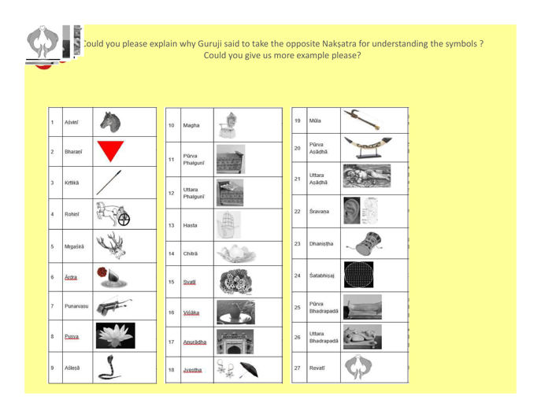

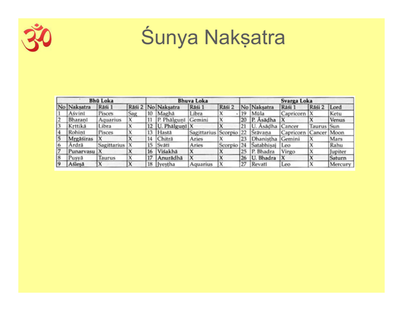


## Lesson 12

<div>

> **Caution**
>
> I’ll provide a comprehensive summary of this Vedic astrology lesson on
> Rashi Drishti (sign aspects). This is a detailed transcript, so I’ll
> break it into key sections:
>
> ## Core Concept: Rashi Drishti vs Graha Drishti
>
> **Rashi Drishti** is fundamentally different from Graha Drishti: -
> **Graha Drishti** = planetary desire to influence; changes with
> dashas/transits (temporary) - **Rashi Drishti** = permanent natural
> functioning; mutual sharing of information between signs; exists
> throughout time
>
> Key example: Mars in Mesha and Guru in Vrishika have mutual rashi
> drishti (knowledge sharing), but only Mars has graha drishti on Guru
> (8th aspect), not vice versa.
>
> ## Three Types of Rashi Drishti
>
> ### 1. **Abhimukha Drishti (Face-to-Face, 100%)**
>
> - Signs directly opposite each other
> - Represents **Vishnu tatva** (sustenance)
> - Mutual dependency for survival
> - Examples:
>   - Mesha-Vrishika: Body health depends on waste elimination
>   - Rishabha-Tula: Family needs partnership
>   - Mithuna-Dhanus: Contracts need knowledge (9th house)
>   - Karka-Makara: Heart rhythm-life cycle (rebirth)
>
> **Protection principle**: Planets in abhimukha signs protect each
> other, especially the sign lord and exalted planet. Malefics in
> abhimukha can jeopardize sustenance.
>
> ### 2. **Parshva Drishti (Side Aspects, 50%)**
>
> Two types: - **First Parshva** (creation side) - **Brahma tatva** -
> **Second Parshva** (destruction side) - **Rudra tatva** (also called
> Badaka)
>
> For Mesha: Simha (creation), Vrishika (sustenance/abhimukha), Kumbha
> (destruction/badaka)
>
> ### 3. **Badaka (Obstacle, 25%)**
>
> The “destruction” parshva - represents overconfidence where we think
> we know but don’t.
>
> **Badaka rules**: - **Chara (movable) signs**: 11th house is badaka -
> **Sthira (fixed) signs**: 9th house is badaka  
> - **Dvisvabhava (dual) signs**: 7th house is badaka
>
> The badaka moves in 3-step pattern opposite to Vishnu’s movement
> through signs.
>
> ## Samukha Drishti (Opposite Signs)
>
> Signs 180° apart represent the same quality with different
> manifestations - two sides of one coin. You can only choose one
> side: - Mesha-Vrishika (Mars): Warrior vs spiritual/occult -
> Rishabha-Tula: Family establishment vs wandering - Mithuna-Dhanus:
> Worldly involvement vs sannyasa
>
> ## Practical Application Method
>
> When analyzing any rashi, examine **four positions**: 1. The rashi
> itself 2. Its creation source (first parshva) 3. Its sustenance
> (abhimukha) 4. Its destruction/obstacles (badaka)
>
> Check both from: - **Lagna** (intellectual ability) - **Lagna lord
> placement** (practical application ability)
>
> ## Chart Examples Analyzed
>
> **Srila Prabhupada** (Dhanus lagna): - Abhimukha = Mithuna (7th house
> challenge: samsara vs sannyasa) – \*\* this is incorrec i think it is
> samukha rashi \*\* - From lagna lord (Guru in 9th/Simha): Abhimukha is
> Makara (2nd) with exalted Shani - successfully faced challenge,
> established family then took sannyasa - Parshva knowledge: Meena (4th
> house purity/bhakti) - Applied through exalted Shani - uplifted drug
> users/hippies to vegetarianism and Krishna consciousness
>
> **Kurt Cobain** (Simha lagna): - Abhimukha = Makara (6th) with
> Shani-Venus (desires/vices problem) - Knowledge source (Tula) lords
> over badaka - created own blockages - Fame he couldn’t handle, led to
> suicide
>
> ## Important Technical Points
>
> - Planets in badaka can be blessing (if benefic) or curse (if malefic)
> - Guru in badaka doesn’t mean no guru if benefic
> - Lords and exalted planets of signs are “blind protectors”
> - Retrograde planets in protective positions add stubbornness to
>   protection
> - Debilitated planets in protective positions cannot protect properly
> - Marana karaka sthana creates additional problems in badaka
>
> ## Sign Dependencies
>
> The transcript lists which planets protect which signs (lord + exalted
> planet for each).
>
> Would you like me to elaborate on any specific section?

</div>

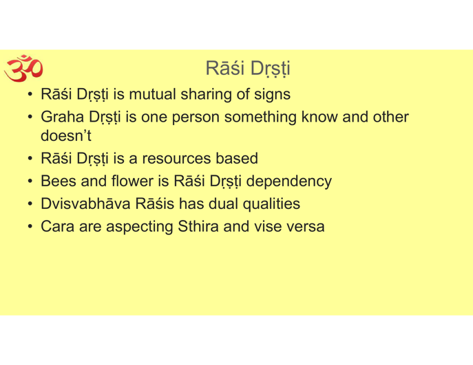

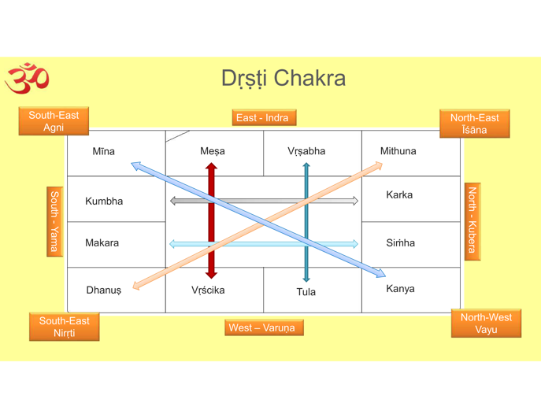

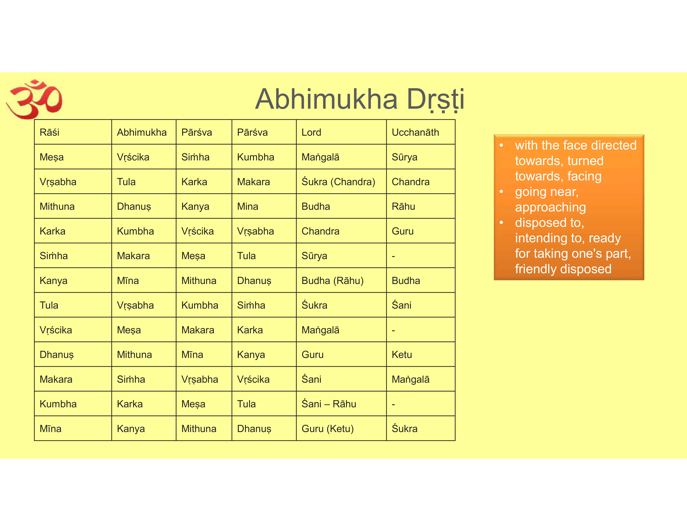

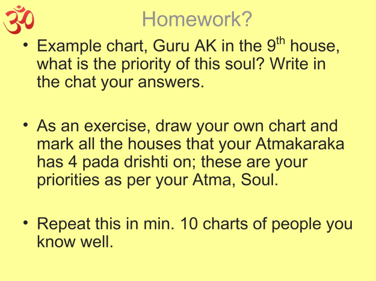

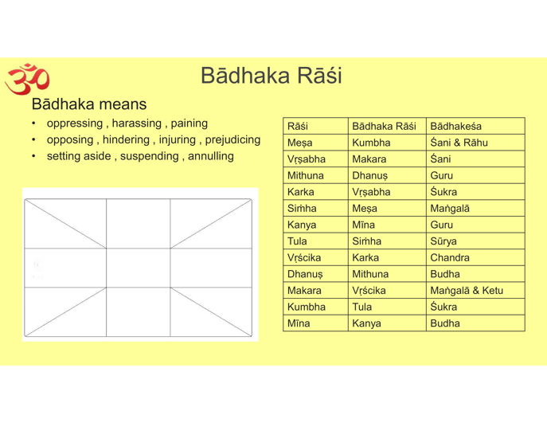

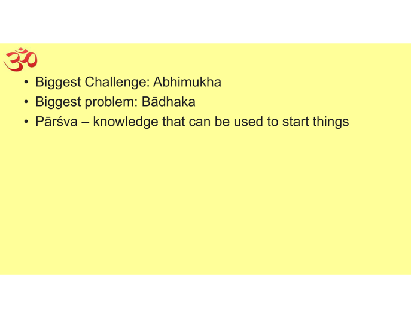

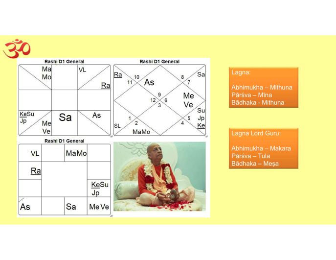

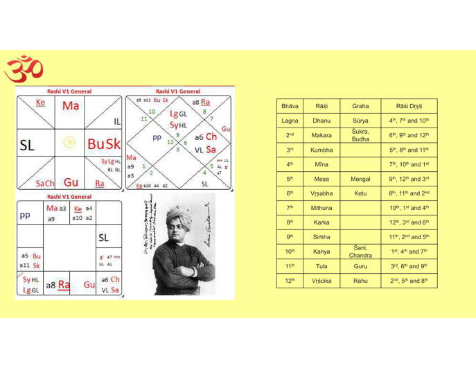

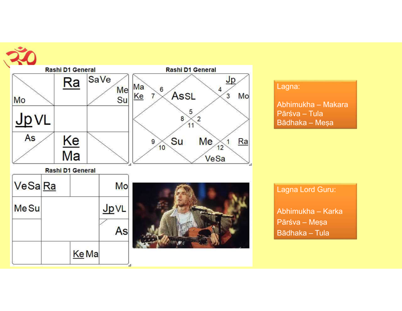

## Lesson 13

<div>

> **Caution**
>
> I’ll provide a comprehensive summary of this Jyotish (Vedic astrology)
> lesson on Bhavas (houses):
>
> ## Core Concepts
>
> **Bhava Definition** - Bhavas are not static areas of life but dynamic
> states of mind, attitudes, sentiments, and experiences - They grow and
> expand based on knowledge and awareness - Three ways to define bhavas:
> Narayana (rashi-based), Bhava Chakra (degree-based), and Bhava Chalita
> Chakra
>
> **Bhava Names** The 12 houses have specific Sanskrit names that reveal
> their significance: Lagna, Dhana, Sahaja, Sukha, Putra, Ari, Yuvati,
> Randhra, Dharma, Karma, Labha, Vyaya
>
> ## Bhava Groups and Underlying Principles
>
> **Kendras (1st, 4th, 7th, 10th)** - Vishnu/Moon concept - Most
> important houses - the four pillars of life - Visualized as a
> four-petal lotus - Only houses we have direct access to - 1st & 7th:
> High tide (high emotions) - birth/coming and going/journey - 4th &
> 10th: Low tide (rest/relaxation) - home and work - Planets in kendras
> cooperate and support each other
>
> **Konas (5th, 9th)** - Lakshmi/Shiva concept - Resources and knowledge
> that sustain life - Represent prosperity and dharma - 5th house:
> Future, mantra, prayers, visualization, children - 9th house: Past,
> guru knowledge, father, lineage, dharma - When bhava lords are placed
> in konas, they show what you pray for or admire
>
> **Dusthanas (6th, 8th, 12th)** - Shani/Saturn concept - Represent
> sorrow, sin, and karmic debts - Planets here have “taxes” to pay - 6th
> house: Weaknesses (shadripu), temptations, lifestyle choices,
> celibacy - FREE WILL - 8th house: Past sins (rina), karmic debts,
> unseen diseases - NO FREE WILL - 12th house: Losses, foreign
> residence, blame
>
> **Upachaya Houses (3rd, 6th, 10th, 11th)** - Free will houses - Have
> potential to grow and develop - Lagna lord in 3rd/6th: Manta Yoga
> (extreme intelligence) - Lagna lord in 10th/11th: Siddha Yoga (huge
> achievements) - 3rd: Choice of weapon/expression - 6th: Dealing with
> enemies/temptations - 10th: Keeping promises, work - 11th: Gains -
> what you’re willing to accept/take
>
> **Trikona (3rd, 6th, 11th)** - Brahma houses - Contribute to our
> creation - 3rd & 6th: Creation part - 11th: Delivery part - Related to
> Rahu (cause of birth) - 6th house: Body creation (with Brahma) - 12th
> house: Mind creation (with Saraswati)
>
> ## Practical Examples
>
> **Travel & Foreign Residence** - 7th house: Journey and movement (not
> residence) - 10th house: Away from home - 12th house: Foreign
> residence/settlement - 3rd house: Short-term travel - 9th house:
> Freedom to travel (visa/permits)
>
> **Children** - Male chart: 5th house for progeny - Female chart: 9th
> house for progeny, conception, pregnancy
>
> **Judgment of Bhavas** - Benefic planets in a house bring happiness
> (sukha) - If bhava lord is in kendra/kona from lagna, that bhava is
> empowered - Example: 6th lord in kendras strengthens celibacy, can
> delay marriage
>
> **Lord Placement** - From lagna: Shows our experience of that bhava -
> From the bhava itself: Shows resources available to that bhava - In
> kendra: God-given, accessible - In kona: Need to pray for it, seek
> knowledge - In dusthana: Sin/sorrow attached
>
> ## Key Teachings
>
> - Increasing knowledge of bhavas changes their quality
> - Each bhava has multiple names revealing different aspects
> - Mantras (5th house) include all mental repetitions, not just
>   Sanskrit prayers
> - Your mantra is your best friend or worst enemy
> - Malefics in houses show specific challenges related to that house’s
>   significations
>
> The lesson emphasized understanding WHY classical texts say what they
> do, not just memorizing combinations.

</div>
